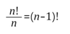

# 1. 순열조합

### 1.1 합의 법칙과 곱의 법칙

- 합의 법칙 : A, B가 **동시에 일어나지 않을 때** (연속해서 발생하지 않을 때), A와 B의 경우의 수가 m, n이면 A 또는 B가 일어나는 경우의 수는 m+n. (or)
- 곱의 법칙 : A와 B가 **서로 영향이 없을 때**, A와 B의 경우의 수가 m, n이면 A,B가 동시에 일어나는 경우의 수는 m x n. (and)

### 1.2 순열과 조합

- 순열 : **서로 다른** n개에서 r개를 택해 **일렬로 나열하는 것**을 n개에서 r개를 택하는 순열이라 한다. (permutation)

- 조합 : **서로 다른** n개에서 **순서를 생각하지 않고** r개를 택하는 것을 n개에서 개를 택하는 조합이라 한다.(combination)

- 같은 것이 있는 순열 : 순열이 **같은 것이 포함된 원소들을 나열하는 경우의 수**는 나열하는 원소의 팩토리얼에 중복된 원소들의 팩토리얼을 나누어준다. 

   

  예를 들어 aaabb와 같은 경우 a가 3개이고 b가 2개이므로 5!을 3!와 2!로 나누어주면 됩니다. (a와 b의 배치 순서에 따른 경우의 수를 나눔)

  

  

- 원순열 : 서로 다른 것을 원형으로 배열하는 순열. n개를 원형으로 나열할 때 같은것이 n개 있으므로 n!/n을 한다.

- 중복순열 : 중복 가능한 n개 중에서 r개를 선택하는 경우. (product. 곱셈)

- 중복조합 : 서로 다른 n개에서 중복을 허용하여 r개를 택하는 것. (homogeneous. 종류)

- 이항정리 : (a+b)의 n승을 전개한 것. 이 중 각 항의 계수 nCr을 이항계수라 한다. 각 항의 계수는 (a+b)중 r개에서 a를, 남은 n-r개에서 b를 택한 것의 수가 된다.

# 2. 확률

### 2.1 확률의 뜻과 활용

- 같은 조건에서 반복할 수 있고 그 결과가 우연에 의해 결정되는 실험 혹은 관찰을 **시행**, 경우의일어날 수 있는 모든 결과의 집합을 **표본공간(S)**, 그 부분집합을 **사건**이라 한다.
- 배반사건과 여사건 : **배반사건**은 사건 A, B가 동시에 일어나지 않는 것. **여사건**은 사건 A가 일어나지 않을 사건. 사건과 여사건은 서로 배반사건이다.
- 수학적 확률 : 시행에 대해서 일어날 수 있는 모든 경우의 수가 N가지이고, 어떤 사건이 일어나는 경우의 수가 K가지일 때, 어떤 사건이 일어나는 확률이인 것

- 통계적 확률 : 같은시행을 *n*번 반복할 때 사건 A가 일어난 획수를 r*n*이라 하면 *n*이 충분히 커짐에 따라 상대도수가 일정한 값 *p*에 가까워지는데 이 *p*를 통계적 확률이라 한다.

 

### 2.2 조건부 확률

#### 2.2.1 조건부 확률

#### 2.2.2 사건의 독립과 종속

### 2.3 확률분포

# 3. 통계적 추정

 

---

참조 사이트

https://coding-factory.tistory.com/606

