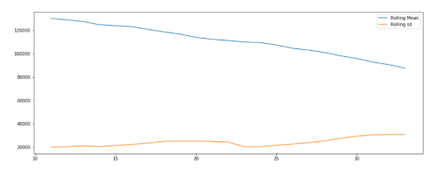

# 코드 분석

link : https://www.kaggle.com/jagangupta/time-series-basics-exploring-traditional-ts


1. EDA
2. 시계열분석
3. 계층적 시계열 분석


1. EDA


- 상품종류별 판매량


2.  시계열 분석

- 월별 판매량


- 이동편균법 - 연도별 감소추세 확인 (평균, 분산)



- 연도별 추세 차분 - 계절마다 주기적인 판매량 확인


- 시계열데이터 정상성 확인

```python
# Stationarity tests
def test_stationarity(timeseries):
    
    #Perform Dickey-Fuller test:
    print('Results of Dickey-Fuller Test:')
    dftest = adfuller(timeseries, autolag='AIC')
    dfoutput = pd.Series(dftest[0:4], index=['Test Statistic','p-value','#Lags Used','Number of Observations Used'])
    for key,value in dftest[4].items():
        dfoutput['Critical Value (%s)'%key] = value
    print (dfoutput)

test_stationarity(ts)

Results of Dickey-Fuller Test:
Test Statistic                 -2.395704
p-value                         0.142953
#Lags Used                      0.000000
Number of Observations Used    33.000000
Critical Value (1%)            -3.646135
Critical Value (5%)            -2.954127
Critical Value (10%)           -2.615968
dtype: float64
```


