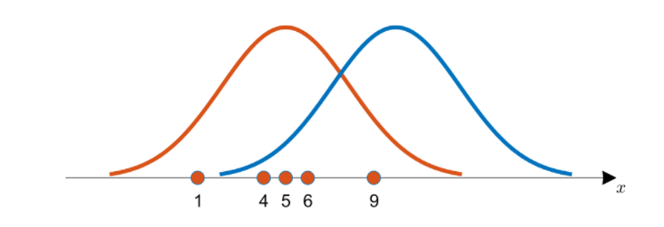
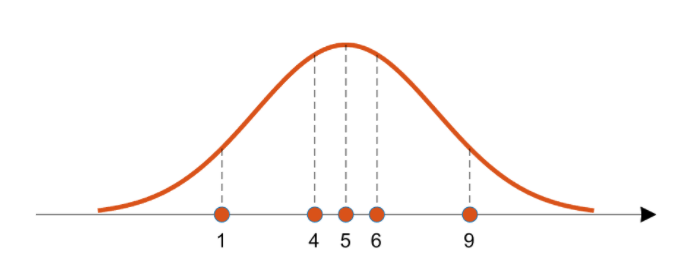
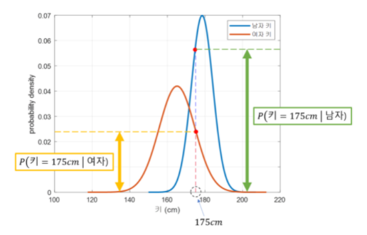

# 1. 최대 우도법

출처 : https://angeloyeo.github.io/2020/07/17/MLE.html

## 1.1 최대 우도법의 정의

최대우도법(Maximum Likelyhood Estimation, MLE)는 모수적인 데이터 밀도 추정방법으로 어떤 확률밀도 함수에서 관측된 표본 데이터 집합으로부터 파라미터를 추정하는 방법.

## 1.2 Toy Example 예시

- 데이터들의 집합은 두 곡선 중 주황색에서 얻었을 확률이 높아 보임.
- 이와 같이 데이터를 관찰함으로 데이터가 추출되었을 분포의 특성을 추정할 수 있음.
- 이 때 추출된 분포가 정규분포라 가정하고 분포의 특성 중 평균을 추정해보자.
- 수학적인 추정방법을 위해서는 데이터의 기여도(likelihood)에 대해 알아야 한다.

## 1.3 Likelihood function

- 기여도(likelihood)란 획득한 데이터가 추정된 분포로부터 나왔을 가능도를 얘기한다. 해당 분포에서 각 데이터들의 likelihood 기여도는 점선 높이로 나타내진다.

- 수치적으로 **가능도를 계산하**기 위해서는 **각 데이터 샘플에서 후보 분포에 대한 높이를 계산해서 모두 곱해야 한다.** (데이터를 획득하는 각 사건은 독립이기 때문)
- 그렇게 해서 계산된 가능도를 생각해볼 수 있는 모든 후보군에 대해 계산하고 이것을 비교하면 우리는 지금 얻은 데이터를 가장 잘 설명할 수 있는 확률분포를 얻어낼 수 있게 된다.

$$
P(x|θ)=n∏k=1 P(xk|θ)
$$

- 위 수식은 전체 표본집합의 결합확률밀도 함수(likelihood function)이며 가장 큰 결과값을 만드는  θ를 추정값으로 정한다. 보통은 자연로그를 이용해 log-lkelihood function을 이용한다.

$$
L(θ|x)=logP(x|θ)=n∑i=1 logP(xi|θ)
$$

## 1.4 lilelihood function의 최대값을 찾는 방법

- MLE는 Likelihood 함수의 최대값을 찾는 것을 의미하며 정의역 함수 입력값에서 자연로그를 이용했을 때의 결과가 그렇지 않을 때와 같다. 
- 그런 이유로 계산의 편의를 위해 log-likelihood 를 사용한다.
- 탐색법은 미분계수를 이용하는 방법이다.
- 찾고자 하는 파라미터에 대해 편미분을 하고 그 값이 0이 되도록 하는 값을 찾는다.

$$
\frac{∂}{∂θ}L(θ|x)=\frac{∂}{∂θ}logPx|θ)=\sum\limits_{i=1}\limits^{n}\frac{∂}{∂θ}logP(xi|θ)=0
$$

# 2. 베이즈 정리의 공식

- 베이즈 정리는 근본적으로 사전확률과 사후확률 사이의 관계를 나타내는 정리이다.
- 네 개의 확률 값 중 P(H)와 P(H|E)는 각각 **사전 확률**, **사후 확률**이라고 부른다.
$$
P(H|E)= \frac{P(E|H)P(H)}{P(E)}
$$

## 2.1 베이즈 정리의 의미와 의의

- 베이즈 정리는 새로운 정보를 토대로 어떤 사건이 발생했다는 주장에 대한 신뢰도를 갱신하는 방법이다.
- 베이즈 정리에서의 확률은 '주장에 대한 신뢰도'라 할 수 있다.

- 가령 동전의 앞면이 나올 확률이 50%라고 하면, 빈도주의자들은 100번 동전을 던졌을 때 50번은 앞면이 나온다고 해석하고, 베이지안 주의자들은 동전의 앞면이 나왔다는 주장의 신뢰도가 50%라고 보는 것.

## 2.2 용어 정리

- 위의 공식에서 H는 Hypothesis로 가설 혹은 '어떤 사건이 발생했다는 주장'이다.
- E는 Evidence의 약자로 새로운 정보를 의미한다.
- 따라서 P(H)P(H)는 어떤 사건이 발생했다는 주장에 관한 신뢰도, P(H|E)P(H|E)는 새로운 정보를 받은 후 갱신된 신뢰도를 의미한다.
- P(H)P(H)와 P(H|E)P(H|E)는 각각 사전 확률, 사후 확률이라고 부르는데, 여기선 **‘evidence를 관측하여 갱신하기 전 후의 내 주장에 관한 신뢰도’** 정도로 이해하면 될 것.

# 3. 나이브 베이즈 분류기

## 3.1 분류의 확률적 판단 근거

**# 사전 지식을 이용한 분류(prior probability)**

- 사전지식만을 가지고 test data sample을 판별할 수 있으며 판별에 도움을 주는 확률값을 사전 확률이라 한다.(prior probability)
- 이러한 사전 확률은 실데이터에서는 training data의 class간 비율로 미리 계산할 수 있음.
  Ex ) 가령 100건의 training data 중 30:30:40의 비율로 class A, B, C가 주어지면 각 클래스에 대한 사전확률은 0.3, 0.4, 0.4이 됨.

**# 특정 정보가 추가되는 경우(likelihood)**

- 키(특정 정보)에 따라 남녀를 판별하는 문제가 주어졌을 때 주어진 training sample을 통해 남녀 분포가 다르다는 것을 안다고 가정하자.
  (특정 정보의 **모집단이 정규 분포를 이룬다고 가정**하여 주어지는 정보. training sample의 평균과 분산을 계산하여 구한다.)

- 분류 대상의 키가 175cm일 때 175cm라는 데이터는 확보한 확률밀도함수 중 남자의 함수분포에 가깝다. 즉 남자라고 생각하는 것이 가능성이 더 크다.
- 이 때 가능성은 **likelihood 기여도**이다. 해당 예시에서는 특징 정보가 하나기 때문에 이 likelihood 기여도를 likelihood로 본다.
- P(키=175cm|성별=남자) > P(키=175cm|성별=여자) 이지만 이는 '추가정보'이기 때문에 남자라고 결정할 충분한 근거가 되지 못한다.-
- 기존의 배경지식에 이번에 추가된 정보인 likelihood를 곱해주어 '판단 근거'를 찾을 수 있다.
  - 남자에 대한 판단 근거 : P(성별=남자)×P(키=175cm|성별=남자)
  - 여자에 대한 판단 근거 : P(성별=여자)×P(키=175cm|성별=여자)
  - 이 두 **prior x likelihood**를 비교해 사람의 성별을 비교한다.

**# 정보가 더 추가되는 경우**

- 지금껏 사전 정보에 추가 정보를 곱해 추가했던 것 처럼 계속 추가 정보를 덧붙인다.
  - 이전의 175cm 남자가 80kg이라 할 때,
  - 남자에 대한 판단 근거 : P(성별=남자)×P(키=175cm|성별=남자)×P(몸무게=80kg|성별=남자)
  - 여자에 대한 판단 근거 : P(성별=여자)×P(키=175cm|성별=여자)×P(몸무게=80kg|성별=여자)

## 3.2 배경 이론 소개

**# 베이즈 정리를 통한 '판단근거' 도출**

- 데이터를 봤을 때 여러개의 feature를 가지고 있는 데이터가 어떤 클래스 인지 판단하고 싶다.

- c1, c2 두가지가 있을 때 사후확률은 다음과 같다.
  $$
  P(c_1|x_1,x_2,⋯,x_n)>?P(c_2|x_1,x_2,⋯,x_n) \\ \\
  P(c_1|x_1,x_2,⋯,x_n)=P(c_1)P(x_1|c_1)P(x_2|c_1,x_1)P(x_3|c_1,x_1,x_2)⋯P(x_n|c_1,x_1,x_2,⋯x_{n−1})
  $$
  

- 각 feature는 **독립적으로 추출된다 가정**하면(이 과정을 'naive Bayes'라 한다.) 전개는 아래와 같아진다.
  $$
  P(x_2|c_1,x_1)=P(x_2|c_1) \\
  P(c_1|x_1,x_2,⋯,x_n)=P(c_1)P(x_1|c_1)P(x_2|c_1)P(x_3|c_1)⋯P(x_n|c_1) \\
  =P(c_1)\prod_{i=1}^n P(x_i|c_1)
  $$

- k개의 class가 있을 때 예측분류 결과는 다음과 같다.
  $$
  \hat{y}=argmax_{k∈{1,2,⋯,k}}P(c_k)\prod_{n=1}^{n} P(x_i|c_k)
  $$
  

