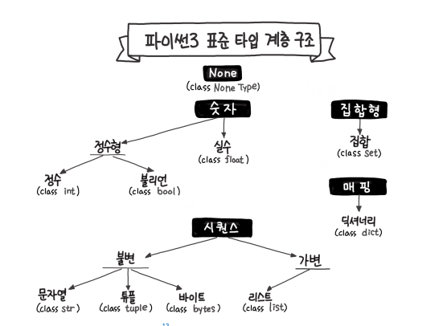

# 파이썬 알고리즘 인터뷰


## 2부 파이썬


### 3장 파이썬

#### 3.1 파이썬 문법

- 인덴트 : 파이썬 공식 가이드인 PEP8에 따라 공백 4칸을 원칙으로 함.

- 네이밍 컨벤션 : 자바에서는 네이밍 컨벤션을 카멜 케이스를 사용하지만 파이썬에서는 PEP8 및 Pythonic Way 철학에 따라 스네이크 케이스를 사용한다.

  - 카멜 케이스 : `camelCase : int = 1` . 대소문자로 단어를 구별하여 표기하는 방식. 가장 첫 글자는 소문자 표기로 한다.
  - 스네이크 케이스 : `snake_case : int 1`. 각 단어를 언더스코어(_)로 구분하여 표기하는 방식.

- `type hint` : 이 기능은 Python `ver3.5` 부터 사용이 가능함. 아래와 같은 형태로 타입을 선언할 수 있음. 함수와 함께 타입 힌트를 사용하면 입력값을 명시할 수 있으며 리턴 값이 `True`, `False` 등이 된다는 것도 표기할 수 있다. 하지만 강제 규약이 아니므로 주의를 요한다. `mypy`를 사용하면 검토가 가능.

  ``` python
  a : str = "1"
  b : int = 1
  
  def fn(a: int) -> bool :
      ...
      
  mypy solution.py
  
  ```

- `list comprehension` : 파이썬은 `map`, `filter`와 같은 함수형 기능을 지원하며 람다 표현식도 지원한다. 하지만 리스트 컴프리핸션을 사용하면 가독성이 좋은 짧은 코드를 생성할 수 있다. 이 때 너무 복잡해지면 오히려 가독성이 떨어지므로 `for`문 혹은 다른 함수와 가독성면을 비교하여 코드를 작성하도록 한다.

  ```python
  >>> list(map(lambda x: x+10, [1,2,3]))
  [11, 12, 13]
  >>> [n * 2 for n in range(1, 10+1) if n % 2 == 1]
  [2, 6, 10, 14, 18]
  # list 외에 dict에도 사용 가능. (ver2.7 이후)
  >>> a = {key: value for key, value in original.intems()}
  ```

- `generator` : `range`를 포함해 루프의 반복(interation)동작을 제어할 수 있는 루틴 형태를 일컫는다. 여러 타입의 값을 하나의 함수에서 생성하는 것도 가능. 대용량의 메모리를 사용하지 않고 원하는 값을 생성해 꺼낼 수 있다. 인덱스로 접근 시, 바로 생성하도록 되어 리스트와 비슷한 느낌으로 사용이 가능하다.

  ```python
  def generator():
      yeild 1
      yeild 'string'
      yeild True
  >>> g = generatior()
  >>> next(g)
  1
  >>> next(g)
  'string'
  >>> next(g)
  True
  
  >>> a = [n for n in range(1000000)]
  >>> b  = range(1000000)
  # 길이 비교
  >>> print(len(a), len(b))
  1000000 1000000
  # 메모리 점유율 비교
  >>> print(sys.getsizeof(a), sys.getsizeof(b))
  8448728 48
  # 인덱스 호출
  >>> b[999]
  999
  
  ```

- `enumerate` : 열거하다는 뜻으로 `list`, `set`, `tuple` 등에 인덱스를 포함한 `enumerate` 객체로 리턴한다.

  ```python
  >>> a = [1,2,3,4,5]
  >>> list(enumerate(a))
  [(0, 1), (1, 2), (2, 3), (3, 4), (4, 5)]
  
  # 사용 예시
  for i, v in enumerate(a):
      print(i,v)
  ```

- `print` 

  ```python
  print( sep : 구분자 설정. default=' '
         end : 끝에 오는 문자열. default = '\n'
       )
  
  # 리스트 출력
  >>> print(' '.join(['A','B']))
  A B
  
  # format 사용법
  >>> idx=1
  >>> fruit = 'Apple'
  >>> print('{}: {}'.format(idx+1, fruit))
  2: 'Apple'
  # f-string (python ver3.6 이후)
  >>> print(f'{idx + 1}: {fruit}')
  2: 'Apple'
  ```

- `pass` : 오류로 인한 정지를 막을 수 있다. 코드 골격을 잡기위해 아래와 같은 방식으로 사용 가능

  ```python
  class Myclass(object):
      def method_a(self):
          pass
      
      def methob_b(self):
          ...
  ```

- `locals` : 로컬 심볼 테이블 딕셔너리를 가져오는 메소드.  클래스 메소드 내부의 모든 로컬 변수를 출력해 준다.

  ```python
  import pprint
  pprint.pprint(locals())
  {'nums':[2, 7, 11, 15],
   ...
   'target':9
  }
  ```


#### 구글 파이썬 스타일 가이드

1. 함수의 기본 값으로 가변 객체(Mutable Object)를 사용하지 말고 불변 객체(Immutable Object)를 사용하라. None을 명시적으로 할당하는 것도 좋은 방법이다.

   ```python
   NO :
       def foo(a, b=[]):
           ...
           a
   
       def foo(a, b : Mapping = {}):
           ...
           a
   
   YES :
       
       def foo(a, b = None):
           if b is None:
               b = []
   
       def foo(a, b: Optional[Sequence]=None):
           if b is None:
               b = []
   ```

2. True, False를 판별할 때는 암시적(Implicit)인 방법을 사용하는 편이 간결하고 가독성이 높다.

   ```python
   Yes :
       if not user:
           print('no users')
   
       if foo == 0:
           self.handle_zero()
       
       if i % 10 == 0 :
           self.handle_multiple_of_ten()
   
   NO :
       if len(user)==0:
           print('no users')
   
       if foo is not None and not foo:
           self.handle_zero()
       
       if not i % 10:
           self.handle_multiple_of_ten()
   ```

   

### 4장 빅오, 자료형

빅오는 입력값이 커질 때 알고리즘의 실행 시간(시간 복잡도)과 함께 공간 요구사항(공간 복잡도)이 어떻게 증가하는지를 분류하는 데 사용되며, 알고리즘의 효율성을 분석하는데 활용된다.

#### 4.1 빅오

빅오는 점근적 실행시간(Asymptotic Running Time)를 표기할 때 주로 사용된다. 점근적 실행시간이란 입력값이 무한대를 향할 때 함수의 실행 시간의 추이를 의미한다. 점근적 실행시간은 시간 복잡도라 할 수 있다. 시간 복잡도의 사전적 정의는 알고리즘을 수행하는 데 걸리는 시간을 설명하는 계산 복잡도(Computation Complexity)를 의미하며 계산 복잡도를 표기하는 대표적 방법이 빅오이다. 시간 복잡도는  함수 중 계수를 무시한 최고차항만을 고려한다.

- *O*(1) : 입력값이 아무리 커도 실행 시간은 일정한 것. 상수 시간을 갖는 알고리즘은 찾기 힘들어 가치가 있다. 하지만 상수값이 매우 크면 의미가 퇴색된다.
- *O*(log *n*) : 로그는 매우 큰 입력값에도 크게 영향을 받지 않는 편으로 견고한 특징을 가진다.
- *O*(*n*) : 입력값만큼 실행 시간에 영향을 받으며 입력값에 알고리즘 수행 시간이 비례한다. (선형 시간 알고리즘, Linear-Time Algorithm) 정렬되지 않은 리스트에서 최대 혹은 최소값을 찾는 경우가 해당된다.
- *O*(*n* log *n*) : 병합 정렬을 비롯한 대부분의 효율 좋은 정렬 알고리즘이 해당된다. 적어도 모든 수에 대해 한번 이상은 비교해야 하는 비교 기반 정렬 알고리즘은 *O*(*n* log *n*)보다 빠를 수 없다.
- *O*(*n*^2) : 버블 정렬같은 비효율적인 정렬 알고리즘이 해당.
- *O*(2^*n*) : 피보나치 수를 재귀로 계산하는 알고리즘이 해당. *O*(*n*^2)과 비슷해보이지만 *O*(2^*n*)이 훨씬 크다.
- *O*(*n*!) : 각 도시를 방문하고 돌아오는 가장 짧은 경로를 찾는 외판원 문제(TSP, Traveling Salesman Problem)이 해당. 가장 느린 알고리즘이다.


##### 4.1.1 상한과 최악

빅오(*O*)는 상한(Upper Bound)를 의미한다. 이외에도 하한(Lower Bound)을 나타내는 빅오메가, 평균을 의미하는 빅세타가 있다. 상한을 최악이랑 혼동하지 말아야 하는데 빅오 표기법은 복잡한 함수를 적당히 정확하게 표현하는 방법일 뿐 최악, 평균적 경우의 식의 복잡도와는 관계가 없는 개념인 것을 유의해야 한다.

빅오의 표기는 아래 그림과 같이 복잡한 함수 *f(n)*이 있을 때 이 실행 상한과 하한을 의미한다. 가장 빠를 때의 시간을 빅오메가, 가장 늦을 때의 시간을 빅오로 칭한다. n이 작은 경우는 무시하며 n이 매우 클 때의 전체적인 큰 그림에 집중한다.


##### 4.1.2 분할 상환 분석 (Amortized Analysis)

분할 상환 또는 상각은 최악의 경우를 여러 번에 걸쳐 골고루 나눠주는 형태로 알고리즘의 시간 복잡도를 계산하는 방법이다. 알고리즘 전체를 보지 않고 최악의 경우만을 살펴보는 것은 비관적이다는 이유로 등장했다. 동적 배열이 그 예가 된다.


##### 4.1.3 병렬화

일부 알고리즘은 병렬화로 실행 속도를 높일 수 있다. 딥러닝, GPU 등이 그 예시다. 알고리즘의 병렬화 유무가 최근 알고리즘의 우수성을 평가하는 중요한 척도로 꼽히고 있다.


##### 4.1.3 자료형

- 파이썬 자료형

  

  - 숫자 :
    `ver2.4` 이후부터 int가 충분하지 않으면 long타입으로 변경되는 구조가 돼 오버플로(Overflow) 현상이 사라졌으며 `ver3` 부터 임의 정밀도를 지원하는 int 단일형으로 통합됐다. 논리 자료형인 bool은 내부적으로 1(`True`)와 0(`False`)로 처리되는 `int`의 서브 클래스다. `object > int > bool`와 같은 구조를 띤다.
  - 매핑(`mapping`) : 키와 자료형으로 구성된 복합 자료혀이며 파이썬에 내장된 유일한 매핑 자료형은 딕셔너리다. 
  - 집합(`set`) : 중복된 값을 갖지 않는 자료형이다. 입력 순서가 유지되지 않으며 다음처럼 중복된 값이 있을 경우 하나의 값만 유지한다.

  ```python
  >>> a = {3,2,3,5}
  {2,3,5}
  ```

  - 시퀀스(Sequence) : '수열'같은 의미로 특정 대상의 순서 있는 나열을 뜻한다. `str`, `list`는 각 문자의 순서, 다양한 값들의 순서의 나열인 자료형들이다. 시퀀스는 불변(Immutable)과 가변(Mutable)로 구분한다. 
    - 불변(Immutable) :  `str`, `tuple`, `bytes` ...
    - 가변(Mutable) : `list`, `dict` ...

  ```python
  # 메모리 주소 확인
  >>> a = 'abc'
  >>> print(id(a), id('abc'))
  2496906531952 2496906531952 # 동일한 메모리 주소
  
  >>> a = 'def'
  >>> print(id(a), id('def'))
  2496909012208 2496909012208 # 동일한 메모리 주소
  
  >>> a[1] = 'd' # immutable이기 떄문에 단순히 입력 불가.
  TypeError: 'str' object does not support item assignment
      
  >>> id(a.replace('e', 'd'))
  2497038241136 # 다른 메모리 주소로 변경.
  ```


##### 4.1.4 원시 타입

C나 Java같은 대표적인 프로그래밍 언어들은 원시 타입(Primitive Type)을 제공한다. 원시 타입은 메모리에 타입의 크기만큼 공간을 할당하고 그 공간을 오로지 값으로 채워넣는다.  ... pass


##### 4.1.5 객체

파이썬은 모든 것이 객체로 가변(Mutable) 과 불변객체(Immutable Object)로 구분할 수 있다. 

- 불변 객체(Immutable Object) :
  파이썬에서 변수를 할당하는 것은 해당 객체에 대해 참조를 한다는 의미이다. 불변 객체로 `tuple`이 있다. 상수처럼 read-only 용도로 사용하거나 무엇보다 값이 변하지 않기 때문에 `dict`의 키나 `set`의 값으로 사용할 수 있다. `list`는 언제든 값이 변할 수 있기 때문에 `dict`의 키로 정하거나 `set`의 값으로 추가할 수 없다.
  
- 가변 객체(Mutable Object) : 
  가변 시퀀스인 `list`는 `int`, `str`과 달리 값이 바뀔 수 있다. 이 말은 다른 변수(b)가 참조하고 있을 때 그 변수의 값 또한 변경된다는 말이다. 또한 참조 변수와 참조 대상이 양방향으로 바뀔 수 있는 C++과 달리 Python은 참조 변수(b)에 다른 값을 할당하면 참조 대상(a)엔 영향이 없다(참조 대상이 Immutable일 때). 반대로 참조 대상(a)이 Mutable일 때는 참조 변수(b)의 값을 조작하면 참조 대상에 영향을 미친다.

  ```python
  >>> a = [1,2,3,4,5]
  >>> b = a
  >>> b
  [1,2,3,4,5]
  >>> a[2] = 4
  >>> print(a, b)
  [1,2,4,4,5] [1,2,4,4,5]
  
  # Immutable Object Test
  >>> a = 10
  >>> b = a
  >>> id(a), id(b)
  (2497086888320, 2496876276208)
  >>> b = 7
  >>> id(a), id(b)
  (2497086888320, 2496876276208)
  
  # Mutable Object Test
  >>> a = [1,2,3]
  >>> b = a
  >>> b[2] = 5
  >>> a
  [1,2,5]
  ```

- 'is' 와 '==' : 'is'는 id() 값을 비교하는 함수다. None은 널값(null)으로 값이 정의되지 않음으로 '=='로 비교가 불가능하고 'is'로 비교할 수 있다.

  ```python
  # list()는 별도의 객체로 복사를 하고 다른 id를 갖게 한다.
  >>> a = [1,2,3]
  >>> a == a, a == list(a), a is a, a is list(a)
  (True, True, True, False)
  
  >>> a = [1,2,3]
  >>> a == copy.deepcopy(a)
  True
  >>> a is copy.deepcopy(a)
  False
  ```


### 5장 리스트, 딕셔너리

#### 5.1 리스트

리스트는 입력을 순서대로 저장하는 시퀀스이자 변경 가능한 목록(Mutable List)를 말한다. 입력 순서가 유지되며 내부적으로 동적 배열로 구현되어 있다.

다양한 기능을 제공하고 있으며 리스트의 주요 연산과 시간 복잡도는 아래와 같다.

| 연산             | 시간 복잡도      | 설명                                                         |
| ---------------- | ---------------- | ------------------------------------------------------------ |
| `len(a)`         | *O*(1)           | 전체 요소의 개수를 리턴.                                     |
| `a[i]`           | *O*(1)           | 인덱스 i 의 요소를 리턴.                                     |
| `a[i:j]`         | *O*(*k*)         | i부터 j까지 슬라이스 길이만큼 k개의 요소를 리턴.<br />k개에 대한 조회가 필요하므로 *O*(*k*)가 걸린다. |
| `elem in a`      | *O*(*n*)         | elem 요소가 존재하는지 확인. 처음부터 순차 탐색하므로 n만큼 걸림. |
| `a.count(elem)`  | *O*(*n*)         | elem 요소의 개수를 리턴.                                     |
| `a.index(elem)`  | *O*(*n*)         | elem 요소의 인덱스를 리턴.                                   |
| `a.append(elem)` | *O*(1)           | 리스트 마지막에 elem 요소를 추가.                            |
| `a.pop()`        | *O*(1)           | 리스트 마지막 요소를 추출. 스택의 연산이다.                  |
| `a.pop(0)`       | *O*(*n*)         | 리스트 첫번쨰 요소를 추출. 큐의 연산이다. 전체 복사가 필요하므로 *O*(*n*)이다.<br /> 큐의 연산을 주로 하면 리스트보다 데크(`deque`)를 권장. |
| `del a[i]`       | *O*(*n*)         | i에 따라 다르며 최악의 경우 *O*(*n*)이다.                    |
| `a.sort()`       | *O*(*n* log *n*) | 정렬. 팀소트(Timsort)를 사용하며 최선의 경우 *O*(*n*)에 실행. |
| `min(a), max(a)` | *O*(*n*)         | 최솟값, 최댓값을 계산하기 위해 전체를 선형 탐색해야 한다.    |
| `a.reverse`      | *O*(*n*)         | 뒤집는다.                                                    |

```python
# insert
>>> a = [1,2,3]
>>> a.insert(1,5)
[1,5,2,3]

# 존재하지 않는 인덱스 조회
try :
    print(a[9])
except IndexError:
    print('존재하지 않는 인덱스')
    
# 삭제
# 인덱스로 삭제
>>> del a[1]
[1,2,3]
# 값으로 삭제
>>> a.remove(2)
[1,3]
# pop
>>> a = [1,2,3,4,5]
>>> a.pop(3)
4
>>> a
[1,2,3,5]
```


#### 5.2 딕셔너리

`key/value` 구조로 이루어져 있으며 `ver3.7` 이후로는 입력의 순서가 유지된다. 내부적으로 해시 테이블(Hash Table)로 구현되어 있다. 대부분의 연산이 *O*(1)에 처리가 가능한 자료형이다. `ver3.6` 이하 버전은 `collections.OrderDict()`라는 별도의 자료형으로 입력 순서를 유지할 수 있다. 또한 이 `ver3.6` 이후부터 메모리 사용량 20%를 줄이는 개선을 했다. 또한 `collections.defaultdict()`로 키 오류를 방지하고 요소의 값을 키로 개수를 값 형태로 만드는 `collections.Counter()` 등이 사용된다.

| 연산           | 시간 복잡도 | 설명                                 |
| -------------- | ----------- | ------------------------------------ |
| len(a)         | *O*(1)      | 요소의 개수를 리턴한다.              |
| a[key]         | *O*(1)      | 키를 조회하여 값을 리턴한다.         |
| a[key] = value | *O*(1)      | 키/값을 삽입한다.                    |
| key in a       | *O*(1)      | 딕셔너리에 키가 존재하는지 확인한다. |

```python
>>> a = dict()

>>> a = {'key1':'value1', 'key2':'value2'}
>>> a['key3'] = 'value3'
>>> a
{'key1': 'value1', 'key2': 'value2', 'key3': 'value3'}

# KeyError 예외 처리 : 입력, 삭제 둘 동시에 발생.
try:
    print(a['key4'])
except KeyError:
    print('존재하지 않는 키')
    
# 삭제
>>> del a['key1']
>>> a
{'key2': 'value2', 'key3': 'value3'}

```

##### 딕셔너리 모듈

- `collections.defaultdict` : `default`를 0으로 `key`가 없을 때도 연산을 가능하게 함.
- `collections.Counter` : 아이템에 대한 개수를 계산해 딕셔너리로 리턴. `.most_common`으로 최고 빈도를 가진 요소 호출이 가능하다.
- `collections.OrderdDcit` : 해시 테이블을 이용한 자료형은 대체로 입력 순서가 유지되지 않는다. 파이썬도 `ver 3.6` 이전에는 마찬가지였으며 이 모듈로 입력 순서를 유지할 수 있다.

```python
import collections

# collections.defaultdict()
>>> a = collections.defaultdict(int)
>>> a['A'] = 5
>>> a['B'] = 4
>>> a
defaultdict(int, {'A': 5, 'B': 4})

>>> a['C'] += 1
>>> a
defaultdict(int, {'A': 5, 'B': 4, 'C': 1})

# collections.Counter()
>>> a = [1,23,4,5,5,5,6,6]
>>> b = collections.Counter(a)
>>> b
Counter({1: 1, 23: 1, 4: 1, 5: 3, 6: 2})

>>> b.most_common(2) # 가장 빈도가 높은 요소 상위 n개 추출
[(5, 3), (6, 2)]
```


