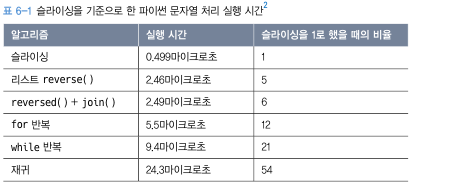

# 2부 파이썬


## 6장 문자열 조작


### 01. 유효한 팰린드롬

#### LeetCode) 125.valid Palindrome 

https://leetcode.com/problems/valid-palindrome/

- `str` 내의 요소를 하나하나 비교하기 위해서는 `deque` 구조가 빠름
- `re` 모듈 사용


**MY ANSWER (80 ms, 15.9 MB -> 70 MS, 15.7 MB)**

```python
class Solution:
    def isPalindrome(self, s: str) -> bool:
        strings = list('abcdefghijklmnopqrstuvwxyz0123456789')
        
        s_alphabet = [ i for i in s.lower() if i in strings ] 
        s_alphabet_r = s_alphabet.copy()
        s_alphabet_r.reverse()

        if s_alphabet == s_alphabet_r :
            return True
        else :
            return False
```


**RIGHT ANSWER**

**1. 리스트로 변환 (284 ms, 19.5 MB)**

```python
# list.isalnum(), list.pop() 사용
class Solution:
    def isPalindrome(self, s: str) -> bool:
        strs = []
        for char in s :
            if char.isalnum():
                strs.append(char.lower())

        while len(strs) > 1 :
            if strs.pop(0) != strs.pop():
                return False

        return True
```


**2. 데크 자료형을 이용한 최적화 (74 ms, 19.3 MB)**

```python
class Solution:
    def isPalindrome(self, s: str) -> bool:        
        #자료형 데크 선언
        strs : Deque = collections.deque()

        for char in s:
            if char.isalnum():
                strs.append(char.lower())

        while len(strs) > 1:
            if strs.popleft() != strs.pop()
                return False

        return True
```


**3. 슬라이싱 사용 (41 ms, 15.5 MB)**

```python
# re 모듈, 슬라이싱 사용.
class Solution:
    def isPalindrome(self, s: str) -> bool:
        s = s.lower()
        # 정규식으로 불필요한 문자 필터링
        s = re.sub('[^a-z0-9]','', s)
        
        return s == s[::-1] # 슬라이싱
```


**문자열 슬라이싱**

- 문자열을 별도로 리스트로 매핑하는 등의 처리는 상당한 연산 비용이 필요해 속도적으로 피해를 볼 수 있음.
- 내부적으로 매우 빠르게 작동하는 특징. 대부분의 문자열 작업은 슬라이싱으로 처리하는 편이 가장 빠름.



```python
S = '안녕하세요'

# `:`옆의 두 인덱스를 생략하면 사본을 리턴한다. 참조가 아닌 값을 복사하기 위해 [:]를 사용할 수 있다.
S[:] == '안녕하세요' 
```


### 03. 로그파일 재정렬

#### LeetCode) 937. Reorder Data in Log Files

https://leetcode.com/problems/reorder-data-in-log-files/submissions/

- `list.sort()` : key에 lambda 식을 적용하여 list 내의 element를 불러오고, 정렬 기준을 복수로 사용할 수 있음.

**RIGHT ANSWER (40 ms, 14.3 MB)**

```python
class Solution:
    def reorderLogFiles(self, logs: List[str]) -> List[str]:
        
        letters = []
        digits = []

        for log in logs :

            if log.split()[1].isalpha():
                letters.append(log)
            else :
                digits.append(log)


        letters.sort(key=lambda x : (x.split()[1:], x.split()[0]))

        return letters + digits
```


### 04. 가장 흔한 단어

#### LeetCode) 819. Most Common Word

https://leetcode.com/problems/most-common-word/

- 정규식과 list comprehension을 잘 사용하자.

**MY ANSWER (36 ms, 14.3 MB)**

```python
class Solution:
    def mostCommonWord(self, paragraph: str, banned: List[str]) -> str:

        s = re.sub('[^a-zA-Z ]', ' ',paragraph).lower()
        s = s.split()

        maxnum = -999
        maxstr = ''
        
        for i,j in collections.Counter(s).most_common():

            if i in banned:
                continue
            elif maxnum < j :
                maxnum = j
                maxstr = i

        return maxstr
```

**RIGHT ANSWER (32 ms, 14.5 MB)**

```python
class Solution:
    def mostCommonWord(self, paragraph: str, banned: List[str]) -> str:
        words = [word for word in re.sub(r'[^\w]', ' ', paragraph)
                .lower().split()
                if word not in banned]
        counts = collections.Counter(words)
        
        return counts.most_common(1)[0][0]
```


### 05. 그룹 애너그램

#### LeetCode) 49. Group Anagrams

https://leetcode.com/problems/group-anagrams/

- `list.sort(key=)` : `key`를 `lambda` 식과 함께 사용하여 기준을 2개로 정렬할 수 있으며 `len()`으로도 정렬을 시킬 수 있다.
- `''.join(list)` 로 `str`과 `list`의 전환을 오갈 수 있음.

**MY ANSWER (100 ms, 17.4 MB)**

```python
class Solution:
    def groupAnagrams(self, strs: List[str]) -> List[List[str]]:
        
        dic = collections.defaultdict(list)
        for s in strs:
            dic[''.join(sorted(s))].append(s)

        return sorted(list(dic.values()))
```

**RIGHT ANSWER (32 ms, 14.5 MB)**

```python
class Solution:
    def mostCommonWord(self, paragraph: str, banned: List[str]) -> str:
        words = [word for word in re.sub(r'[^\w]', ' ', paragraph)
                .lower().split()
                if word not in banned]
        counts = collections.Counter(words)
        
        return counts.most_common(1)[0][0]
```


### 06. 가장 긴 팰린드롬 부분 문자열

#### LeetCode) 5. Longest Palindromic Substring

https://leetcode.com/problems/longest-palindromic-substring/

- 슬라이딩 윈도우에 대해 공부하라.
- `while`문은 `False`가 찍힐때까지 반복한다.

**RIGHT ANSWER (248 ms, 14.4 MB)**

```python
class Solution:
    def longestPalindrome(self, s: str) -> str:
        def expand(left: int, right: int) -> str:
            while left >= 0 and right < len(s) and s[left] == s[right]:
                left -= 1
                right += 1
            return s[left + 1:right]

        # 해당 사항이 없을때 빠르게 리턴
        if len(s) < 2 or s == s[::-1]:
            return s

        result = ''
        # 슬라이딩 윈도우 우측으로 이동
        for i in range(len(s) - 1):
            result = max(result,
                         expand(i, i + 1),
                         expand(i, i + 2),
                         key=len)
        return result

```
