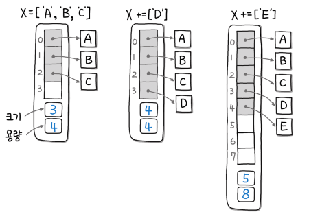

# 3부 선형 자료구조


## 7장 배열

- 배열 : 값 또는 변수 엘리먼트의 집합으로 구성된 구조로, 하나 이상의 인덱스 또는 키로 식별된다. 고정된 크기만큼의 연속된 메모리 할당.
- 자료구조 
  - 메모리 공간 기반 연속(Contiguous)방식 : 스택, 큐 등 추상 자료형(Abstract Data Type, ADT)의 대부분은 배열 또는 연결리스트를 기반으로 함. 
  - 포인터 기반 연결(Link)방식

- 동적 배열 : 자바의 `ArrayList`, C++의 `std:vector`를 예시로 미리 크기를 지정하지 않고 자동으로 리사이징하는 배열 방식. 미리 초깃값을 잡아 배열을 생성하고 데이터가 추가될 때 메모리가 더 필요하게 되면 이를 늘려주고 복사한다(ex. Doubling). 




### 07. 두 수의 합

#### LeetCode) 1. Two Sum

https://leetcode.com/problems/two-sum/


**MY ANSWER (842 ms, 14.9 MB)** 

- in을 이용한 탐색 : 시간복잡도 $O(n^2)$

```python
class Solution:
    def twoSum(self, nums: List[int], target: int) -> List[int]:
        if len(nums) == 2 :
            return [0,1]

        for i, num in enumerate(nums):            
            abs_ = target-num
            if abs_ in nums[i+1:] :
                
                return [i, nums.index(abs_,i+1)]
```


**RIGHT ANSWER **

- 첫번쨰 결과를 뺸 결과 키 조회 : 60ms, 15.5MB. 시간복잡도 1, 최악의 경우 n

```python
class Solution:
    def twoSum(self, nums: List[int], target: int) -> List[int]:
        nums_map={}
        
        for i, num in enumerate(nums):
            if target - num in nums_map and i != nums_map[target-num]:
                return [i, nums_map[target-num]]
            nums_map[num]=i
```

- 투 포인터 이용 : 만약 인덱스 반환이 아니라면 사용이 가능하다.

~~~python
class Solution:
    def twoSum(self, nums, target) :
        nums.sort()
        left, right = 0, len(nums)-1
        
        while not left == right : 
            if nums[left] + nums[right] < target:
                left += 1
            elif nums[left] + nums[right] > target:
                right -= 1
            else :
                return [left, right]
~~~


### 07. 빗물 트래핑

#### 42) Trapping Rain Water

https://leetcode.com/problems/two-sum/

**RIGHT ANSWER **

- 투 포인터를 사용해 탐색. (76 ms, 15.9 MB) $O(n)$으로 풀이가 가능.

```python
class Solution:
    def trap(self, height: List[int]) -> int:
        if not height :
            return 0
        
        volume = 0 
        left, right = 0, len(height)-1
        
        left_max, right_max = height[left], height[right]
        
        while left < right:
            left_max, right_max = max(height[left], left_max), max(height[right], right_max)
            
            # 더 높은 쪽을 향해 투 포인터 이동
            if left_max < right_max:
                volume += left_max - height[left]
                left += 1
                
            else :
                volume += right_max - height[right]
                right -= 1
        
        return volume
```

- 스택 쌓기를 활용해 문제를 풀이. (96 ms, 15.9 MB) 투 포인터와 마찬가지로  $O(n)$으로 풀이가 가능.

```python
class Solution:
    def trap(self, height: List[int]) -> int:
        stack = []
        volume = 0
        
        for i in range(len(height)):
            # 변곡점을 만나는 경우
            while stack and height[i] > height[stack[-1]]:
                # 스택에서 꺼낸다
                top = stack.pop()
                
                if not len(stack):
                    break
                
                # 이ㅈ과의 차이만큼 물 높이 처리
                distance = i - stack[-1] - 1
                waters = min(height[i], height[stack[-1]]) - height[top]
                
                volume += distance * waters
                
            stack.append(i)
        return volume
```

