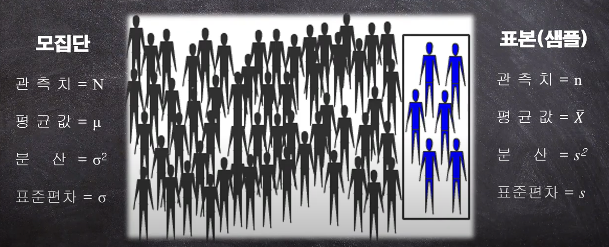
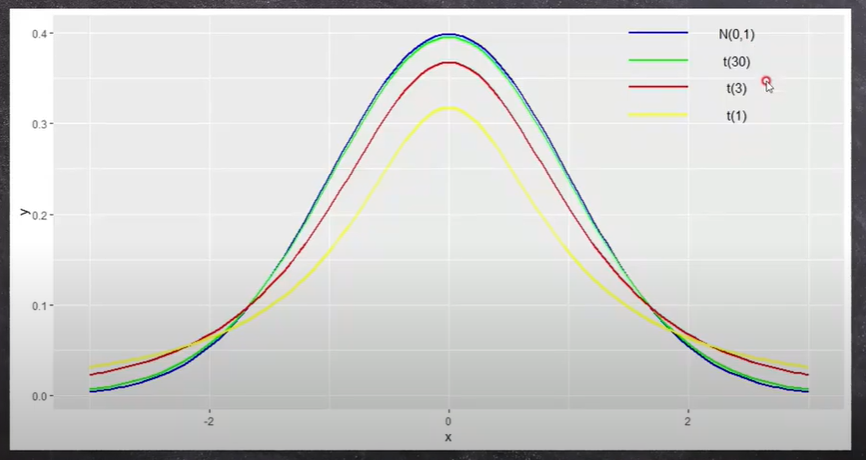
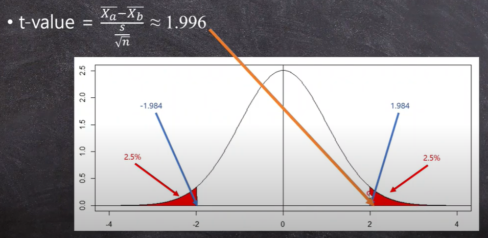

## 1. t-test 란?

- 모집단의 표준편차가 알려지지 않았을 때, 정규분포의 모집단에서 모은 샘플(표본)의 평균값에 대한 가설검정 방법.

- 두 개의 집단(표본, Sample)이 같은지 다른지 비교하기 위해 사용. ( 평균값을 비교 )

  

- **예시 > **
  A 대학과 B 대학의 학생들 중 누가 더 키가 큰지 판별하려 한다. A 대학의 평균은 178.5cm, B 대학의 평균은 179.9cm 이다.
  - A와 B의 평균키가 우연히 같은 확률은 얼마? ( 1.4cm 차이가 우연히 발생했을 확률은 얼마? 유의한가, 유의하지 않은가)
  - 표준편차 : 평균값을 중심으로 편차치만큼 데이터가 퍼짐. 말인 즉슨 평균을 기준으로 랜덤하게 분산돼 있다.
  - 1.4cm(두 집단의 평균적인 거리 = 퍼져있는 정도로 해석) -> 표준편차와 비교해 유의성을 따짐.

## 2. z-test

$$
Z-Score =  \frac{(X - \mu)}{\sigma}
$$

1. z-socre 값으로 하는 테스트를 z-test라 하며, z-score로 변환하는 것을 z-transformation 혹은 표준화(standardization) 라고 한다.
1. 표준편차당 관찰값(X)이  평균으로부터 얼마나 떨어져 있는지를 의미한다.
1. standardization을 위해서 정규분포를 따른다는 가정이 있어야 한다.

## 3. t-test 검정

아래와 같은 통계적 가설인 귀무가설과 대립가설을 검정해야 한다.
$$
H_o : \overline{X_a} = \overline{X_b} \\
H_a : \overline{X_a} \neq \overline{X_b}
$$

### 3.1 양측검정(two-tails)과 단측검정(one-tail)

- 양측검정과 단측검정을 사용해야 하는 경우는 따로 정해진게 없다. 사용자가 가설을 세우고 사용해야 한다.

  - 양측검정, 단측검정의 귀무가설과 대립가설

  $$
  <양측검정>\\
  H_0 : D_{a-b} = 0 \\
  H_a : D_{a-b} > 0 \ or \ D_{a-b} <0
  \\ \\
  <단측검정>\\
  H_0 : D_{a-b} = 0 \\
  우측 : H_a : D_{a-b} > 0 \\ 
  좌측 : H_a : D_{a-b} <0
  $$

  -  양측검정은 양 끝의 2.5%씩 5%안에 1.4cm이 속하는지 확인하며 단측검정은 한쪽에서 5%안에 1.4cm 속하는지 확인하게 된다.

### 3.2  t-test를 위한 t-value와  t-distribution

$$
t-value = \frac {\overline{X_a} -\overline{X_b}}{s/\sqrt{n}}
$$

- t-test는 두 집단의 평균값의 차이를 표준편차와 비교하는 것이기 때문에 수식의 분모에서 표준편차와 표본의 크기가 사용된다.
  푸른선( N(0,1) )은 표준편차이며 t(n)은 자유도에 따른 t-distribution이다. 자유도(degree of freedom, df)이 커질수록 t-distribution은 표준정규분포에 가까워 진다고 볼 수 있다.

- t-test에서 자유도(df)는 n-1로 계산되므로, 표본의 크기가 클수록 자유도가 커지고 t-distribution에서 표준정규분포를 자유롭게(..) 사용할 수 있게 된다.

  

- **예시 >**

  -  표준편차(s)가 7.05cm, 표본의 크기(n)가 101명이면 t-value는 1.996 이다.
  - t-table 을 참고하여 면적을 계산하면 df는 n-1인 100일 때 1.984이다. 이는 critical value(c.t.)라고 부른다.

  

  - t-value가 c.v.보다 크며 두 평균의 차이인 1.4cm는 우연히 발생했을 확률은 5%(p-value)보다 작으므로 이 차이는 통계적으로 유의하다.
    A대학과 B대학의 차이는 유의하며(우연히 발생했을 확률이 5%보다 적으며), 두 대학의 키가 다른 원인이 있다고 볼 수 있다.**유의하다 로 결론을 맺으면 안되는 것을 주의!!**

## 4. t-test의 종류

### 4.1 One-sample t-test

$$
H_o : \overline{X} = \mu \quad\to\quad \overline{X} - \mu = 0 \\
H_a : \overline{X} \neq \mu \quad\to\quad \overline{X} - \mu > 0 \quad or \quad \overline{X} - \mu > 0
$$

- 한 집단의 평균값이 내가 생각한 수치와 같은지 혹은 다른지 테스트를 하는 과정.
- **예시 > ** X대학생들의 키가 178.5일 때 대한민국 대학생들의 평균 키 180cm와 같은가?

$$
t-value = \frac {\overline{X_a} -\overline{X_b}}{s/\sqrt{n}} \quad (df=n-1)
$$

### 4.2 Paired t-test

$$
H_o : \overline{X_{before}} = \overline{X_{after}} \quad\to\quad D_{before-after} = 0 \\
H_a : \overline{X_{before}} \neq \overline{X_{after}} \quad\to\quad D_{before-after} > 0 \quad or \quad D_{before-after} < 0
$$

- **예시 >** 교보재를 보기 전 시험점수는 76.4점이고 교보재를 본 후 시험점수는 84.1점이다. 이 때 교보재의 영향이 있는가 없는가?
- 같은 샘플을 사용하기 때문에 paired t-test라 부른다. 이 때에 공식은 아래와 같다. ( 사실 two-sample t-test의 공식이 아래와 같다. )

$$
t-value = \frac {\overline{X_{before}} -\overline{X_{after}}}{s/\sqrt{n}} \quad (df=n-1)
$$

### 4.3 Two-sample t-test

- 두 표본의 평균을 비교하는 t-test. 사실 계산 공식은 **3.2**의 예시와 달리 아래와 같다.

$$
t-value = \frac{\overline{X_a} - \overline{X_b}}{\sqrt{s^2/n_a + s^2/n_b}} \\
s^2 = \frac{\Sigma(x_a-\overline{X_a})^2 + \Sigma(x_b-\overline{X_b})^2}{n_a+n_b-2} \quad (df=n_a+n_b-2, \  \sigma_a =\Sigma(x_a-\overline{X_a}))
$$

---

**참조**

https://www.youtube.com/channel/UCnN2E8RCEuKi-WLBrd0Nu1A

​	
