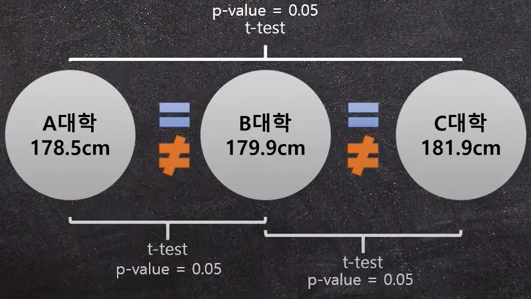
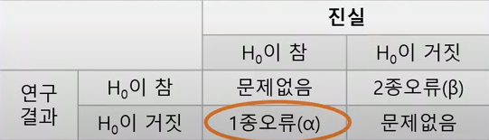
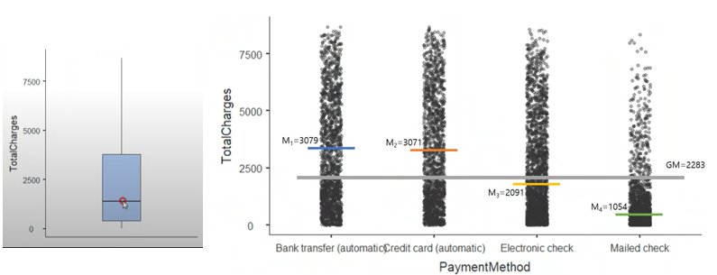
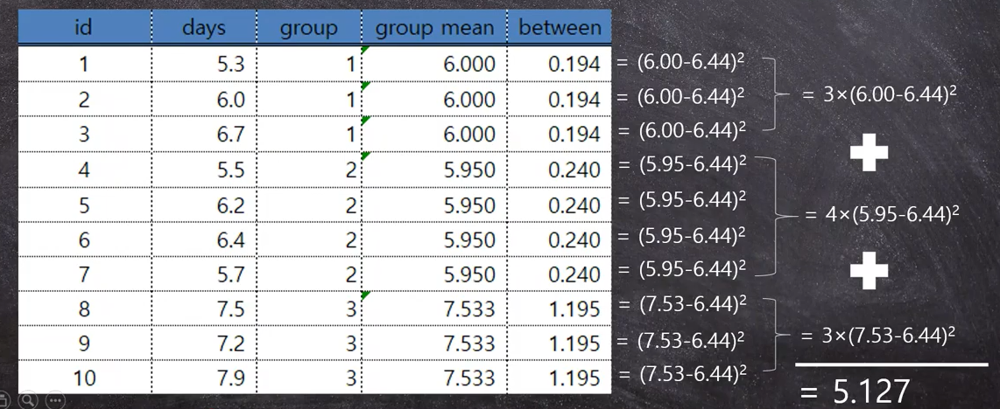
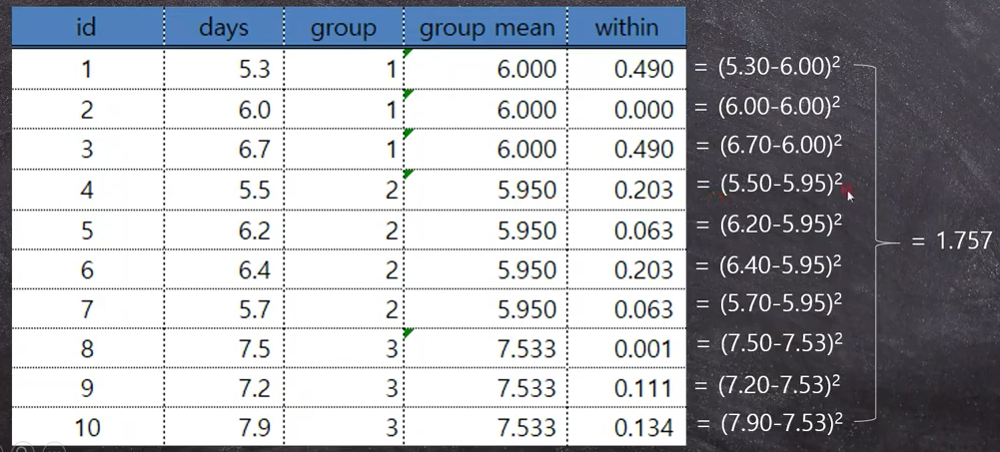
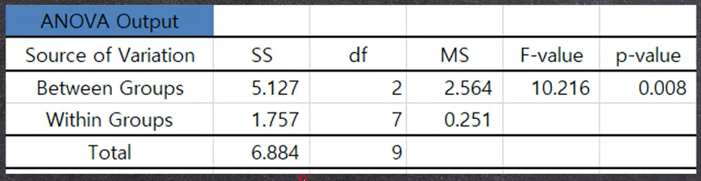

## 1. One-way ANOVA를 사용할 때?

​	세 대학의 평균 키의 차이를 비교할 때 각 그룹간의 t-test를 하는 Multiple t-test를 사용하면 1종 오류(유의하지 않을 때 유의하다 판단)에 해당하고 만다. 3번 t-test를 적용할 때 각각에 적용되는 0.05의 p-value가 영향을 미쳐 약 0.15가 적용되는 1종오류가 발생하게 되는 것.

​	이 떄 사용하는 통계법이 One-way ANOVA(Analysis of Variance)이다. 여기서 One-way는 독립변수가 하나라는 의미.

**변수**

1. 독립변수(Indipendent variable) : 
   논리적인 관계에서의 독립을 의미. 다른말로 결과에 대한 예측변수(predictor variable), 설명변수(explanatory variable)라고 한다. 인과관계에 대해 조사,연구하게 되는데 이 인과관계의 원인에 해당하는게 독립변수이다.
2. 종속변수(Dependent variable) : 
   논리적인 인과관계에 있어 종속을 의미. 다른말로 반응변수(response variable), 결과변수(outcome variable)라고 한다.
3. 통제변수(Control variavle) : 
   기본적으로는 독립변수와 동일하나 연구, 조사의 주 관심사에 벗어난 변수이다. 통제변수를 감안하지 않을 경우 모델의 중요변수가 누락됐다는 Model Misspecification이 발생한다.

## 2. ANOVA와 변수

- 종속변수 : 연속형(Continuous) 변수만 가능
- 독립변수 : 이산형, 범주형(Discrete, Categorical) 변수만 가능 

​	**예시> **

​	영상물의 폭령성이 어린아이에게 미치는 영향에 대한 연구 중 각기 다른 세 영상물을 시청한 아이들 그룹의 폭력적인 행동을 점수화 해 조사하였음. 이 때 종속변수는 아이들의 폭령행동 점수(연속형), 독립변수는 영상의 종류(1 column, 3 level)다.

$$
Y_{ij} = \mu + \tau_j + e_{ij} \\ Y_{ij} - \mu = \tau_j + e_{ij}
$$

- $\mu$ : 평균으로 종속변수의 값이 100% 독립변수의 영향이라고 볼 수 없기 때문에 사용된다. 사과 출하량에서 어떤 변인을 제거해도 사과의 출하량이 평균값 정도는 유지되고 0이 되지 않는다.
- $\tau_j$ : 독립변수로 j는 그룹(level, j= 1, 2, 3, 4 ...)을 의미한다.
- $Y_{ij}$ : 종속변수로 연속형 변수여야 한다. j는 그룹, i는 그 그룹 내의 ID(row)이다.
- $e_{ij}$ : 오차. i, j는 마찬가지로 그룹과 그룹 내의 ID를 의미한다.

## 3. F-value

$$
\sigma^2 = \frac{\sum_{i=1}^{n}{(x_i-\overline{x})^2}}{n-1}
$$

​	F 값이란 두개의 분산 비율로 이를 구하기 위해서는 두개의 평균이 필요하다. 과연 어떤 평균이 필요한가?

**예시>**

​	어떤 ISP(Internet Service Provieder)는 고객의 총 지출금액이 지불방법에 따라 차이가 나는지 알고 싶다. 종속변수는 총 지출금액(Total Charges), 독립변수는 지불방법(Payment Method)로 Bank Transfer, Credit Card, Electronic Check, Mailed Check 4가지 level이 있다.

- Between Variance : GM(그룹전체평균)으로부터 각 그룹의 평균 사이의 분산. BV가 클 경우 전체 평균으로부터 각 그룹의 평균값이 멀리 떨어져 있으며, 적어도 한 그룹은 다른 그룹과 평균이 다를 수 있다는 의미다.

- Within Variance : 각 그룹 내의 분산을 모두 합친 값. t-test에서 t-value 계산시의 분모의 표준편차와 같이 random한 변화의 정도이다. 다시말해 유의함을 따지기 위한 비교 대상이며 BV가 WV보다 충분히 커야 유의미하다 판단하고 각 그룹의 평균이 다르다 볼 수 있다.

- F-value : 
  $$
  F-value = \frac{BetweenVariance}{WithinVariance} = \frac{MS_{Treatment}}{MS_{Error}} = \frac{MS_{Between}}{MS_{Within}}
  $$

  MS는 Mean Squared, Treatment는 변화를 준 부분, Error는 랜덤함을 뜻한다. Betwwen Variance와 Within Variance를 비교해 비율로 나타낸 값이 F-value며 유의하기 위해서는 random한 변동값인 Within Variance보다 Between Variance가 훨씬 커야 한다.

## 4. One-way ANOVA 계산

$$
H_0 : \mu_1 = \mu_1 = \cdots = \mu_k \\
H_a : \mu_i \not= \mu_j \ for \ some \ i,j
$$

​	만약 F값이 충분히 커서 유의 하다면(p-value < 0.05) Between Variance가 충분히 크다는 의미지만 구체적으로는 알지 못하기 때문에 위와 같이 표현한다 (k는 그룹의 개수). One-way ANOVA의 계산을 위해 다음의 예시를 들어보자.

**예시>**

​	감기약의 효과를 측정하기 위해 감기약 A,B 그리고 플라시보를 독립변수로 하고 10명의 대상자를 세 개의 그룹으로 나누어 감기가 낫는데까지 걸린 날짜를 측정해 종속변수로 한다.

- Between Variance : 분산의 공식에 그대로 적용이 가능. 전체 평균과 각 그룹평균의 차의 제곱을 더해준다. 각 그룹의 평균차에 ID 개수만큼 곱해 더해주면 된다. 그리고 자유도를 나누어주는데, 이 때 자유도 df1은 k-1이다. 그룹이 두개이기 때문에 자유도도 둘이라 할 수 있다.
  

- Within Variance : 그룹내의 분산을 구한 뒤 모두 합친 후 자유도로 나누어준다. 이 떄 자유도 df2는 n-k로 7이다. df1과 df2를 합하면 n-1이 된다.
  

- 통계프로그램 결과 : 계산된 F-value로 p-value를 계산한 뒤 결과로 유의성을 판별한다. 아래 예시는 0.008로 0.05보다 작아 유의하다는 것으로 판단할 수 있다. p-value는 F-distribution에서의 확률밀도함수에서 계산이 가능하다.
  

​		

## 5. ANOVA의 F-table과 사후검정

​	위의 표는 F-Table로 열 방향이 df1의 자유도, 행 방향이 df2의 자유도이다. 이 테이블은 p-value마다 다르며 위 테이블은 0.05에서의 테이블이다. 전의 예시에서 c.v.(critical value)가 4.74이며 p-value는 0.05보다 작으므로 유의하다. 이 c.v.를 F-Distribution에서의 확률밀도를 구해보면 0.05보다 작은 것을 알 수 있다. F-Distribution 또한 df1, df2마다 다르다.

## 6. JAMOVI

$$
\eta^2 = \frac{SS_{Between}}{SS_{Between}+SS_{Within}} = \frac{SS_{Between}}{SS_{Total}}
$$

$\eta^2$ : 전체 분산 중의 독립변수의 비중. 종속변수가 가진 분산을 독립변수가 설명할 수 있는 정도를 나타냄.

**참조 : 아래의 영상을 바탕으로 작성되었음.**

https://youtu.be /HlSyvMRLu4w

