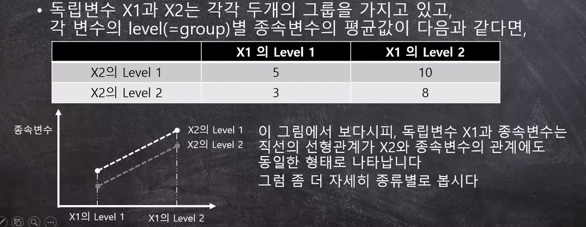
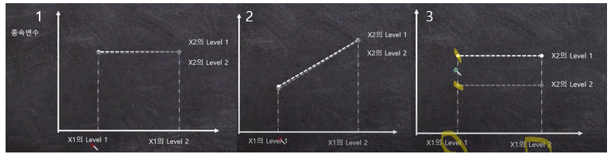
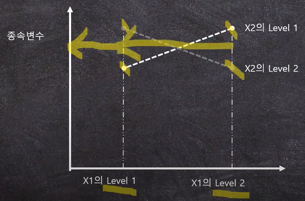
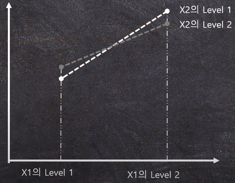

## 1. Two-way ANOVA란

- 독립변수가 2개 $+\alpha$인 ANOVA를 Two-way ANOVA라 한다. 즉 이 경우 Main effect(주효과)가 2개인데 Main effect라 함은 각 독립변수에 따른 종속변수의 변화를 의미한다. 
- $\alpha$는 interaction(상호작용, 교호작용)으로 한 독립변수의 main effect가 다른 독립변수의 level에 따라 linear relationship이 non-linear하게 변하는 경우를 말한다.
- Two-way ANOVA에서는 각 변수에 대한 F-value, 그리고 interaction에 대한 F-value까지 총 3개의 F-value가 필요하게 된다.

### 1.1 Interaction (상호작용, 교호작용)

​	Interaction이란 한 독립변수의 종속변수에 대한 영향관계가 다른 독립변수의 level(group)에 따라 변할 경우 이를 interaction effect가 있다고 한다. 이러한 두 변수를 이용해 다양한 결과를 예측할 수 있게되어 종속변수의 변화에 대한 원인을 판단할 수 있는 중요한 도구로 사용할 수 있다.

**예시>**

- 각 통계기법에서는 종속변수와 독립변수를 선형관계로 가정함. 
- 독립변수 X1과 X2의 종류에 따른 종속변수의 평균값을 위 표와 나타냈을 때, X2의 레벨에 따른 X1에서의 종속변수와 관계는 동일하게 선형으로 나타난다. X1, X2의 main effect는 존재하지만 Interaction effect는 없다. 

- 각 경우들은 level에 따른 평균의 차이로 main effect의 유무를 판별한다.
- 1의 경우에는 X1, X2의 main effect가 없으며 Interaction effect도 없다.
- 2의 경우X1의 main effect는 유의하며 X2의 main effect는 없고 Interaction effect도 없다.
- 3의 경우 X1의 main effect는 없고 X2의 main effect는 있으며 Interaction effect는 없다

- 마지막 이 경우에는 X1의 level1과 level2의 평균이 동일, X2의 level1과 2의 평균이 동일한 것으로 양측의 main effect는 없다.
- 하지만 X1에서 각 그룹의 평균값에 따른 선을 그어보면 수평선이 그려지는데, X2의 level1에 의해 양의 상관관계가, level2에 의해 음의 상관관계가 나타난다. 반대로 X2에서는 main effect가 없지만 X1의 level에 따라 main effect가 보여 Interaction effect가 있는 것으로 볼 수 있다. 

- 이 경우에서는 X1의 main effect는 존재, X2의 main effect는 없다. 그리고 X1의 level에 따라 X1의 level1에서는 X2의 level2가 level1보다 더 높고 반대로 X1의 level2에서는 X2의 level1이 level2보다 더 큰 걸 보이며 Interaction effect가 있는 것으로 보인다.

## 2. Two-way ANOVA의 계산

$$
F-value_{main\ effect1} = \frac{BetweenVariacne_{main\ effect1}}{WithinVariance}= \frac{\frac{SS_{main\ effect1}}{df_1of main\ effect1}}{\frac{SS_{within}}{df_2of\ within\ variance}}\\
F-value_{main\ effect2} = \frac{BetweenVariacne_{main\ effect2}}{WithinVariance}= \frac{\frac{SS_{main\ effect2}}{df_1of main\ effect2}}{\frac{SS_{within}}{df_2of\ within\ variance}}\\
F-value_{interaction\ effect} = \frac{BetweenVariacne_{interaction\ effect}}{WithinVariance}= \frac{\frac{SS_{interaction\ effect}}{df_1of interaction\ effect}}{\frac{SS_{within}}{df_2of\ within\ variance}}\\
$$

- Two-way ANOVA의 계산을 위헤서는 2개의 main effect, 그리고 interaction effect에 대한 between variance와 within variance 4가지가 필요하다
- 통계적 가설은 effect의 개수에 따라 아래와 같은 3개의 식이 필요하다. 두 main effect의 통계적 가설은 One-way ANOVA와 같이 각 그룹의 평균에 대한 가설이며 interaction에 관해서는 존재여부에 대한 가설을 세운다.
- 각 통계적 가설에 대해 유의하다는 판별이 되면, main effect에 대해서는 사후검정을 실행한다. 하지만 interaction은 과정이 매우 복잡하여 그래프로 나타내는 방법이 더욱 편리하다.

$$
H_{01} : \mu_{11} = \mu_{11} = \cdots = \mu_{1k} \\
H_{a1} : \mu_{1i} \not= \mu_{1j} \ for \ some \ i,j\\ 
\\
H_{02} : \mu_{21} = \mu_{21} = \cdots = \mu_{2k} \\
H_{a2} : \mu_{2i} \not= \mu_{2j} \ for \ some \ i,j\\ 
\\
H_{03} : The\ \ interaction\ \ effect\ \ does\ \ not\ \ exist\\
H_{a3} : The\ \ interaction\ \ effect\ \ exists\\
$$

**참조 : 아래의 영상을 바탕으로 작성되었음.**

https://youtu.be/Z-wrgf7QfCM

