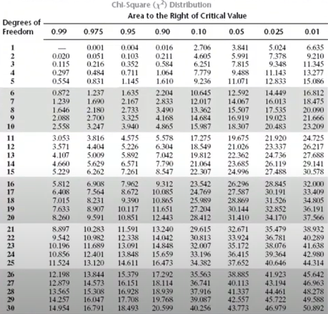
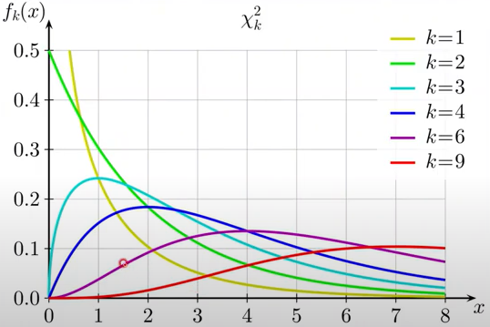
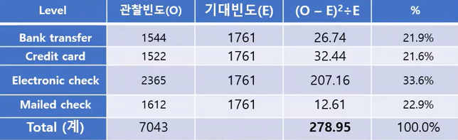
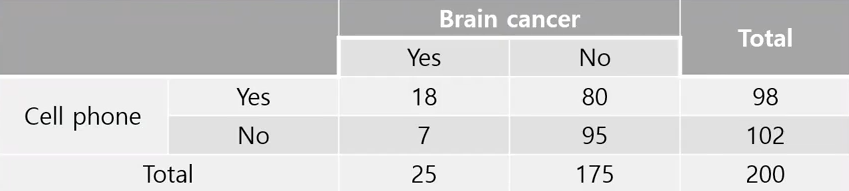
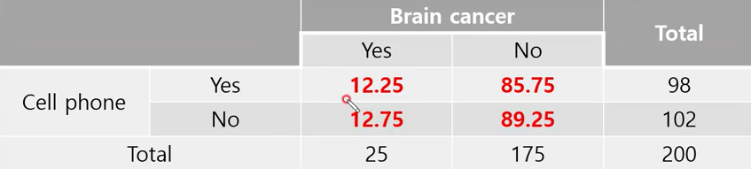
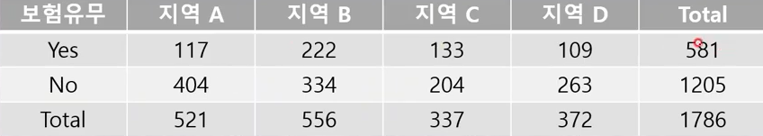
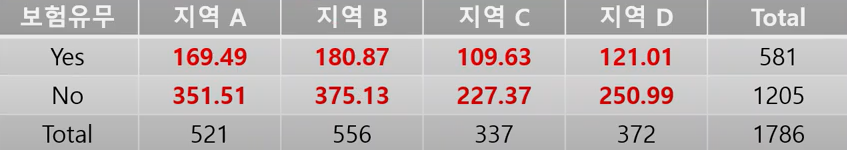

## 1. 카이제곱검정

- ANOVA는 종속변수는 정량적 데이터, 독립변수는 정성적 데이터(categorical variable)이다. 종속변수와 독립변수 둘 다 명목척도(Qualtitative variable)일 때  t-test와 ANOVA 모두 사용할 수 없다. 
- 이 상황에 사용하는 것이 교차분석으로 chi-square test라고 한다. chi-square value와 chi-suqare distribution을 통해 분석을 진행한다.
  - 변수가 하나인 경우 : 변수 내의 그룹간 비율(proportion)을 비교한다. 그룹이 2개인 경우 Binomial test, 그 이상인 경우 카이제곱 검정을 수행한다.
  - 변수가 두개 이상인 경우 : 변수 사이의 연관성(assocication)을 파악한다. ex)  휴대폰 사용과 뇌암, 인종과 특정 질병 등

$$
\chi^2 = \sum\frac{(O-E)^2}{E}, \ df=n_{group}-1
$$

- O는 관찰 빈도(Observed frequency), E는 기대 빈도(Expected frequency)로 관찰 빈도는 데이터 내에서 주어지는 반면 기대 빈도는 계산을 해야한다.

## 2. 일원 카이제곱 검정 (One-way $\chi^2$ test)

- One-way ANOVA와 같이 변수가 한 개일 때 수행한다. 명목척도(Qualitative variable)을 변수로 2개 이상의 그룹(category)을 가져야 한다.
- 카이검정제곱에서 유의성이 의미하는 것은 기대빈도에 대한 것으로 기존 연구 혹은 이론에서 그룹의 빈도가 다를 수 있으면 기대 빈도를 수정해 검정을 진행할 수 있다. 때문에 카이제곱 검정을 적합도(goodness of fit)이라 부른다.

**예제>**

​	Payment method라는 변수는 Bank transfer, Credit card, Electronic check, Mailed check의 4개의 그룹으로 구성되어 있다. 이 지불방법의 차이를 알고싶을 때, 즉 그룹간 고객의 수가 비슷할 것으로 가정하여 검정을 진행한다.

- 카이제곱검정에서의 대립가설과 귀무가설은 아래와 같다.

$$
H_0 = P(BankTransfer) = P(CreditCard) = P(ElectronicCheck) = P(MailedCheck) = 0.25\\
H_a = Proportion\ of\ 4\ categories\ are\ not\ even
$$

1. 관찰 빈도를 데이터로부터 확인한다.
2. 기대빈도를 구한 후 $\chi^2$를 구한다. (278.95)
3. 자유도를 구한 뒤 chi-square distribution에서 p-value를 확인한다. 예제에서는 <0.001 이다.

## 3. 이원 카이제곱 검정 (Two-way $\chi^2$ test)

- 이원 카이제곱 검정에서는 독립 변수가 두개 이상이므로 가장 단순한 형태는 두 독립 변수의 각 그룹인 2x2 분석이 된다. 
- 분석을 위해 표에 데이터의 빈도를 작성한 것인 분할표(contingency table)를 사용한다 . 두개의 변수를 row, column으로 나누어 빈도를 정리한다. 분할표를 통해 행과 열 사이(두 독립변수 사이) 연관성을 확인한다.

$$
\chi^2 = \sum\frac{(O-E)^2}{E}, \ df=n_{group}-1 \\ 
E = \frac{RowTotal\times ColumnTotal }{GrandTotal}
$$

**예제>**

​	휴대폰과 Brain cancer간의 연관성을 조사하기 위해 200명의 암환자를 임의 추출하여 두가지를 조사하였다. 진단된 암이 Brain cancer인지, 암을 진단받았을 때 휴대폰을 사용한 기간이 3년 이상인지의 유무를 조사하였다.

1. Brain cancer와 휴대폰 사이 분할표에서 계산한 결과 P(CP|BC) = 18/25 = 0.72 , P(CP|NBC) = 80/175 = 0.46으로 차이점이 구분되어 보임.

   - 귀무가설 $H_0$ = Brain cancer와 Cell phone 사이의 연관성은 없다. (상호 독립이다.)
   - 대립가설 $H_a$ = Brain cancer와 Cell phone 사이의 연관성은 있다.

   

2. 기대 빈도(E)를 계산한 표는 위와 같으며 이를 바탕으로 가이제곱을 계산할 때 6.048, p-value가 0.014이다. df는(2-1)X(2-1) = 1. 이를 통해 봤을 때 Brain cnacer와 Cell phone사이에 연관성이 있는 것으로 보인다. (인과관계가 있다는 뜻은 아니다.)
   $$
   \chi^2 = \frac{(18-12.25)^2}{12.25} + \frac{(7-12.75)^2}{12.75} +
   \frac{(80-85.75)^2}{85.75} + \frac{(95-89.25)^2}{89.25} = 6.048
   $$

**예제>**

​	지진 보험은 지역에 따라 편차가 클 가능성이 클 것으로 판단해 지진 보험 가입 유무를 지역별로 조사하여 이원 카이제곱 검정을 수행했다.
$$
H_0 = P(YES | A) = P(YES|B) = P(YES|C) = P(YES|D)\\
\qquad P(NO | A) = P(NO|B) = P(NO|C) = P(NO|D)\\
H_a = The\ probability\ not\ equal\ from\ region\ to\ region.
$$
 

1. $\chi^2$ = 47.105, df = (4-1)X(2-1) = 3 이며 p-value <0.05의 결과나 나왔다.
2. 지진보험의 유무와 거주 지역은 통계적 연관성이 있다. 하지만 범주 간의 확률의 차이가 얼마나 큰지 알 수 없으며 이를 위해 CI(Confidence interval, 신뢰구간)을 사용해야 한다.

## 4. 한계점 및 전제조건, 기타사항

#### 4.1 한계점 및 전제조건

1. 랜덤 샘플링 및 독립성을 전제해야 한다.
   - 각 범주가 서로 배타적이어야 함.
   - 한 대상이 하나 이상의 범주에 들어갈 수 있음
2. 각 셀의 기대빈도가 5 이상이어야 함.
   - 기대빈도를 5 이상으로 맞추기 위해 경우에 따라 범주를 합쳐야 한다.
   - 불가능할 경우 Fisher's exact test(피셔의 정확검정) 혹은 likelihood ratio test(G-test)를 해야 한다.
3.  만약 df가 1일 때 (범주가 2개이거나 이원 카이제곱 검정에서 2x2인 경우) 비연속성의 조건부 확률을 연속성의 카이제곱 분포에 적용함으로 문제가 발생하게 된다. 연속성을 위해서는 df가 높아야 함. 
   - 일원 카이제곱 검정 : 연속성 보정을 하는 Yate's correction 혹은 chi-squre continuity correction을 사용해야 한다.
   - 이원 카이제곱 검정(2x2) : 카이제곱 검정 결과와 Yate's correction의 결과가 다를 때 Fisher's exact test를 사용한다.

#### 4.2이원 카이제곱 검정 (2X2)의 경우

- 상대 위험도(relative rist) : 의학계열에서 주로 사용

  - 상대 위험도는 두 확률의 차이인 $P_1 - P_2$ 가 아니라 $P_1 \div P_2$로 나타낸다.
  - 상대 위험도가 1일 경우 두 사건은 발생확률이 동일하며 1보다 클 경우 위험이 증가, 1보다 작을 경우 위험이 감소하는 의미를 갖는다.

  

  - P(BC|CP) = 18/98 = 0.184 , P(BC|NCP) = 7/102 = 0.069 로 상대 위험도는 0.184/0.069인 2.67이다.
  - 휴대폰 사용자가 그렇지 않은 사람에 비해 약 2.67배 BC에 걸릴 확률이 높다.
    

- 교차비/오즈비(Odds ratio)

  - 오즈(odds) : 어떤 사건이 발생하지 않을 확률 대비 발생할 확률. p = 1/2일 때 odds = 1, p가 3/4일때 odds = 3이 된다. 이 사건이 일어나지 않을 확률 대비 일어날 확률이 1배, 3배다 라는 뜻이다.
    $$
    Odds = \frac{p}{1-p}
    $$
    
  - 교차비/오즈비(Odds ratio) : 두 오즈의 비율. 상대 위험도와 다르게 일정한 비율로 계산이 된다.
    $$
    \theta = \frac{\frac{P(A|B)}{1-P(A|B)}}{\frac{P(A|C)}{1-P(A|C)}}
    $$
    위 분할표에서 P(BC|CP) = 0.184 , P(BC|NCP) = 0.069 로 이 둘의 오즈비는 3.04가 된다. 뜻인 즉 BC가 발생할 오즈는 핸드폰 사용자가 그렇지 않은 사람보다 3배가 높다 해석할 수 있다. 이를 P(CP|BC) 와 P(CP|NCP)의 오즈비를 계산했을 때 또한 3.05로 계산되며 3.04과 유사한 것을 알 수 있다.
  
  - 이를 쉽게 계산하려면 (18 X 95) / (80 X 7)로 계산이 가능하다.
    
  
- 변수 사이의 상관관계 파악
  - 명목척도의 경우 : Contingency coefficient(분할계수 , C계수), Phi and Cremer's V
  - 순위척도의 경우 : Kendall's tau-b, Gamma

---

**참조**

https://www.youtube.com/channel/UCnN2E8RCEuKi-WLBrd0Nu1A
