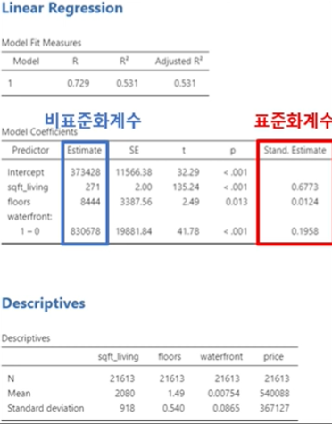

## 1. 회귀분석이란?

- 주어진 독립변수로 종속변수를 예측하기 위해 단순회귀(Simple regression), 다중회귀(Multiple regression)를 사용할 수 있다.
- 회귀 분석에서는 추세선을 계산하는데 이 떄 발생하는 예측값과 측정값(종속변수)의 오차(error)를 가장 적게하는 가장 합리적인 추세선을 찾는다. 이를 최소제곱법이라 한다. 
- 이때 이 추세선은 평균을 지나게 되는데, 회귀분석이라 함은 이 평균으로의 회귀를 의미한다.
- 오차의 제곱합으로 합산을 하게되는데 분산과 유사한 의미를 지니게 된다.

$$
y = a + \beta x
$$

- 독립변수가 하나일 때의 회귀 분석을 OLS(Ordinary Least square)라 한다. a : 절편(constant), b: 기울기(slope) 

- 회귀분석의 해석은 본인의 연구가설을 뒷받침 하기 위한 근거로 사용하여야 한다. 
  ex) 다음과 같이 거실 크기가 1 $feet^2$ 증가할 때 매매가는 281$ 증가한는 것으로 분석결과가 나왔으며 거실의 크기가 클 수록 매매 가격이 비쌀 것이다 라는 연구 가설과 일치한다.
  

## 2. 표준 오차와 t-test

- 최소제곱법으로 오차의 제곱합이 최소가 되는 회귀 방정식을 구했지만 이 계수에 대한 유의성은 판별되지 않았다. 이 때 표준 오차를 유의성 판단에 사용하게 된다.
- 이론적으로 같은 모집단에서 적합한 방법으로 표본을 구해도 표본 집단의 평균은 매번 조금씩 다를 수 밖에 없다. 이 표본 집단의 평균들의 표준 편차를 표준 오차라 한다.
- 표준 오차로 표본 집단이 모집단에 얼마나 가까운지 판단하며 모집단의 평균을  평균의 참 값이라고 할 때 표준 오차가 작으면 참 값에 더 가깝다는 뜻이다. 

- 좌측의 데이터와 우측의 데이터 중 같은 변화율을 가짐에도 우측이 표준 오차가 더 크며 유의성이 떨어지게 된다. p-value는 t-value로 부터 구하는데 이 t-value의 수식은 아래와 같다. 수식에서의 $\beta$는 회귀계수(Estimate)이다.

$$
t-value = \frac{\beta}{SE_\beta} = 2.4/1.9 = 1.26 \\
df = 1
$$

- 회귀분석의 회귀계수와 t-test는 동일한 개념으로 두 집단의 평균값의 차이는 회귀계수(증감율)과 같은 의미이며 0이 되어서는 안된다. 따라서 t-test로 회귀계수의 유의성을 판단할 수 있다. 따라서 위의 산포도에서도 회귀계수는 2.4로 계산이 되었으나 유의하지 않음으로 의미가 없는 회귀분석으로 치부한다.
- 직선관계가 아닌 경우 회귀분석을 하면 잘못된 회귀계수를 얻게 됨으로 유의해야 한다.

## 3. R-square의 해석

### 3.1 R-square의 의미와 계산

- 통계적 기법은 분살을 설명하기 위한 도구들이며 회귀분석 또한 종속변수의 분산을 독립변수로 설명하는 과정이다. 독립변수가 종속변수를 설명하기에 문제가 없다면 남은 오차는 random한 것으로 여긴다.

$$
R^2 = 1 - \frac{SSE}{SST}\\
SST = \sum(y_i - \overline{y_i})^2\\
SSE = \sum(y_i - \hat{y_i})^2
$$

- R-square또한 모델의 분산 설명력으로 볼 수 있으며 종속변수의 전체 분산 대비 독립변수로 설명되는 분산의 비율로 해석이 가능하다. R-square의 계산법은 위의 수식과 같으며 0-1 사이의 범주를 가지는데 설명력이 없을 때 0, 설명력이 100%일 때 1이다.

- R-square가 높을수록 무조건 좋은것이 아니다.  의미 없는 독립변수의 추가 조차 R-square를 증가시키고 자유도를 증가시켜 비용을 발생하도록 한다. 또한 높은 R-square은 과적합(overfitting) 문제가 발생할 수 있다.

  

### 3.2 잔차도(residual plot)란?

- 회귀분석의 전제 조건은 독립변수가 종속변수를 설명하기에 문제가 없다면 남은 오차는 random한 것으로 여기는 것이다.
- 아래의 그래프는 예측값과 잔차의 산점도이다. 좌측은 특정한 패턴이 보이지 않지만 우측은 증가하는 모양을 파악할 수 있으므로 random하지 못한 분포를 보여준다. 이 경우 R-square가 높아도 적합하지 못하게 된다.

- 이러한 이유로 회귀분석을 계산한 뒤 잔차도(residual plot)이 랜덤하게 분포한 것을 확인해야 한다.
- 이런 R-square의 단점을 보정하기 위해  adjusted R-square를 사용하게 되며 다음을 감안해야 한다.
  1. 추가된 독립변수가 자유도 1을 잃고도 충분히 분산을 설명하는 식으로 자유도가 감안 되었는지.
  2. R-square, adj. R-square의 크기가 심하게 다르다면 의미 없는 독립변수가 많다는 의미.

## 4. 표준화 계수

- 표준화 계수란 종속변수에 대한 독립변수들의 단위를 통일(scailing)시킨 계수다. 표준화계수의 단위는 없어져 모든 독립변수를 같은 단위 상에서 비교를 가능하게 한다. 모든 독립 변수를 표준화 시킨 후에 회귀 분석을 해도 가능하다.
  1. 표준화계수는 원점(0, 0)을 지나가는 회귀 직선.
  2. 절편(intercept)은 0이다.
  3. 회귀계수의 크기 비교가 가능하다.

$$
Standard\ Estimate = Estimate \times \frac{SD_x}{SD_y}
$$

- 위의 예시에서 세 독립변수 중 거실의 크기가 표준화계수가 가장 크므로 세 독립변수 중 가장 영향력이 크다고 해석할 수 있다(상대적 중요성). 하지만 표쥰화계수는 비표준화계수를 scailing한 것에 불과하므로 표준화계수의 차이가 유의한지 추가적인 검증이 필요하며 표준화계수의 큰 차이가 없을 경우 큰 의미가 없다.

## 5. 더미변수의 활용

​	더미변수란 값이 오직 0과 1로 이루어진 변수로 수리적인 의미(numerical meaning)은 없다. 기본적으로는 인산형, 범주형 변수인데 이를 연속형 변수처럼 사용한다. 범주형 변수의 경우 범주가 3개 이상인 경우 1, 2, 3 등 연속형 변수가 되어 회귀분석에 적용할 수 없어 문제가 된다. 이럴 때 사용하는게 더미변수이다.

- 필요한 변수의 개수 : 범주의 개수 -1 (예시 : 4-1 = 3). 더미변수가 범주의 개수만큼 있을 때 더미트랩에 걸려 회귀분석이 수행되지 않음.
  

- 더미변수의 해석 : 제거된 범주가 비교의 기준이 된다. 예시에서 기준그룹은 bank transfer이 된다(모든 더미변수에서 0인 범주)
  - Credit card 더미변수는 유의하지 않음 : Credit card 지불 고객과 Bank transfer 고객간의 총 지불금액은 유의한 차이가 없다.
  - Electronic check 더미변수는 유의함 : Electronic check 지불 고객과 Bank transfer 고객간의 총 지불금액은 유의한 차이가 있고 Electronic check가 Bank transfer의 총 지불금액보다 유의하게 적다. 그 차이는 -988$
  - Mailed check 더미변수는 유의함 : Mailed check 지불 고객과 Bank transfer 고객간의 총 지불금액은 유의한 차이가 있고 Mailed check가 Bank transfer의 총 지불금액보다 유의하게 적다. 그 차이는 -2024$. 가장 적은 통신비를 사용하고 있다.
- Electronic check과 Mailed check의 비교를 하기 위해서는 두 범주 중 하나를 기준으로 하는 새로운 더미 변수를 다시 만들어 비교해야 한다.

## 6. 다중공선성(Multicollinearity)이란?

- 다중 공선성을 이해하기 위해서는 상관관계, R-square, 최소제곱법을 알고 있어야 한다.
- 다중 공선성이란 상관관계가 매우 높은 독립변수들이 동시에 모델에 포함될 때 발생한다. 유사한 변수가 포함되면 최소제곱법이 계산되지 않기 때문이다. 회귀계수의 표준오차 또한 비정상적으로 커진다. t-value의 수식에 의해 표준오차가 상승하면 t-value는 낮아지게 되고 원래는 유의함에도 불구하고 유의성이 떨어진다. 

- 다중공선성 검사
  1. 산포도와 상관계수를 확인한다. : 상관계수가 약 0.9를 넘는다면 다중공선성의 문제가 있을 수 있다.
  2. 허용, 공차(tolerance)를 확인한다 : tolerance란 한 개의 독립변수를 종속변수로 나머지 독립변수를 독립변수로 하는 회귀분석에서 나오는 R-square로 계산을 한다(1-R-square). R-square가 1이라면(tolerance는 0) 심각한 상관관계가 있음을 뜻한다.
  3. 분산팽창지수(Variance Inflation Factor, VIF) : VIF = 1/tolerance. VIF가 크다는 것은 다중 공선성이 큰 것과 같다. 일반적으로 연속형 범주에서는 10, 더미변수에서는 3보다 클 경우 문제가 있다 판단한다.
  4. 상태지수(Condition Index) : 흔하게 사용되지 않으며 100 이상일 때 심각한 다중공선성이 있는 것으로 판단한다.

- 다중공선성의 해결

  1. 다중공선성이 큰 변수가 유의한지 따져야 한다. : 표준오차가 팽창되었음에도 유의하다는 의미이므로 그 자체로 유의하여 그대로 두어도 무방하다.
  2. 해당 변수를 제거한다. : 일반적인 방법이지만 해당 변수가 연구의 중심이 되는 중요 변수일 경우 문제가 된다. 기존의 연구 및 이론, 논리적 구성을 재검토 하거나 주성분 분석을 한다.
  3. 주성분분석으로 변수를 재조합한다. :  두 변수의 겹치는 분산을 제거하는 효과가 있다. 하지만 이 결과가 정방향이 아니며 이상한 결과가 되는 경우가 있다.
  4. 다중공선성이 발생한 독립변수들을 합친다. : 변수가 유사하다는 뜻이므로 이들을 하나로 합쳐 회귀분석에 사용할 수 있다. 하지만 유의하다 해도 해석이 어려워진다. 합친 값의 평균(harmonious, weighted 등)을 가장 많이 사용하나 허점이 있다.
  5. 능형 회귀분석을 사용한다.
  6. Mean centering 방법을 사용한다. : 모든 변수를 각 변수의 평균값으로 뺸 뒤 회귀분석을 하는 방법. 어느정도 효과가 있으나 완벽하지 않다.

  

## 7. 이분산성(Heteroskedasticity)이란?

​	이분산성의 반대말은 동분산성(Homoskedasticity)으로 분산이 동일하다는 의미이다. 이분산성은 회귀계수의 표준오차(분산)이 다르다는 의미이다. 회귀분석에서 t-value는 회귀계수를 표준오차로 나눈 것인데 표준 오차가 이분산성을 띄게되면 하나의 수로 나타낼 수 없기 때문에 문제가 된다.

**예시>**

1. 위는 주택가격과 거실크기에 대한 산포도이며 회귀분석을 했을 때 통계값은 오른쪽과 같다. p-value가 유의한 것으로 판단된다.
2. 붉은 직선을 회귀직선이라 할 때, 데이터는 회귀직선을 중심으로 퍼져있으며 이 퍼져있는 정도는 표준오차와 같다.
3. 이 때 1, 2, 3의 구간을 나누었을 때 3번은 표준오차가 굉장히 낮으며 1번은 굉장히 크다. 이러한 상황이 이분산성이 생긴 상황이다.
4. 거실 크기가 커질수록 회귀계수의 표준오차가 커진다. 이를 다른 말로 할 때 표준오차는 독립변수의 거실크기의 함수로 표현될 수 있다.
5. 아래의 잔차도에서도 일관된 패턴이 보이고 있다.

**이분산성 확인 방법**

- 산포도 확인
- 잔차도 확인
- White test : 이분산성이 있을 때 유의하게 된다.
- Goldfeld-Quandt test : 이분산성이 있을 때 유의하게 된다.
- Breusch-Pagan test : 이분산성이 있을 때 유의하게 된다.

**이분산성의 해결법**

1. (heteroskdastistic) robust standard error를 사용
2. Weighted least square regression (WLS regression)
   - 이분산성의 함수를 찾아서 그 역함수로 독립변수를 만들어 추가하는 OLS
   - 이분산성의 역함수를 찾기 어려운 문제가 있다.
3. GLS/FGLS regression
   - 근본적으로는 WLS와 동일한 개념.
   - 이론적으로 쉬우나 현실적인 어려움이 있다.

