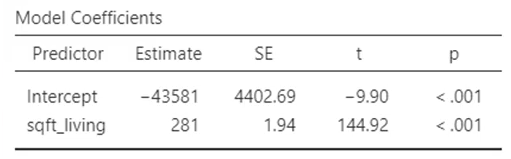

## 1. 회귀분석이란?

- 주어진 독립변수로 종속변수를 예측하기 위해 단순회귀(Simple regression), 다중회귀(Multiple regression)를 사용할 수 있다.
- 회귀 분석에서는 추세선을 계산하는데 이 떄 발생하는 예측값과 측정값(종속변수)의 오차(error)를 가장 적게하는 가장 합리적인 추세선을 찾는다. 이를 최소제곱법이라 한다. 
- 이때 이 추세선은 평균을 지나게 되는데, 회귀분석이라 함은 이 평균으로의 회귀를 의미한다.
- 오차의 제곱합으로 합산을 하게되는데 분산과 유사한 의미를 지니게 된다.

$$
y = a + \beta x
$$

- 독립변수가 하나일 때의 회귀 분석을 OLS(Ordinary Least square)라 한다. a : 절편(constant), b: 기울기(slope) 

- 회귀분석의 해석은 본인의 연구가설을 뒷받침 하기 위한 근거로 사용하여야 한다. 
  ex) 다음과 같이 거실 크기가 1 $feet^2$ 증가할 때 매매가는 281$ 증가한는 것으로 분석결과가 나왔으며 거실의 크기가 클 수록 매매 가격이 비쌀 것이다 라는 연구 가설과 일치한다.
  

## 2. 표준 오차와 t-test

- 최소제곱법으로 오차의 제곱합이 최소가 되는 회귀 방정식을 구했지만 이 계수에 대한 유의성은 판별되지 않았다. 이 때 표준 오차를 유의성 판단에 사용하게 된다.
- 이론적으로 같은 모집단에서 적합한 방법으로 표본을 구해도 표본 집단의 평균은 매번 조금씩 다를 수 밖에 없다. 이 표본 집단의 평균들의 표준 편차를 표준 오차라 한다.
- 표준 오차로 표본 집단이 모집단에 얼마나 가까운지 판단하며 모집단의 평균을  평균의 참 값이라고 할 때 표준 오차가 작으면 참 값에 더 가깝다는 뜻이다. 

- 좌측의 데이터와 우측의 데이터 중 같은 변화율을 가짐에도 우측이 표준 오차가 더 크며 유의성이 떨어지게 된다. p-value는 t-value로 부터 구하는데 이 t-value의 수식은 아래와 같다. 수식에서의 $\beta$는 회귀계수(Estimate)이다.

$$
t-value = \frac{\beta}{SE_\beta} = 2.4/1.9 = 1.26 \\
df = 1
$$

- 회귀분석의 회귀계수와 t-test는 동일한 개념으로 두 집단의 평균값의 차이는 회귀계수(증감율)과 같은 의미이며 0이 되어서는 안된다. 따라서 t-test로 회귀계수의 유의성을 판단할 수 있다. 따라서 위의 산포도에서도 회귀계수는 2.4로 계산이 되었으나 유의하지 않음으로 의미가 없는 회귀분석으로 치부한다.
- 직선관계가 아닌 경우 회귀분석을 하면 잘못된 회귀계수를 얻게 됨으로 유의해야 한다.

## 3. R-square의 해석

### 3.1 R-square의 의미와 계산

- 통계적 기법은 분살을 설명하기 위한 도구들이며 회귀분석 또한 종속변수의 분산을 독립변수로 설명하는 과정이다. 독립변수가 종속변수를 설명하기에 문제가 없다면 남은 오차는 random한 것으로 여긴다.

$$
R^2 = 1 - \frac{SSE}{SST}\\
SST = \sum(y_i - \overline{y_i})^2\\
SSE = \sum(y_i - \hat{y_i})^2
$$

- R-square또한 모델의 분산 설명력으로 볼 수 있으며 종속변수의 전체 분산 대비 독립변수로 설명되는 분산의 비율로 해석이 가능하다. R-square의 계산법은 위의 수식과 같으며 0-1 사이의 범주를 가지는데 설명력이 없을 때 0, 설명력이 100%일 때 1이다.

- R-square가 높을수록 무조건 좋은것이 아니다.  의미 없는 독립변수의 추가 조차 R-square를 증가시키고 자유도를 증가시켜 비용을 발생하도록 한다. 또한 높은 R-square은 과적합(overfitting) 문제가 발생할 수 있다.

  

### 3.2 잔차도(residual plot)란?

- 회귀분석의 전제 조건은 독립변수가 종속변수를 설명하기에 문제가 없다면 남은 오차는 random한 것으로 여기는 것이다.
- 아래의 그래프는 예측값과 잔차의 산점도이다. 좌측은 특정한 패턴이 보이지 않지만 우측은 증가하는 모양을 파악할 수 있으므로 random하지 못한 분포를 보여준다. 이 경우 R-square가 높아도 적합하지 못하게 된다.

- 이러한 이유로 회귀분석을 계산한 뒤 잔차도(residual plot)이 랜덤하게 분포한 것을 확인해야 한다.
- 이런 R-square의 단점을 보정하기 위해  adjusted R-square를 사용하게 되며 다음을 감안해야 한다.
  1. 추가된 독립변수가 자유도 1을 잃고도 충분히 분산을 설명하는 식으로 자유도가 감안 되었는지.
  2. R-square, adj. R-square의 크기가 심하게 다르다면 의미 없는 독립변수가 많다는 의미.

### 4. 표준화 계수

- 표준화 계수란 종속변수에 대한 독립변수들의 단위를 통일(scailing)시킨 계수다. 표준화계수의 단위는 없어져 모든 독립변수를 같은 단위 상에서 비교를 가능하게 한다. 모든 독립 변수를 표준화 시킨 후에 회귀 분석을 해도 가능하다.
  1. 표준화계수는 원점(0, 0)을 지나가는 회귀 직선.
  2. 절편(intercept)은 0이다.
  3. 회귀계수의 크기 비교가 가능하다.

$$
Standard\ Estimate = Estimate \times \frac{SD_x}{SD_y}
$$

- 위의 예시에서 세 독립변수 중 거실의 크기가 표준화계수가 가장 크므로 세 독립변수 중 가장 영향력이 크다고 해석할 수 있다. 하지만 표쥰화계수는 비표준화계수를 scailing한 것에 불과하므로 표준화계수의 차이가 유의한지 추가적인 검증이 필요하며 표준화계수의 큰 차이가 없을 경우 큰 의미가 없다.

