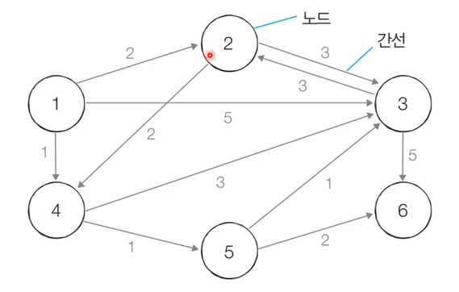

## 1. 최단 경로 알고리즘이란?

- 최단 경로 알고리즘은 가장 짧은 경로를 찾는 알고리즘이다.
- 다양한 문제상황
  - 한 지점에서 다른 한 지점까지의 최단경로
  - 한 지점에서 다른 모든 지점까지의 최단경로
  - 모든 지점에서 다른 모든 지점까지의 최단 경로
- 각 지점은 그래프에서 노드로 표현하고 지점 간 연결된 도로는 그래프에서 간선으로 표현한다.

## 2. 다익스트라 최단 경로

- 특정 노드에서 출발하여 다른 모든 노드로 가는 최단경로를 계산하는 알고리즘.
- 다익스트라 최단 경로 알고리즘은 음의 간선이 없을 떄 정상적으로 동작한다. (현실에서 도로는 음의 간선으로 표현되지 않는다.)
- 다익스트라 최단 경로 알고리즘은 그리디 알고리즘으로 분류된다. 매 상황에서 가장 비용이 적은 노드를 선택해 임의의 과정을 반복하기 때문.

- 알고리즘 동작 과정

  1. 출발 노드를 설정한다.
  2. 최단 거리 테이블을 초기화한다.
  3. 방문하지 않은 노드 중에서 최단 거리가 가장 짧은 노드를 선택한다.
  4. 해당 노드를 거쳐 다른 노드로 가는 비용을 계산하여 거리 테이블을 갱신한다.
  5. 3, 4번을 반복한다.

  

