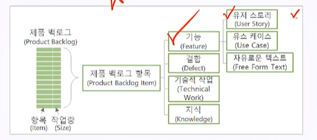

# 10. 스크럼 개요

## 10.1 스크럼 소개

- 스크럼은 개발 팀을 효율적으로 관리하는 방법을 제공함.

- 스크럼의 핵심

  1. 가장 많이 사용되는 애자일 기법

  

  2. 1-4주의 스프린트

  

  3. 세 가지 역할

     - 스크럼 팀은 제품 책임자(PO), 개발팀(DT), 스크럼 마스터(SM)로 구성됨(세 가지 역할).
     - 스크럼 팀은 3-9명으로 구성된 작은 팀
     - PO는 무엇을 개발할 것인지 결정하며 스크럼 마스터는 스크럼 프로세스를 촉진.

     

  4. 세 가지 아티팩트
     - 증분 : 스프린트가 종료될 때 인크리먼트가 동작하는 상태가 되어야 하며 제품 책임자가 이를 확인하고 제품 릴리즈 여부를 결정.
     - 제품 백로그 : 사용자 중심의 요구사항에 관한 지시 목록. 프로젝트 전 단계에 걸쳐 계속 추가 및 수정.
     - 스프린트 백로그 : 제품 백로그로부터 추출되어 해당 스프린트에 할당된 기능 목록을 말함.

  

  5. 다섯 가지 이벤트
     - 스프린트 : 반복주기 혹은 보고 주기. 일반적으로 2주로 설정함. 기능이 완성되지 않아도 연장하지 않으며 스프린트 백로그에서 정한 제품 기능의 일부(Increment)를 만듦.
     - 스프린트 계획 : 스프린트 시작에 앞서 수행하는 미팅. 제품 백로그로부터 스프린트 백로그를 토출함. 
     - 일일 스크럼 : 스탠드업 미팅. 15분의 짧은 시간동안 진행. 활동 현황을 공유함.
     - 스프린트 리뷰 : 관계자와 함께 제품을 시연하는 이벤트. 
     - 회고

## 10.2 스크럼 프로세스

 스크럼은 프로젝트 기간과 스프린트를 정한 후 제품 백로그를 프로젝트 전반에 걸쳐 업데이트 하고 제품을 개발하는 애자일 프로젝트 관리 방법론 중 하나.

- 증분 :  세로 프로세스의 계획. 점진적으로 발전하며 제품의 기능을 추가, 보완함. 현재 증분에서 다루지 않는 산출물은 상위 수준 혹은 미래의 증분에서 잠정 배분함.
- 반복 : 표준 프로세스, 단계. 각 단계의 마지막에서 산출물이 완성되야 함.

## 10.3 스크럼 착수

- 제품 비전을 작성함.
- 초기 제품 백로그를 준비하고 프로젝트 절반에 걸친 제품 로드맵에 증분과 반복 계획을 반영.
- 스크럼 팀을 구성하고 착수회의와 제품 백로그 미팅을 수행. 팀 헌장을 개발

1. 제품 비전
   - 대상 사용자, 고객사 이름을 기술.
   - 개곡의 니즈를 식별
   - 제품 성공을 위한 제품의 중요 속성, 기능을 결정
   - ROI, 혜택, 개발 기간 등 사업적 목표를 설정함.

2. 제품 로드맵

3. 증분(Increment)

   - 잠정적으로 인도 가능한 제품 요소. 
   - 프로젝트 착수 시 프로젝트 전체 기간에 걸친 증분 계획을 마일스톤 일정 차트 형식으로 작성해야 함.
   - 각 스프린트가 종료될 때는 증분이 동작하는 상태가 되야 함.

4. 제품 백로그

   

   - 제품 개발을 위하여 팀이 유지해 나가는 사용자 중심의 요구사항에 관한 지시 목록

5.  착수 회의(Kick-off Meeting)

   - 이해관계자에게 정보를 제공하고 참여를 유도함.
   - 자발적 헌신을 확보

6. 팀 헌장

   - 의사소통, 의사결정, 회의예절 등 주제를 논의해 서로에게 중요한 가치를 발견할 수 있음.
   - 팀원들이 직접 개발할 떄 효과적임.

