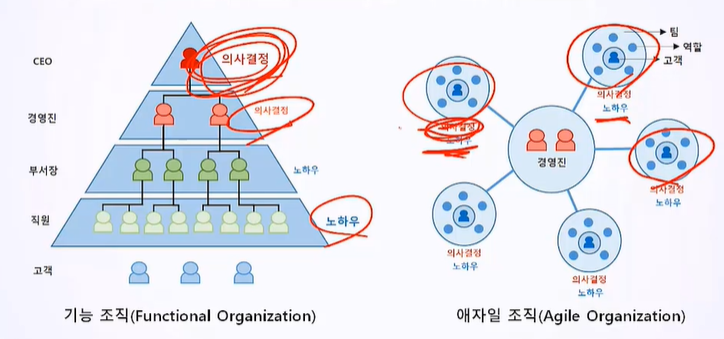
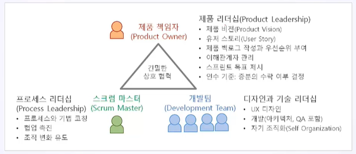
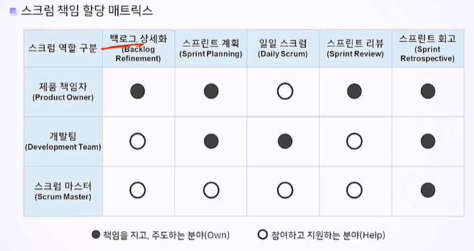
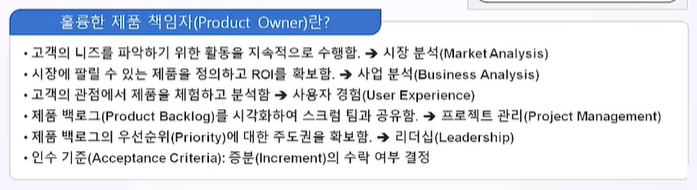
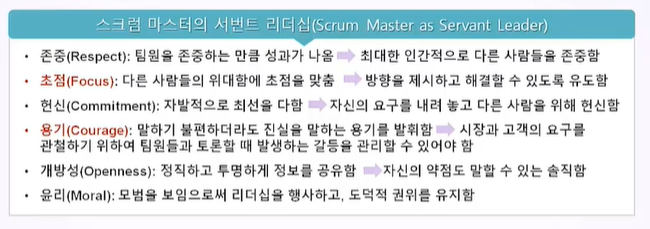
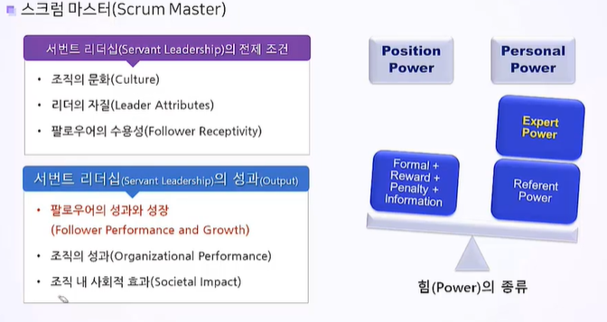
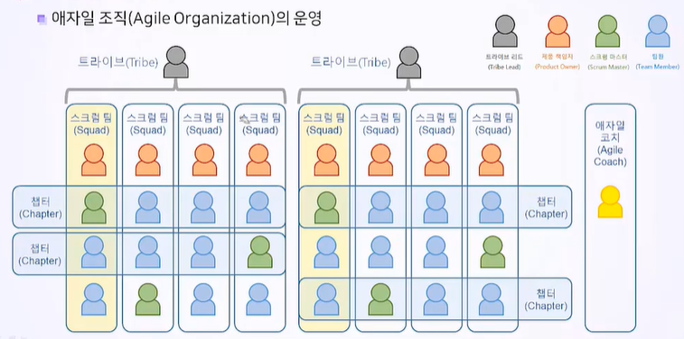
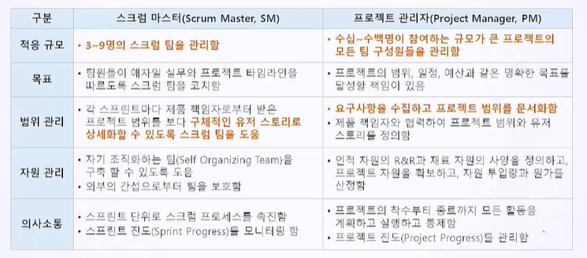
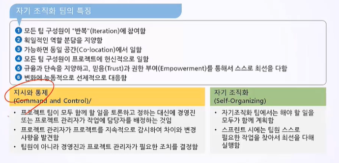

# 11. 스크럼 팀

## 10.1 스크럼 팀의 구성원

- 애자일 조직과 관계된 Agile Manifesto의 3대 원칙
  1. 소프트웨어를 일찍, 지속적으로 전달해 고객을 만족시키는 것.
  2. 동기부여된 개인들을 중심으로 프로젝트를 구성하고 필요로 하는 환경과 지원을 제공하라. 그들이 일을 끝낼 수 있도록 신뢰하라.
  3. 최상의 아키텍처, 요구사항, 설계는 자기조직화된 팀에서 나온다.

- 각 구성원의 역할이 할당된 매트릭스는 다음과 같음.

1. 제품 책임자(PO)

   

   - 제품 비전 : 고객 정보와 제품의 가장 중요한 속성, 방향 제시
   - 제품 로드맵 : 에픽 중심으로 증분형 라이프 사이클과 마일스톤 제시
   - 제품 백로그 : 고객의 요구사항을 수집해 제품 백로그를 시각화하고 팀과 함께 유저 스토리로 발전시킴.
   - 제품 백로그의 우선순위 부여 : 바로 다음 스프린트에 실행할 유저 스토리 선정
   - 이해관계자 관리 : 이해 관계자 참여 유도, 의사소통 전달, 개발팀에게 지시
   - 스프린트 목표 제시 : 스크럼 프로세스를 추적하고 통제
   - 인수 기준 : 증분의 수락 여부 결정

2. 스크럼 마스터

   - 전체를 지원하고 관리하는 사람. 촉진자, 서번트 리더
   - 팀원들이 활동하기 편하도록 장애물을 제거하는 역할로 서번트 리더쉽을 발휘.
   - 프로세스 기법 코칭 : 스크럼 프로세스를 촉진, 스크럼을 이해시키고 적용함.(선도와 봉사)
   - 협업 촉진 : 제품 책임자 지원, 개발팀 지원
   - 조직 변화 유도 : 상명하복식 조직을 자기조직화 팀으로 유도 개선.

   

   

   

3. 개발팀(DT)

   - 제품 책임자로부터 받은 유저 스토리를 작업으로 정의하고 본인의 작업에 대해 권한을 가지고 결정함.
   - 스크럼 보드에 스프린트 백로그를 작성
   - 작업량(스토리 포인트)를 산정함
   - 반복 프로세스를 위해 제품 책임자와 스크럼 마스터와 협력함

## 10.2 스크럼 팀의 관리

1. PM

   - 외부에서 스크럼 팀을 지원. 스크럼 팀의 일원이 아님

   - 예측형 프로젝트에서 PM은 계획, 지시, 통제하는 프로젝트 책임자 역할이지만 애자일에선 비전을 제시하고 지원하는 프로젝트 책임자.

   - 규모가 큰 프로젝트에서 한명의 PM과 여러 스크럼 마스터가 존재할 수 있음.

2. T자형 인재 : 다방면 전문가. 애자일 팀원들은 상호 지식을 공유해야 함.

3. 자기 조직화 팀
   

4. 개발팀의 크기 : 3-9명 팀원이 많아지면 이해의 충돌과 노이즈가 많아짐.

5. 의사소통 모델
   - 의사소통에는 노이즈와 이해가 개입되기 때문에 의사소통 채널은 적을수록 좋음.
   - 커뮤니케이션 채널 수 : N(N-1)/2
   - 의사소통 방해 요인 : 부적절한 메세지 전달, 나쁜 아이디어라 말하는 것, 적대감, 무관심

