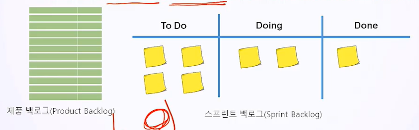
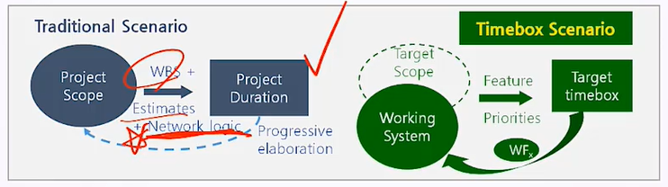
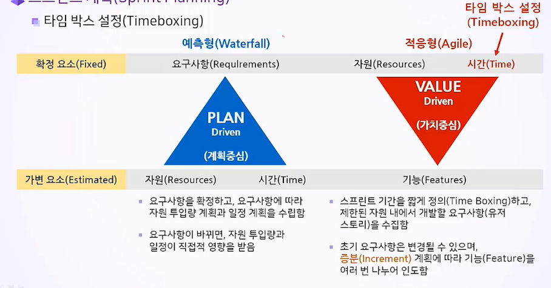

# 12. 스크럼 계획 수립1

## 12.1 스프린트 계획

- 스크럼은 여러 번 스프린트를 반복함으로 증분(Increment)을 인도함.
- 스프린트 계획의 내용
  - 스프린트 백로그 : 유저 스토리, 우선 순위, 스토리 포인트(작업량, 시수), 인수 기준
  - 스프린트 리스크
  - 타임박스와 스프린트 일정 계획

- 스프린트 설정으로 작은 단위의 개발 업무를 단기간 내에 전력 질주를 하듯이 개발할 수 있음.
  - 스프린트(Sprint) = 케이던스(Cadence) = 반복(Iteration) = 시간 상자 주기(Time-boxed Period)
  - 1-4주 내에 결정. (보통 2주)
  - 스프린트 내에서 스프린트 계획, 일일 스크럼, 개발, 스프린트 리뷰, 회고 등 제품 개발 수행

1. 스프린트 계획 회의(Sprint Planning Meeting)
   - 제품 백로그로부터 해당 스프린트에 할당할 스프린트 백로그를 도출.
   - 백로그 항목 정의, 기능, 결함, 기술적 잡업, 지식 등을 논의

2. 스프린트 계획(Sprint Planning)
   - 스프린트 계획의 주도(Own) 역할 : 제품 책임자(PO), 개발팀(DT)
   - 스프린트 계획의 지원 역할 : 스크럼 마스터(SM)
   - 제품 책임자는 스프린트 백로그 항목의 우선순위를 부여하며 스크럼 팀 전체는 그걸 이해함.
3. 타임 박스 설정(Timeboxing)
   - 시간 상자 주기는 팀이 목표를 완료할 때까지 지속되는 주기
   - 일반적으로 타임박스는 2주로 정의.
   - 기간이 짧을수록 작업량을 보다 정확히 예측하고 빠른 피드백을 유도함.
   - 프로젝트 전반의 리스크가 감소하고 작업의 버퍼를 보다 정확하게 산정하고 합리적으로 시간을 사용할 수 있음.

