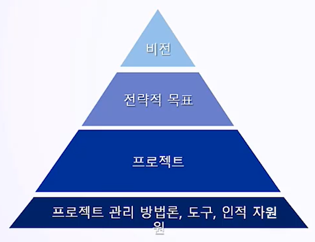
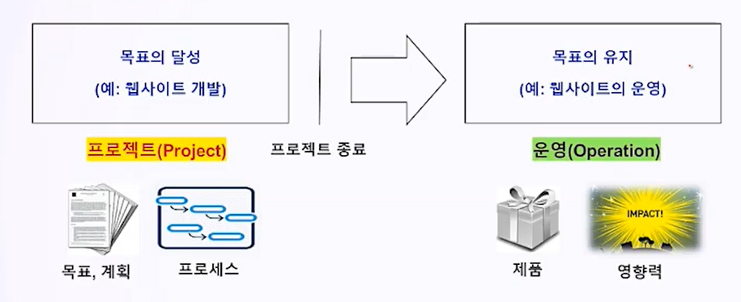

# 1. Project의 이해

## 1.0 목표

**학습 내용**

1. PJT 업무의 가치
2. PJT의 개념
3. PJT vs 운영(Operation)

**학습 목표**

- PJT 업무를 정의, 운영업무와 차이점을 구분
- PJT의 불확실성을 해소하기 위한 점진적 상세화 방법에서 Water-Fall과 Agile 차이를 구분.

## 1.1 PJT 업무의 가치

- PJT 관리 : 1, 3년후 조직의 미래 모습을 주도적인 기획으로 개척하는 것을 의미. 조직의 비전과 전략적 목표를 바탕으로 구성.
- PM을 중심으로 경영 전략을 프로젝트화 하고, 프로젝트 중심으로 성장과 발전을 함.
  - **PJT 관리 방법론**은 PJT제안과 실행을 성공시키기 위한 필수 요건.
  - **PJT 관리 정보 시스템**을 사용하는 기업이 늘며 PJT 관리 역량을 전문화하는 **PMO(Project Management Office)**이 운영됨.

## 1.2 PJT와 운영의 정의

**프로젝트와 운영의 차이**

- 프로젝트 업무
  - **고유성** : 목표달성을 위해 산출물이 있어야 함.
  - **한시성** : 각 프로젝트에는 시작일과 마감일이 존재.
  - **불확실성** : 단계의 제시, 점진적 상세화
  
- 일반 업무(운영)
  - 사업의 유지를 위해 **상시성, 반복성**이 있음.

- 공통점 
  - 사람이 수행하고 자원의 제약을 받으며 계획, 실행, 통제를 거침

## 1.3 프로젝트의 특징

1. 프로젝트에서는 **산출물**의 개념이 존재한다. 프로젝트의 고유한 목표에 따라 유형 혹은 무형의 산출물이 분명하게 나뉨.

**산출물 에서의 Water-Fall과 Agile**

- Water-Fall 방식에서는 제품, 서비스, 문서가 산출물의 방식임.
- 반면 Agile 방식에선 각 단계에서 결과로 나온 개선 현황이 주 산출물의 방식이 됨.

2. 프로젝트는 **시한**을 두고 움직인다. 프로젝트의 시작시점과 종료시점으로 달성된 산출물(목표 달성)은 이후 목표의 유지(운영)의 영역으로 넘어간다.

3. 프로젝트의 **불확실성**이 존재한다. 이를 해결하기 위해 점진적 상세화, 구체화를 시켜야 한다. 이 점진적 단계를 프로세스라 한다.

- 프로젝트가 진행됨에 따라 정보의 양이 증가하고 정확한 산정치가 제시되며 계획의 정확도를 높여 나가게 된다.

- Agile의 경우 표준 프로세스를 반복하며 Water-Fall은 한 번의 프로세스로 산출물을 제시함.

**프로젝트의 범위는 프로젝트 전 단계에 걸쳐 점진적으로 상세화 된다.**

- 전자의 경우 Water-Fall 방식, 후자의 경우 Agile 방식의 프로젝트라 함.

- 다른 분야와 달리 IT의 경우 복잡성 때문에, 고객에게 인도할 결과물을 나눠(증분) 프로젝트를 진행함.

**방법론에 따른 작업 분류 기준**

- 프로젝트의 범위는 프로젝트 전 단계에 걸쳐 점진적으로 상세화 됨.
- Water-Fall : 상위단계 - 하위단계 - 프로세스
- Agile : 증분 - 반복 - 에픽(상위기능) - 기능 - 사용자 스토리(고객관점 하위기능) - 작업(이슈, 하위기능 구현).
  - WBS(Work Breakdown Structure)는 프로젝트가 진행되면서 할당됨.
