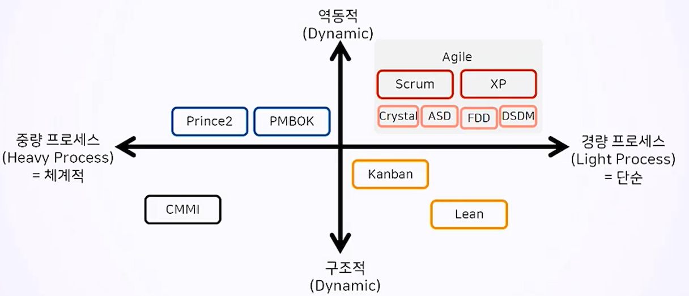
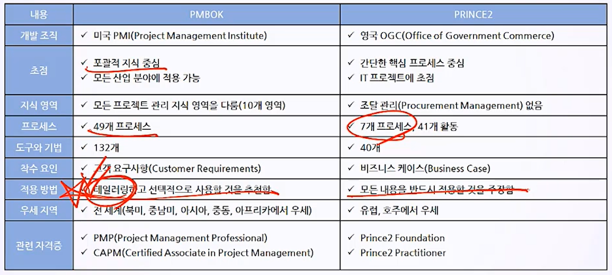

# 2. 프로젝트 관리 방법론

## 2.1 프로젝트 관리 지식 개요

- 1996년 PMI(Project Management Institute) 에서 PMBOK(Project Management Body of Knowledge) 1st Edition 출간.
- 동일해 영국 OGC(Office of Government Commerce, 영국 조달청)에서 PRINCE2(Project IN Controlled Envirionments)를 출간.

### 2.1.1 방법론이란?

- 프로젝트를 성공적으로 관리하기 위한 검증된 지식 체계. 가치창출을 위한 프로세스, 도구, 기법을 포함.

- 프로젝트의 산출물 목록과 관리 체계가 해당하며 업무 수행과 통제를 위한 지침이 있음.

- 프로젝트 관리 방법론은 다음과 같이 구분할 수 있음. (프로세스 : 중량, 경량)

### 2.1.2 PMBOK(Project Management Body of Knowledge)

- 가장 많이 알려진 방법론이며 모든 프로젝트에 적용가능한 일반화된 지식임. 애자일, 예측형, 하이브리드 등 다양한 방법론을 유연하게 적용.

- PMBOK 프로젝트 관리 지식 영역
  - 범위, 일정, 리스크, 품질, 자원, 통합, 이해관계자, 조달, 원가, 의사소통
  - 애자일 방법론에서는 범위, 일정, 리스크관리가 중요하게 여겨짐.
- PMBOK와 PRINCE2의 차이 : PMBOK가 PRINCE2보다포괄적이고 유연한 성격을 가지고 있다.

### 2.1.3 예측형(Water Fall)과 애자일(Agile) 방법론

- 예측형은 계획중심으로 프로젝트가 진행되지만 애자일은 가치중심으로 프로젝트를 진행하며 기능에 우선순위를 부여해 핵심적인 기능을 우선적으로 개발하는 프로세스로 진행한다.

| 요소     | 예측형     | 애자일     |
| -------- | ---------- | :--------- |
| 확정요소 | 요구사항   | 자원, 시간 |
| 가변요소 | 자원, 시간 | 기능       |

1. 예측형 프로젝트 관리(폭포수모델, Water Fall)

   - 프로젝트 범위가 명확할 때 적용.
   - 고객과 경영진에 산출물을 체계적으로 문서화하여 보고.
   - 프로젝트 범위, 일정, 자원, 비용 등을 통합관리 함.

   - 제조, 건설, IT, 연구개발 등 모든 산업분야에 적용.

2. 적응형 프로젝트 관리(Agile)

   - 프로젝트 범위의 변경 가능성과 불확실성이 크다.
   - 문서 격식주의를 최소화하여 개발자 중심으로 프로젝트 작업을 진행.
   - 창의적으로 범위를 구현하는데 초점을 맞춤.
   - IT, 연구개발에 적용.

3. 예측형과 애자일의 공통점
   - 프로젝트를 성공적으로 관리하는 것을 목표로 함.
   - 요구사항을 식별하며, 상호협력적으로 이해관계자들 간에 소통함. 
   - 프로젝트 제약 조건을 균형있게 조정.