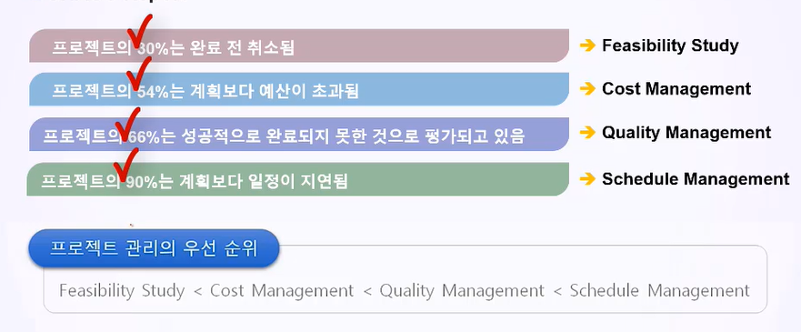
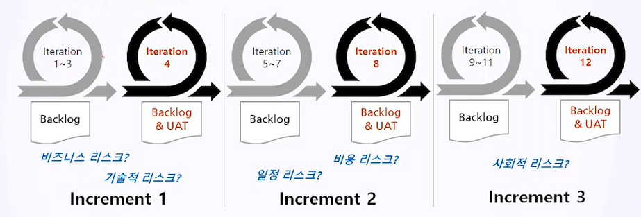
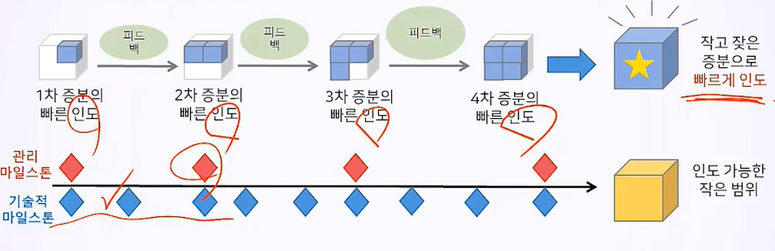

# 3. 애자일 프로젝트 개요

## 3.1 애자일 소개

### 3.1.1 애자일의 정의

- 신속하고 변화에 유연하며 적응적인 개발을 목표로 하는 다양한 경량 개발 방법론 전체를 일컫는 총칭.

- 증분 : 여러 하위 프로젝트를 통해 점진적으로 프로젝트 범위와 일정을 개발하고 프로젝트 산출물을 빠르게 인도함.
- 반복 : 반복적인 작업으로 리스크를 관리함.

### 3.1.2 애자일 방법론의 공통점

- 고객이 프로젝트에 적극 참여.
- 프로젝트의 리스크를 관리.
- 역동적인 일정 관리에 초점을 맞춤.
- 반복에 기반한 프로세스를 활용함.

### 3.3 애자일의 기대 효과

- 애자일은 반폭 프로세스를 통해 프로젝트를 진행하기 때문에 요구사항의 추가에 유연하고 빠르고 지속적인 고객 피드백을 통해 프로세스 전반에 걸쳐 의사소통을 개선한다.

- 프로젝트 방향을 정하는 의사 결정에 필요한 중요 정보를 받아 처리하는 사업 담당자에게 권한을 강화함.

- 프로젝트의 진척 상황에 대한 높은 가시성과 영향력으로 문제를 감지.

## 3.2 애자일 프로젝트의 특징

### 3.2.1 IT 프로젝트 실패의 교훈

- 고객은 자기가 진짜 원하는 것을 올바로 제시하지 못함.
  - 요구사항과 기대사항을 구분해야 함.
  - 고객과 개발자의 협력을 통해 요구사항의 불확실성을 줄이고 고객이 수용할 수 있는 대안을 지속적으로 제시해야 한다.
- 요구사항 정의는 프로젝트 팀이 주도해야 하며 교차기능 요구사항을 정의할 수 있어야 함.
- IT 프로젝트의 가장 중요한 점은 리스크 관리 역량이다.

### 3.2.2 CHAOS Report

- 프로젝트는 규모가 클 수록 실패하며 작을수록 성공할 확률이 높음.
- 장기 프로젝트의 경우라도 2개월 내에 산출물을 생산하는 등 리스크 관리를 해야 함.

### 3.2.3 애자일의 우선관리 대상

애자일의 1차적인 목표는 프로젝트 리스크 관리로 프로젝트의 리스크 관리를 위한 애자일의 기법은 반복(Iteration)임. 

