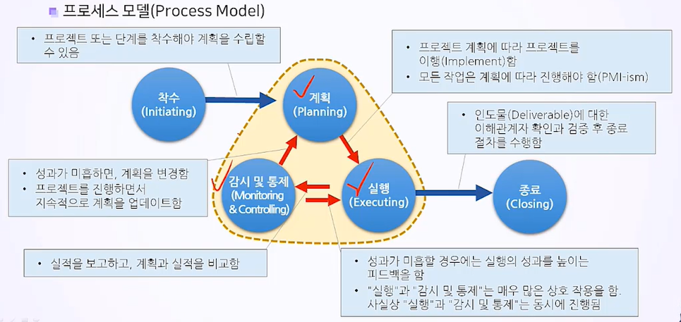

# 5. 프로젝트 라이프사이클의 이해

## 5.1 프로젝트 라이프사이클의 기초

**PMBOK(Project Management Body of Knowledge)**

**프로세스 모델**

- 프로젝트의 규모와 복잡성이 클 수록 애자일 단계가 적합함.
- 프로젝트 라이프 사이클에서 단계는 순차적일 수도, 반복적일수도, 중첩(패스트 트래킹)될 수도 있음.
- 라이프사이클은 인도물을 산출해내야 종료됨.

**단계 게이트**

- 단계 게이트 = 프로젝트 게이트 = 프로젝트 단계의 끝에 위치한 마일스톤
- 각 단계에 마일스톤을 배치함으로 프로젝트 중 문제사항이 생기면 후속작업으로 이를 해결해야 함.
- 각 단계는 마무리가 되지 않으면 다음 과정과 중첩될 수 있음.

**일반 라이프사이클**

## 5.2 예측형 프로젝트 관리 vs 적응형 프로젝트 관리

**예측형 프로젝트 라이프사이클(폭포수 모델)**

- 불확실성이 낮을 때 선택. 계획적.
- 프로세스 그룹은 상호 중첩됨.

- 실행 프로세스에서 시간, 비용, 자원이 가장 많이 투입됨.
- 오라클 프리마베라, 마소 프로젝트

**애자일 프로젝트 라이프사이클(적응형 프로젝트)**

- 불확실성이 클 때 선택. 점진적 계획 보강.

- 각 증분마다 계획과 실행을 반복.
- 각 증분 하위의 스프린트라는 더 짧은 주기로 스프린트의 계획과 실행도 반복함.

## 5.3 예측형 라이프 사이클

