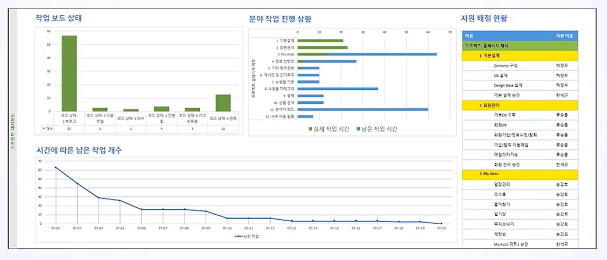
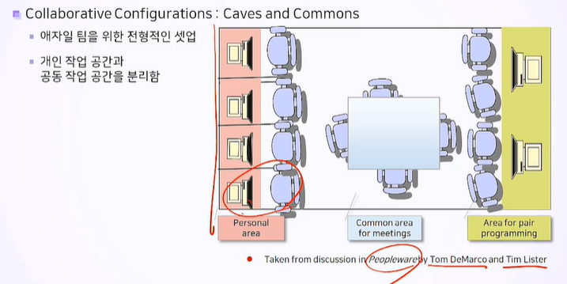
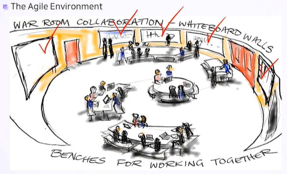

# 9. 애자일 환경

## 9.1 애자일 환경에 필요한 요소

1. 비유연성 
   - 만능 방법론에 지나치게 집착함.
   - 회사의 고익 툴만을 활용하려 함
2. 애자일하지 못한 물리적 환경
   - 칸막이
   - 시끄러운 공간
   - 모이지 못하고 가상팀으로 일함

## 9.2 최소화된 문서 격식주의

- 적당한 문서화와 재능 의존의 조화를 맞춰야 함. 

- 프로세스를 활용하지 않고 자원의 재능에만 의존하는 것은 부족한 것.

## 9.3 지속가능한 페이스

**지속 가능한 페이스의 의미**

- 열심히 일 함
- 개인의 한계를 인식함
- 장기간 작업을 지속할 수 있도록 페이스를 조절해야 함.
- 일반적으로 한 주에 40시간을 작업시간으로 하지만 개인차가 있다.

## 9.4 동일 장소 배치

1. 가능하면 동일 장소 배치함
   - 팀은 하나의 프로젝트에만 참여
   - 가능하면 고객의 대표 역할이 참여해야 함
   - 프로젝트에 도움이 되지 않는 사람은 퇴출함
2. 가상의 공동 작업
   - 비디오 화상회의
   - 음성 또는 화상 원격회의
   - 공유 기능을 제공하는 전자 화이트보드 시스템
   - 온라인 협업 소프트웨어

## 9.5 정보의 소통이 원활한 작업 환경

- 정보의 소통이 원활한 작업 환경을 구성하면 상황 보고를 줄일 수 있음. 

- 즉각적인 상황 공유 메커니즘을 통해 소통한다.
- 크리스털, XP 스토리보드 등

**좋은 정보 발열기의 조건**

1. 커야 함
2. 일반적인 혹은 관심 있는 관찰자에게 쉽게 보여야 함
3. 한 눈에 이해되야 함
4. 자주 방문해서 볼 가치가 있도록 자주 변경되어야 함. 
5. 업데이트하기 편리해야 함

## 9.6 조용한 환경

1. 줄여야 할 것
   - 회사의 간섭
   - 자질구레한 의무
   - 프로젝트와 관계되지 않는 작업
   - 행정적 작업
   - 팀 외부로부터의 사내 정치
2. 늘려야 할 것
   - 동기 부여
   - 작업 수행 역량과 가용성

## 9.7 협업을 위한 좌석 배치

- 의사소통과 협업에 도움이 되는 작업 환경을 만들어야 함
- 팀원들은 자신의 원하는 자리에 마음대로 앉을 수 있어야 함
- 개발자를 위한 그들의 동굴과 공동 구역을 제공하면 훌룡한 보고서가 더 잘 나올 수 있음.

