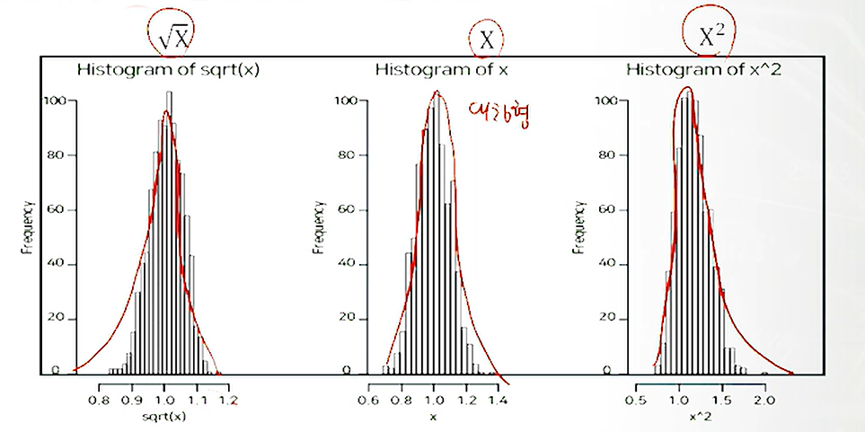
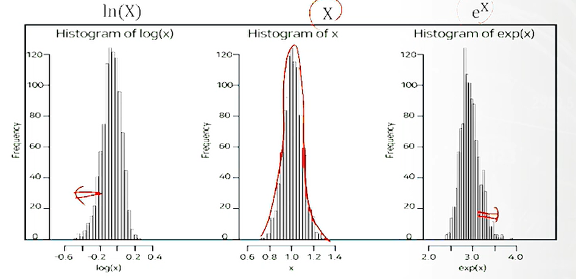
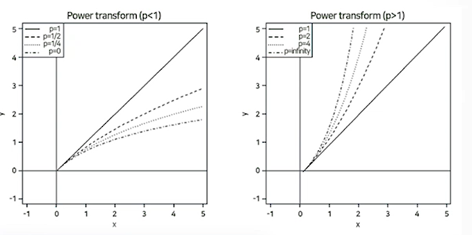

# 1. 데이터 생성

**(1) 요약변수** 

- 단어빈도, 상품별 구매금액, 상품별 구매량, 영화 매출액 등

**(2) 파생변수** 

- 특정한 의미를 갖는 작위적 정의에 의한 변수. 
- 사용자가 특정 조건을 만족하거나 특정 함수에 의해 값을 만들어 의미를 부여한 변수.
- 매우 주관적일 수 있으므로 논리적 타당성을 갖춰야 함.
- 구매상품 다양성변수, 가격선호대 변수, 라이프스타일 변수, 영화인기도 변수 등

# 2. 데이터 정제

**(1) 결측값의 이해**

- 기록누락, 미응답, 수집오류 등 이유로 결측이 발생. 

- 결측값이 포함된 자료라도 나머지 변수의 값들은 의미있는 정보이므로 정보의 손실을 최소화 하도록 결측을 처리하는 것이 바람직 함.

**(2) 결측값 처리법**

- 완전 제거법(list-wise deletion) : 결측값이 하나 이상 포함되면 행을 삭제. 정보의 손실로 분석 결과가 왜곡될 수 있음.
- 평균 대체법(mean value imputation) : 해당 변수의 평균값으로 결측치를 대체. 추정량의 표준오차가 과소추정될 수 있음.
- 핫덱 대체법(hot deck imputation) : 동일 데이터 내에서 결측값이 발생한 관찰치와 유사한 특성을 가진 다른 관찰치의 정보를 이용하여 대체.
- 그 외 Regression imputation, kNN imputation, k-nearest imputation 등

**(3) 이상값의 이해** 

- 이상값은 다른 데이터와 동떨어진 것을 의미. 의미있는 정보일 수도 있고 단순히 입력 오류로 발생한 값일 수도 있음.

**(4) 이상값의 탐지**

- 상자 그림(Box plot) 
  - -1.5IQR - Q1과 Q3 + 1.5IQR의 범위를 넘어가는 자료를 이상값으로 진단.
  - 이 때 1.5를 tukey 계수라 하며 이 계수는 3, 5 등(이상치가 많을 때)이 될 수 있음. 

- 표준화 점수(Z-score)
  $$
  Z_i = \frac{x_i - \bar{x}}{s}
  $$

  - 평균이 0, 표준이 1로 스케일링.
  - 표준화 점수의 절대값이 2, 3보다 큰 경우를 이상값으로 진단. 이 때 2, 3은 표준편차 s를 의미.

- 이상값 제외(trimming) : 처리는 간단하지만 정보 손실이 발생하고 추정량 왜곡이 생길 수 있음.
- 이상값 대체(winsoriization) :이상값을 정상값 중 최대 또는 최소 등으로 대체하는 방식.

- 변수변환 : 자료값 전체에 로그변환, 제곱근 변환 등을 적용. 
- 변수구간화(binning) 
  - 연속형 변수를 구간을 이용하여 범주화 하는 과정.
  - 이상치 문제를 완화하고 결측치 처리 방법이 될 수 있음. (결측범주 등으로 범주화)
  - 변수간 관계가 단순화되어 분석 시 과적합을 방지할 수 있고 결과 해석이 용이해짐.

# 3. 데이터 변환

- 데이터 변환은 자료 변환을 통해 자료의 해석을 쉽고 풍부하게 하기 위한 과정임. 
- 분포의 대칭화
- 산포를 비슷하게 함 : 영어, 국어, 수학 과목의 평균 비교에서 분포가 다른 각 그룹들의 평균 비교를 쉽게 하기 위해 적용
- 변수간 관계를 단순화시키기 위해 : 비선형 관계를 선형 관계로 단순화 하여 추정, 해석, 추론통계 방법을 적용하기 용이함.

**(1) 제곱근 변환 vs 제곱 변환** : 제곱근의 경우 분포를 왼쪽으로(Positive skew), 제곱의 경우 분포를 오른쪽으로(Negative skew)하는 효과.

**(2) 로그 변환 vs 지수 변환** : 로그의 경우 분포를 왼쪽, 지수의 경우 분포를 오른쪽으로 하는 효과. 제곱의 경우보다 치우침이 큰 경우 사용.

**skew**

- skewness가 -0.5 ~ 0,5 일 경우 데이터는 상당히 대칭적이다.
- skewness가 -1~-0.5 이거나 0.5~1 일 경우 데이터는 적당히 치우쳐있다.
- skewness가 -1보다 작거나 1보다 클 경우 데이터는 상당히 치우쳐있다.

**(3) 박스콕스 변환(Box-Cox Transform)** : 위의 경우들을 일반화 한 경우. 1은 제곱근, 3은 제곱 유형 3에서 p가 무한일 경우 exp가 됨.
$$
1) \quad y = \frac{1}{p}( (x+1)^p-1), \quad p = \frac{1}{2},\frac{1}{3},\frac{1}{4} \\
2) \quad y = ln(x+1), \quad p=0 \\
3) \quad y = (1+ \frac{x}{p})^p-1 \quad p=2,4,8
$$

# 4. 데이터 결합

- 이너 조인(inner join) : 두 테이블에 키(key)가 공통으로 존재하는 레코드(record)만 결합
- 풀아우터 조인(full outer join) : 두 테이블 중 어느 한쪽이라도 존재하는 키에 대한 레코드를 모두 결합.
- 레프트 조인(left join) : 왼쪽 테이블에 존재하는 키에 대한 레코드를 결합
- 라이트 조인(right join) : 오른쪽 테이블에 존재하는 키에 대한 레코드를 결합

