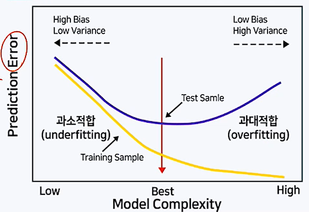
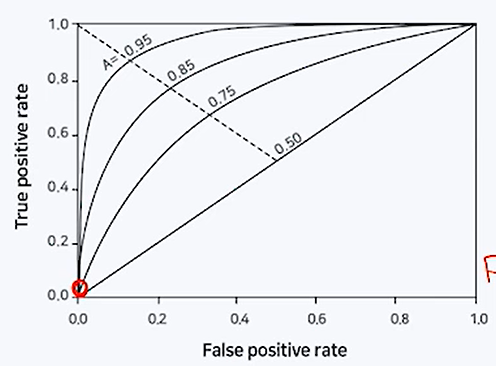

# 1. 머신러닝의 기본 개념 및 방법론 분류

**(1) 머신러닝**

- 컴퓨터 시스템에 명시적으로 프로그래밍 하지 않더라도 데이터를 스스로 학습하여 문제를 해결할 수 있게 하는 기술을 의미.

- 사람이 인지하기 어려운 복잡한 규칙과 패턴을 파악하여 의미있는 결과를 얻을 수 있음.

**(2) 머신러닝의 발전**

- 머신러닝 알고리즘의 발전
- 컴퓨팅 성능의 발전
- 대용량 데이터의 축적 및 관리기술 발전

**(3) 지도학습 (Supervised Learning)**

- 라벨이 있는 훈련용 데이터에서 여러 특성변수를 이용해 목표 변수인 라벨(label)을 예측하도록 모델을 학습함.
- 라벨의 데이터 타입에 따라 라벨이 연속형이면 회귀(regression) 알고리즘, 범주형이면 분류(classification) 알고리즘으로 분류함.
- 대표 알고리즘 : Linear Regression, k-nearest Neighbors, Logistic Regression, Softmax Regression, Decision Tree, SVM, Random Forest, Boosting, Neural Network, Deep Learning

**(4) 비지도학습(Unsupervised Learning)**

- 라벨이 없는 훈련용 데이터에서 특징 변수들 간의 관계나 유사성을 기반으로 의미있는 패턴을 추출.
- 자율학습 이라고도 함.
- 군집화(clustering), 차원축소(dimension reduction), 추천시스템(recommendation) 등에 활용됨.
- 대표알고리즘 : k-means Clustering, Hierarchical Clustering, PCA, LDA, t-SNE, Apriori, Auto-Encoders.

**(5) 강화학습(Reinforecement Learing)**

- 행동하는 주체(agent)가 있고 행동을 했을 때의 상태(state)와 보상(reward)을 바꿔주는 환경(environment)로 구성됨.
- 주체가 매번 어떠한 행동(action)을 하면 환경에 의해 상태와 보상이 바뀌면서 주체는 보상이 가장 커지는 방향으로 계속 학습해 나가게 됨.
- 대표 알고리즘 : SARSA, Q-Learning

# 2. 머신러닝 모델의 검증 및 평가

**(1) 모델 기반 지도학습 알고리즘의 일반적인 분석 절차**

- 주어진 데이터 전처리 및 탐색
- 적절한 모델을 선택
- 주어진 데이터로 모델을 훈련시킴
- 훈련된 모델을 적용하여 새로운 데이터에 대한 예측을 수행

**(2) 과대적합(overfitting)의 문제**

- 주어진 자료는 거의 완벽한 예측이 가능하지만 미래의 새로운 자료에 대한 예측력이 떨어지는 문제. (일반화가 부족함)
- 복잡한 알고리즘을 사용하여 데이터를 훈련하는 경우 과대적합의 문제를 항상 염두에 두어야 함.

**(3) 모델의 검증 및 평가 개요**

- 모델 평가의 필요성
  - 과대적합을 막고 일반화 오차를 줄이기 위해서는 새로운 데이터에 얼마나 잘 일반화될지를 파악해야 함.
  - 모델 적합에 사용된 자료를 평가를 위해 재활용하지 않고 평가만을 위한 데이터를 확보할 필요가 있음.

- Hold-out 방식 : 주어진 자료를 다음의 세 그룹으로 랜덤하게 분할한 뒤, 주어진 목적에 따라 각각 모델의 훈련, 검증, 평가에 활용함.
  1. 훈련 데이터(Training data) : 모델의 학습을 위해 사용되는 자료
  2. 검증 데이터(Validation data) : 훈련 자료로 적합되는 모델을 최적의 성능으로 튜닝하기 위해 사용되는 자료. 훈련에 필요한 하이퍼파라미터(hyperparameter)를 조정하거나 변수선택(model selecting) 등에 이용
  3. 테스트 데이터(Test data) : 훈련 및 검증 자료로 적합된 최종 모형이 미래에 주어질 새로운 자료에 대하여 얼마나 좋은 성과를 갖는지를 평가하는데 사용되는 자료.
- K-fold 교차검증(Cross-validation) 방식
  - 자료의 수가 충분하지 않은 경우에 훈련 데이터에서 너무 많은 양의 데이터를 검증 또는 평가 데이터에 뻇기지 않도록 교차 검정 기법을 사용.
  - 자료를 균등하게 k개의 그룹으로 분할한 뒤 각 j에 대해 j번째 그룹을 제외한 나머지 k-1개 그룹의 자료를 이용하여 모델을 적합.
  - j번째 그룹의 자료에 적합된 모델을 적용한 뒤 예측 오차를 구함.
  - j=1에서 k에 대해 위의 과정을 반복한 뒤 k개의 예측 오차를의 평균을 구함.
  - 예측오차의 평균값을 기준으로 모델의 검증 또는 평가를 수행.

**(4) 일반화 오차 및 편향-분산 트레이드 오프(Bias-Variance Trade off)**

- 모델의 복잡한 정도에 따라 훈련 데이터와 평가 데이터의 예측 오차는 다음과 같은 패턴을 보이게 됨.
- 모델이 복잡할수록 데이터가 달라지고 학습마다 모델이 달라지기 때문에 Model Complexity가 낮으면 Bias가 높고 Variance는 낮으며 반대의 경우 Bias가 낮고 Variance가 높음. 
- 최적의 Model Complexity를 찾아 Test error를 최대로 낮추는 것을 추구해야 함.

**(5) 과대적합을 막기 위한 방법**

- 훈련 데이터를 많이 확보
- 모델의 복잡도를 낮춤. 
  - 특성 변수의 수를 줄이거나 차원을 축소
  - 파라미터에 규제(regulation)을 적용함. Ridge, Lasso 등

# 3. 머신러닝 모델의 평가지표

(1) 회귀(Regression) 모델의 평가 지표

- RMSE(Root mean square error) 

- R-square
- MAE(mean absolute error)
- MAPE(mean average percentage error)

(2) 분류(Classification) 모델의 평가 지표

- 정오분류표(confusion matrix) 

| 실제\모형 | Positive           | Neagative          |
| --------- | ------------------ | ------------------ |
| Negative  | FP(false positive) | TN(true negative)  |
| Positive  | TP(rue positive)   | FN(false negative) |

- 정확도(Accuracy)
  - 전체 관찰치 중 정분류된 관찰치의 비중. (TN+TP) / (TN+FP+FN+TP)
  - 불균형한 자료일 경우 모델의 성능이 왜곡될 가능성이 있음.
  - Positive, Negative의 비용이 다른 경우 다른 성능지표를 확인해야 함.
- 정밀도(Precision)
  - Positive로 예측한 것 중 실제 범주도 Positive인 데이터의 비율. (TP) / (FP+TP)
  - 예측값이 Positive인 경우 Negative로 잘못 예측했을 때 비용이 커지는 경우 사용. (ex. 스팸메일)
- 재현율, 민감도(Recall, Sensitivity)
  - 실제값이 Positive인 것 중 Positive로 예측된 비율 (TP) / (FN+TP)
  - 실제값이 Positive인 경우 Negative로 잘못 예측했을 때 비용이 커지는 경우 사용. (ex. 암환자)

- ROC(Receiver operating characteristic) 도표
  
  - 분류의 결정임계값(threshold)에 따라 달라지는 TPR(민감도, Sensitivity)과 FPR(1-특이도, 1-specificity)의 조합을 도표로 나타냄.
    - TPR : True Positive Rate(민감도). 1인 케이스에 대해 1로 잘 예측한 비율
    - FPR : False Positive Rate(1-특이도). 0인 케이스에 대해 1로 잘못 예측한 비율
  - 임계값이 1이면 FPR=0, TPR=0
  - 임계값을 1에서 0으로 낮춰감에 따라FPR과 TPR은 동시에 증가함.
  - FPR이 증가하는 정도보다 TPR이 빠르게 증가하면(곡선이 y축에 가까울수록) 이상적.

- AUC(Area Under the Curve)
  - ROC 곡선 아래의 면적을 의미.
  - 가운데 대각선의 직선은 랜덤한 수준의 이진분류에 대응되며 이 경우 AUC는 0.5임.
  - 1에 가까울수록 좋은 수치이며, FPR이 작을 때 얼마나 큰 TPR을 얻는지에 따라 결정됨.

