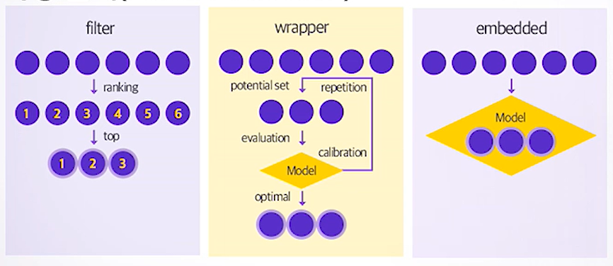
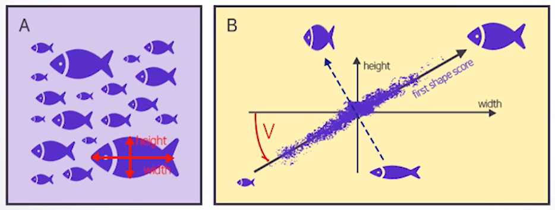
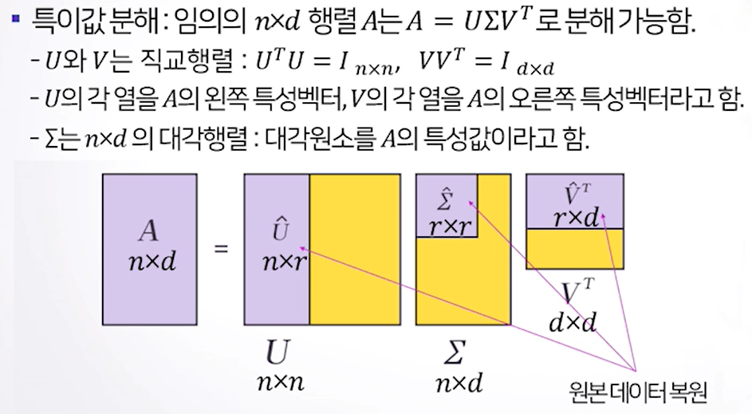

# 1. 특성공학 개요

**(1) 특성공간 차원축소의 필요성**

- 모델의 해석력 향상
- 모델 훈련시간 단축
- 차원의 저주 방지 
  - 데이터의 차원이 커지면 데이터상의 빈 공간이 생겨(sparse) 예측력이 저하됨.
- 과적합에 의한 일반화 오차를 줄여 성능 향상 
  - 불필요한 변수를 사용하면 모델 복잡도를 늘려 일반화하지 못함.

**(2) 특성공간 방법론**

- 특성 선택(feature selection) : 가지고 있는 특성 중 더 유용한 특성을 선택.
- 특성 추출(feature extraction) : 가지고 있는 특성을 결합하여 더 유용한 특성을 생성.

# 2. 특성선택 방법론

- 주어진 특성 변수들 가운데 가장 좋은 특성변수의조합만 선택함.
- 불필요한 특성 변수를 제거함.
- Filtering, Wrapper, Embedded 방식으로 분류 가능

**(1) Filter 방식 **

- 각 특성변수를 독립적인 평가함수로 평가함.
- 각 특성변수 Xi와 목표변수 Y와의 연관성을 측정한 뒤, 목표 변수를 잘 설명할 수 있는 특성 변수만을 선택하는 방식.
- Xi와 Y의 1:1 관계로만 연관성을 판단.
- t-test, chi-square test, information gain등의 지표가 활용됨.
- 계산비용이 적고 속도가 빠르지만 특성변수간 상호작용을 고려하지 않음.

**(2) Wrapper 방식**

- 다양한 특성변수의 조합에 대해 목표변수를 예측하기 위한 알고리즘을 훈련하고 cross-validation 등의 방법으로 훈련된 모델의 예측력을 평가함. 그 결과를 비교하여 최적화된 특성변수의 조합을 찾는 방법.
- 특성변수의 조합이 바뀔 때 마다 모델을 학습함.
- 특성변수에 중복된 정보가 많은 경우 이를 효과적으로 제거함.
- 대표적인 방법으로는 순차탐색법인 forward selection, backward selection, stepwise selection 등이 있음.
- 특성변수 간의 상호적용을 고려하고 주어진 알고리즘에서 최적의 특성변수 조합을 찾음.
- 계산비용이 크고 속도가 느리며 과적합 가능성이 있음.

**(3) Embedded**

- 학습 알고리즘 자체에 feature selection을 포함하는 경우.
- Wrapper방식은 모든 특성변수 조합에 대한 학습을 마친 결과를 비교하는데 비해, Embedded방식은 학습 과정에서 최적화된 변수를 선택한다는 점에 차이가 있음.
- 대표적인 방법으로 특성변수에 규제를 가하는 방식인 Ridge, Lasso, Elastic net 등이 있음.

# 3. 특성추출 방법론

- 주요 특성 추출법
  - PCA(Principal component analysis)
  - SVD(Singular Value Decomposition)
  - LDA(Linear discriminant analysis)
  - NMF(Non-negative matrix factorization)

## 3.1 주성분분석(PCA)

**(1) 주성분 분석이란**

- 서로 연관되어있는 변수들(x1, ... , xk)이 관찰됐을 때, 이 변수들이 전체적으로 가지고 있는 정보들을 최대한 확보하는 적은 수의 새로운 변수(주성분, PC)를 생성하는 방법.
- 주성분은 중요한 변수 순서로 정렬되며 각 변수마다 포함하는 정보의 양(x의 변동)을 수치적으로 나타냄.
- 주성분을 정할 때는 데이터의 분산(변동성)이 큰 방향으로 주성분을 정하며 각 축은 서로 독립적인 정보를 반영함.

**(2) 주성분 분석의 목적**

- 자료에서 변동이 큰 축을 탐색함.
- 변수들에 담긴 정보의 손실을 최소화하면서 차원을 축소함.
- 서로 상관이 없거나 독립적인 새로운 변수인 주성분을 통해 데이터의 해석을 용이하게 함.

**(3) 주성분 분석 아이디어**

- k개의 특성 변수 x1, ... , xk의 주성분이 y1, ... , yk라면 이들은 특성변수의 선형결합식으로 아래와 같이 표현됨.

$$
y_1 = l_{11}x_1 + l_{21}x_2 + \cdots +l_{k1}x_k \\
y_2 = l_{12}x_1 + l_{22}x_2 + \cdots +l_{k2}x_k \\
\cdots \\
y_k = l_{1k}x_1 + l_{2k}x_2 + \cdots +l_{kk}x_k
$$

- V[y1]를 최대로 하는 길이가 1인 벡터 l1 = (l11, l21, ... , lk1)로 첫번째 주성분 y1을 결정.
- Cov[y2,y1] = 0 을 만족하며 V[y2]를 최대로 하는 길이가 1인 벡터 l2 = (l12, l22, ... , lk2)로 두번째 주성분 y2을 결정.
- Cov[yj,ym] = 0 (m < j)을 만족하며 V[yj]를 최대로 하는길이가 1인 벡터 lj = (l1j, l2j, ... , lkj)로 j번째 주성분 yj을 결정.

**(4) 주성분 분석에 관한 기하학적 의미**

- 주성분 축은 원래 변수들의 좌표축이 직교 회전 변환된 것으로 해석할 수 있음.
  - 첫번째 주성분 축은 데이터의 변동이 가장 커지는 축임.
  - 두번째 주성분 축은 첫번째 주성분 축과 직교하며 첫번째 주성분 축 다음으로 데이터의 변동이 큰 축을 나타냄.
  - 각 관찰치 별 주성분 점수는 대응하는 원 자료 값들의 주성분 좌표축에서 좌표 값에 해당함.
  - 자료들의 공분산 행렬이 대각행렬이 되도록 회전한 것으로 해석할 수 있음.

## 3.2 특성값분해(SVD)

**(1) 특성값 분해 이론**

- 정보가 많은 순서대로 m개만 이용하여 근사하는 경우 m계수 근사라고 함.
- PCA의 계수를 계산하기 위해 SVD를 계산하는 경우가 많음.

