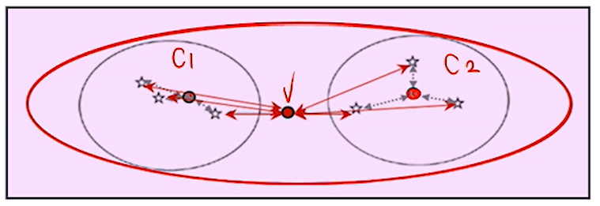

# 1. 군집분석 개요

**(1) 군집분석이란**

- 어떤 개체나 대상들을 밀접한 유사성(similarity) 또는 비유사성(dissimilarity)에 의하여 유사한 특성을 지닌 개체들을 몇 개의 군집으로 집단화하는 비지도학습법.
- 각 군집의 특성, 군집간의 차이 등에 대한 탐색 대상으로, 집단에 대한 심화된 이해가 목적.
  - 신규 마케팅을 위한 수요층 조사에 있어 특성 변수의 유사성을 기준으로 grouping 하여 가장 어울리는 군집을 선별.
- 특이 군집의 발견, 결측값의 보정 등에도 사용될 수 있음.
  - 제품 생성 과정에서 수집된 센서데이터로 Cluster를 만들었을 때 몇 군집이 다른 군집에 비해 특이점을 가짐 -> 불량여부판단가능
  - 특정 집단의 소득이 NaN일 때 이 집단의 평균소득으로 imputation할 때

**(2) 군집의 조건**

- 동일 군집에 속한 개체끼리는 유사한 속성이 매우 많음.
- 다른 군집에 속하는 개체끼리는 유사한 속성이 매우 적음.

# 2. 계층적 군집분석

**(1) 계층적 군집분석 개요**

- 병합적(agglomerative) vs 분할적(divisive)
  - 병합적 : 개체 간 거리가 가까운 개체끼리 차례로 묶어주는 방법으로 군집을 정의
  - 분할적 : 개체 간 거리가 먼 개체끼리 나누어 가는 방법으로 군집을 정의
  - 계층적 군집분석에서는 병합적 방법이 주로 사용됨.

**(2) 개체 간 거리 및 군집 간 거리의 정의**

- 개체 간 거리
  - 유클리디안 거리
  - 맨해튼 거리
  - 민코우스키 거리
- 군집 간 거리 
  - 군집간의 차이를 평가하는 방법. 방법에 따라 Dendrogram에서 보여지는 형태가 달라 몇가지 시도를 해보아야 함.
  - 단일 연결법(최단 연결법, single linkage) : 두 집단 내 개체간 최단 거리
    - 아래의 순서로 군집을 정한 뒤 군집간 거리가 멀고 군집 내 거리가 가까워지도록 적절한 지점에서 절단하여 군집 수 결정 (2개)
    - 
  - 완전 연결법(최장 연결법, complete linkage) : 두 집단 내 개체간 최장 거리
  - 평균 연결법(average linkage) :  두 군집의 모든 개체간 거리들의 평균
  - 중심 연결법(centroid linkage) : 두 군집의 중심 사이의 거리로 정의
  - ward 연결방법(ward linkage)
    
    - SSE_k를 군집 k의 중심으로부터 해당 군집 간 객체간의 거리 제곱 합으로 정의한 뒤, 총 k개의 군집이 있다면 SSE = sum(SSE_k)로 정의.
    - k개 중 2개의 군집을 하나의 군집으로 묶었을 때 오차 제곱합이 증가하는 정도를 두 군집간의 거리로 정의
      

