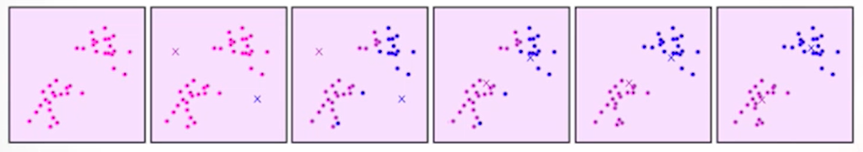
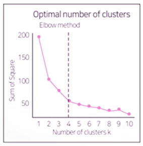

# 1. K-means 군집분석 개요

**(1) K-means 군집분석**

- 사전에 결정된 군집수 k에 기초해 전체 데이터를 상대적으로 유사한 k개의 군집으로 구분.
- 계층적 방식에 비해 계산량이 적고 대용량 데이터를 빠르게 처리함.
- 사전에 적절한 군집 수 k에 대한 예상이 필요.
- 초기에 군집 중심이 어디로 지정되는지에 따라 최종 결과가 영향을 많이 받음.
- 잡음이나 이상치의 영향을 많이받음.

**(2) K-means 군집분석 알고리즘**

- 개체를 k개의 초기 군집으로 나눈다.
- 각 군집의 중심(centroid)을 계산한 뒤 모든 개체들을 각 군집의 중심에 가장 가까운 군집에 할당시킨다.
- 새로운 개체를 받아들이거나 잃은 군집의 중심을 다시 계산한다.
- 위 과정을 더 이상의 재배치가 생기지 않을 때까지 반복한다.
- 초기값에 따라 군집이 달라질 수 있으므로 여러 번의 시도로 차이가 있는지 확인해야 함.
  

**(3) K-means 군집분석 예시**

| 관찰치 | X1   | X2   |
| ------ | ---- | ---- |
| A      | 5    | 3    |
| B      | -1   | 1    |
| C      | 1    | -2   |
| D      | -3   | -2   |

1. 임의로 k=2개의 군집 (AB), (CD)로 분할.
2. 각 군집의 중심을 계산. 
   - AB : (2,2)
   - CD : (-1,-2)
3. 각 개체에 대해 각 군집 중심과의 거리를 계산.
   - A : AB에 더 가까움
   - B : CD에 더 가까움
   - C : CD에 더 가까움
   - D : CD에 더 가까움
4. B는 군집 CD에 더 가까우므로 B를 CD에 통합하여 정의.
5. 다시 군집의 중심값 계산.
   - A : (5,3)
   - BCD :  (-1,-1)
6. 군집 중심에서 각 개체간의 거리를 계산.

| (root squared) | A    | B    | C    | D    |
| -------------- | ---- | ---- | ---- | ---- |
| A              | 0    | 40   | 41   | 89   |
| BCD            | 52   | 4    | 5    | 5    |

**(4) K-means 군집분석에서 적절한 군집 수의 결정**

- 오차제곱합(SSE, sum of squared error)
  - 각 군집 내 개체들과 해당 군집 중심점과의 거리를 제곱한 값들의 합.
  - 오차 제곱합이 작을수록 군집 내 유사성이 높아 잘 응집된 것임.
- 군집수 k에 따른 SSE의 변화를 Elbow 차트로 시각화한 뒤 SSE가 급겨깋 감소하다 완만해지기 시작하는 시점의 k를 적정 군집수로 판단함.
  

