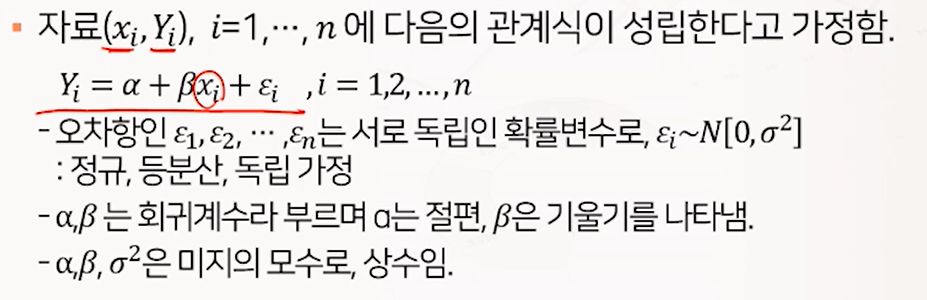
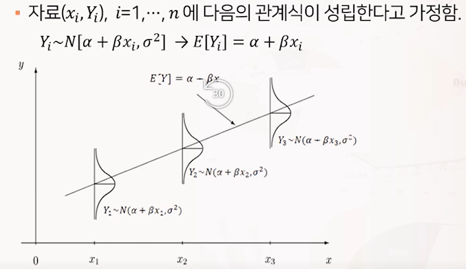
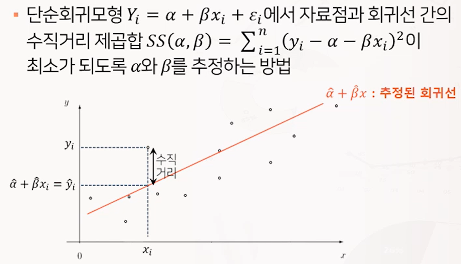
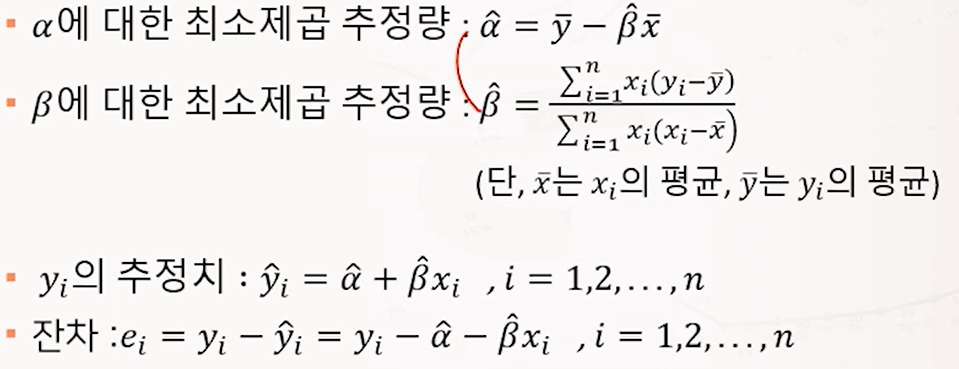
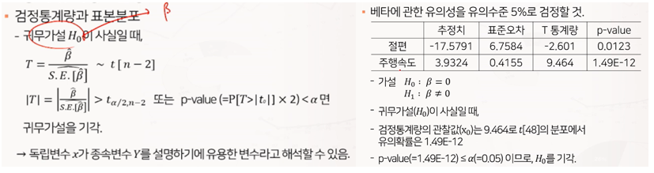
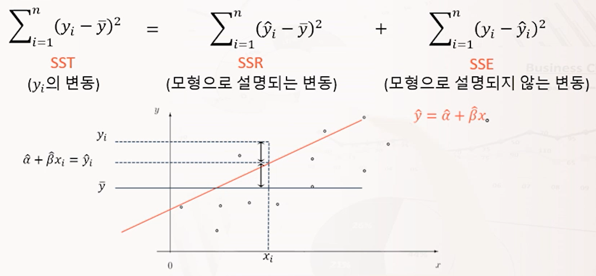

# 1. 단순회귀분석 Simple Linear Regression

1. 모형의 정의
2. 모형의 모수 의미
3. 모형의 모수 추정법 : 최소제곱법
4. 모형의 모수에 관한 가설검정
5. 모형에 관한 적합도

**(1) 회귀분석 개요**

- 독립변수와 종속변수 간의 함수적인 관련성을 규명하기 위하여 어떤 수학적 모형을 가정하고, 이 모형을 측정된 자료로부터 통계적으로 추정하는 분석방법.

- y=f(x)의 함수 관계가 있을 때 x를 설명변수(explanatory variable) 또는 독립변수(independent variable), y를 반응변수(response variable) 또는 종속변수(dependent variable)이라 함.  이 때 y는 연속형 변수여야 함.
- 사용되는 독립변수가 2개 이상일 때 다중회귀(Multi Linear Regression)이라 함.

# 2. 단순선형회귀모형

**(1) 모형 정의 및 가정**

- 오차는 랜덤으로 발생한다고 가정을 하며 아래의 항목을 만족해야 함.
  - 정규성
  - 등분산성
  - 독립성

- 오차가 랜덤으로 발생하므로 y도 랜덤한 성질을 가지고 있음.
  
  - y 또한 정규분포를 따르고 있으며 분산은 오차랑 같을 때, 그 기댓값이 x에 관한 선형함수로 표현할 수 있음.

**(2) 최소제곱법**

- 모수추정 : 모형이 포함한 미지의 모수 알파, 베타를 추정하기 위하여 각 독립변수 x_i에 대응하는 종속변수 y_i로 짝지어진 n개의 표본인 관측치(x_i, y_i)가 주어짐.
- 회귀선으로부터 각 y_i의 수직거리(오차)의 제곱합을 최소로 하는 알파와 베타의 추정을 최소제곱법이라 함.
  

- 오차는 모수이므로 관찰이 불가능하기 때문에 오차에 대응하는 개념인 오차를 사용. 추정치와 관측값의 차이를 잔차라 함.
- 잔차분석 : 오차의 여러 가정을 검증할 때 잔차를 사용해 분석함.

# 3. 단순선형회귀모형의 유의성 검정

**(1) 모형의 유의성 t 검정**

- 독립변수 x가 종속변수 y를 설명하기에 유용한 변수인가에 대한 통계적 추론은 회귀계수 베타에 대한 검정을 통해 파악할 수 있음.

- 실제 베타는 0이지만 우연히 관측된 값으로 인해 선형성을 가지는가 ...
  $$
  H_0 : \beta = 0 \\
  H_1 : \beta \not= 0
  $$
  

- n-2는 자유도, t_0는 검정통계량의 관찰값임.

**(2) Y의 변동성 분해**

(3) 모형의 적합성

- 결정계수 
  $$
  R^2 = \frac{SSR}{SST} = 1-\frac{SSE}{SST}
  $$
  

  - SST = SSR + SSE 이므로 항상 0과 1 사이의 값을 가짐.
  - y_i의 변동 가운데 추정된 회귀모형으로 통해 설명되는 변동의 비중을 의미함.
  - 0에 가까울수록 추정된 모형의 설명력이 떨어지는 것으로, 1에 가까울수록 추정된 모형이 y_i의 변동을 완벽히 설명하는 것으로 해석.
  - 결정계수는 두 변수 간의 상관계수의 제곱과 같음.  (https://rython.tistory.com/17)

