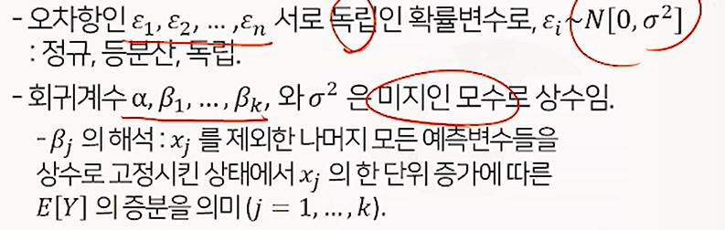
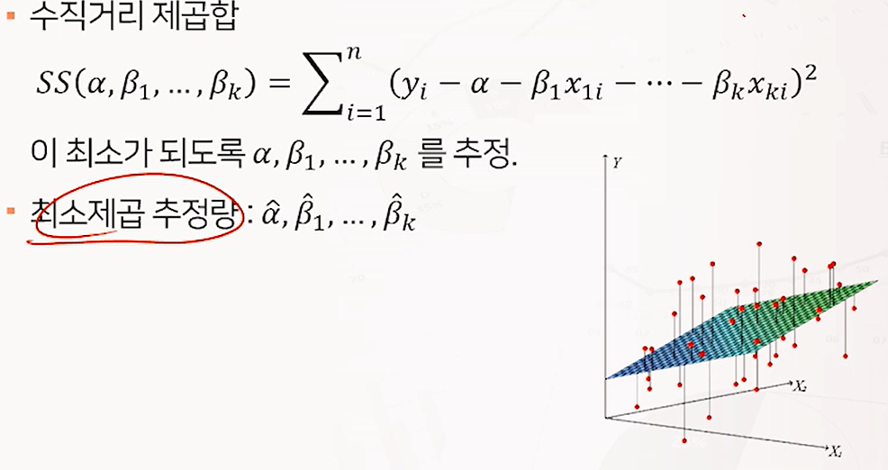

# 1. 다중선형회귀모형

**(1) 다중선형회귀모형**

- 독립변수가 두개 이상인 선형 회귀모형

- 여러 개의 독립변수를 이용하면 종속변수의 변화를 더 잘 설명할 수 있을 것.

- 자료 ((x_1i, x_2i, ... , x_ki), Y_i), i=1, ... , n 에 다음의 관계식이 성립한다고 가정.
  $$
  Y_i = \alpha + \beta_1x_{1i} + \beta_2x_{2i} + \cdots + \beta_kx_{ki} + \epsilon_i \quad (i=1,2,\ldots,n)
  $$
  

**(2) 회귀계수의 추정**

**(3) 범주형 독립변수가 포함된 회귀모형**

- 범주형 독립변수를 회귀모형에 포함하기 위해서는 더미변수(dummy variable) 기법을 사용.
- 더미변수는 0 또는 1의 값을 갖는 변수. 한 범주형 컬럼에 대해 더미변수의 개수는 컬럼의 범주 개수 -1 이다.
- 더미변수는 회귀선의 기울기가 아닌 절편에 관여.

