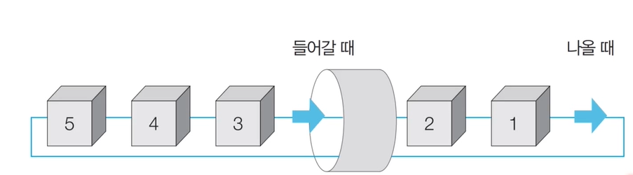
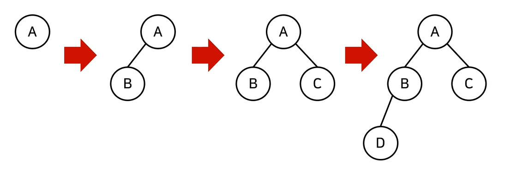
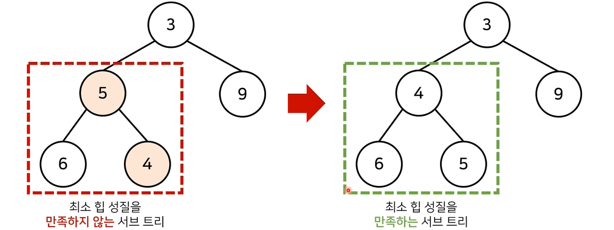

## 1. 기본 자료구조 : 스택과 큐

 

### 1.1 스택 자료구조

- 먼저 들어온 데이터가 나중에 나가는 형식의 자료구조. DFS(깊이 우선 탐색, Depth-Frist Search), BFS(너비 우선 탐색, Breadth-First Search) 등 다양한 알고리즘에 사용
- 입구와 출구가 동일한 형태로 스택일 시각화 할 수 있다. ex). 박스 쌓기
- 삽입과 삭제의 연산으로 구성. 빅오는 1이다.


**Python 예제**

```python
stack = []

# 5 2 3 7 삽입, 삭제, 1 4 삽입, 삭제
stack.append(5)
stack.append(2)
stack.append(3)
stack.append(7)
stack.pop()
stack.append(1)
stack.append(4)
stack.pop()

print(stack[::-1])
print(stack)
```


### 1.2 큐 자료구조

- 먼저 들어온 데이터가 먼저 나가는 형식의 자료구조. (선입선출)
- 입구와 출구가 모두 뚫려있는 터널과 같은 형태.
- 파이썬에서 리스트 자료형으로도 `deque`를 구현이 가능하지만 빅오가 더 크기에 `collections.deque`를 사용한다.




```python
from collectionㄴ import deque

queue = deque()

# 5 2 3 7 삽입, 삭제, 1 4 삽입, 삭제
# pop()를 사용하면 stack처럼 사용할 수 있다.
queue.append(5)
queue.append(2)
queue.append(3)
queue.append(7)
queue.popleft()
queue.append(1)
queue.append(4)
queue.popleft()

print(queue)
#deque([3, 7, 1, 4])
queue.reverse()
print(queue)
#deque([4, 1, 7, 3])
```


## 2. 우선순위에 따라 데이터를 꺼내는 자료구조


### 2.1 우선순위 큐(Priority Queue)

- 우선순위 큐는 우선순위가 가장 높은 데이터를 가장 먼저 삭제하는 자료구조.

- 데이터를 우선순위에 따라 처리하고 싶을 때 사용. 
  ex)  물건 데이터를 자료구조에 넣고 가치에 따라 꺼내 확인할 경우

- 구현방법

  - 단순 리스트
  - 힙자료구조를 이용한 구현
    (단순 N개의 데이터를 힙에 넣고 꺼내는 작업은 정렬과 동일. ($O(NlogN)$)

  


### 2.2 힙(Heap)의 특징

힙은 완전 이진트리 자료구조의 일종. 항상 루트 노드(root node)를 제거한다. 완전 이진트리란 루트(root) 노드로부터 시작하여 왼쪽 자식노드, 오른쪽 자식노드 순서로 데이터가 차례대로 삽입되는 트리다. 
새로운 원소가 삽입됐을 떄 $O(logN)$의 시간복잡도가 된다. 루트까지 도달하는 시간이 짧음. 힙에서 원소가 제거될 떄는 마지막 노드가 루트 노드에 위치시켜  자식 노드와 비교하여 재정렬하는`Heapify()`를 진행한다.



- 최소 힙(min heap) : 루트 노드가 가장 작은 값을 가짐. 값이 작은 데이터가 우선적으로 제거. 자료가 입력될떄 부모 노드로 거슬러 올라가며, 자신의 값이 더 작은 경우 위치를 교체한다.
- 최대 힙(max heap) : 루트 노드가 가장 큰 값을 가짐. 값이 큰 데이터가 우선적으로 제거. 자료가 입력될 때 부모 노드로 거슬러 올라가 자신의 값이 더 큰 경우 위치를 바꾼다.



```python
import sys
import heapq                # minheap. maxheap을 원할 경우 입출력에 음수를 붙여 사용.
input = sys.stdin.readline  # 반복문으로 여러줄을 받을 때 시간초과 발생을 방지하기 위해 사용.

def heapsort(iterable):
    h = []
    result = []
    # 모든 원소를 차례로 힙에 삽입
    for value in iterable:
        heapq.heappush(h,-value)
    # 힙에 삽입된 원소를 차례대로 꺼내어 담기
    for i in range(len(h)):
        result.append(-heapq.heappop(h))

    return result

n = int(input())
arr = []

for i in range(n):
    arr.append(int(input()))

res = heapsort(arr)

for i in range(n):
    print(res[i])
```


