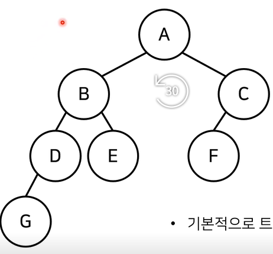
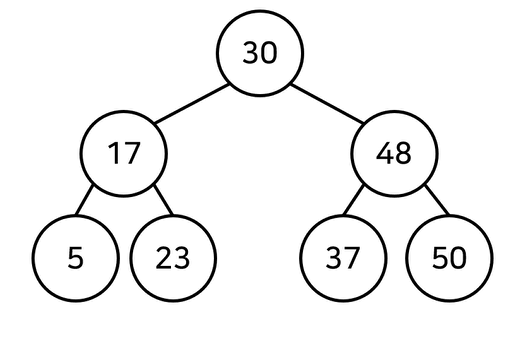
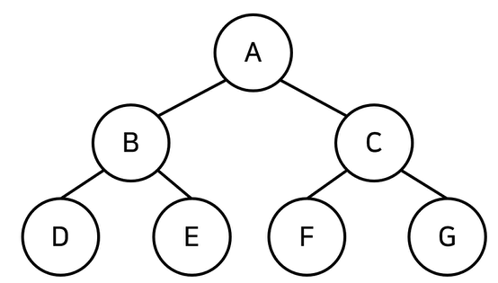
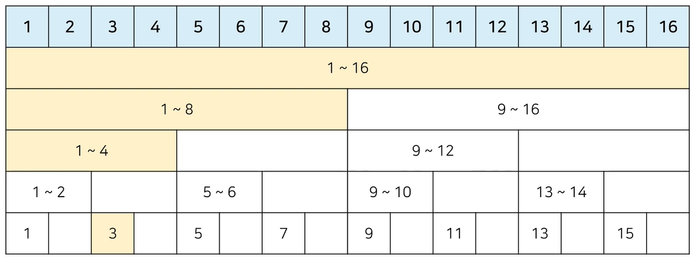

## 1. 활용도 높은 자료구조 : 트리 자료구조

- 트리는 가계도와 같은 계층적인 구조를 표현할 때 사용할 수 있는 자료구조.

  - 루트 노드(root node) : 부모가 없는 최상위 노드 (A)
  - 단말 노드(leaf node) : 자식이 없는 노드 (E, F, G)
  - 크기(size) : 트리에 포함된 모든 노드의 개수 (7)
  - 깊이(depth) : 루트 노드부터의 거리 (A:0, B,C:1, D,E,F:2, G:3)
  - 높이(height) : 깊이 중 최댓값 (G:3)
  - 차수(degree) : 각 노드의 (자식 방향) 간선 개수(6). 전체 크기가 N일 때 간선은 N-1.

  

### 1.1 이진 탐색 트리(Binary Search Tree)

- 이진 탐색이 동작할 수 있도록 고안된 효율적인 탐색이 가능한 자료구조의 일종.
- 이진 탐색 트리의 특징 : 왼쪽 자식노드 < 부모 노드 < 오른쪽 자식노드
  - 부모 노드보다 왼쪽 자식 노드가 작다.
  - 부모노드보다 오른쪽 자식 노드가 크다.



### 1.2 트리의 순회(Tree Traversal)

- 트리의 모든 원소를 확인하고자 할 때, 트리트리 자료구조에 포함된 노드를 특정한 방법으로 한번씩 방문하는 방법. 트리의 정보를 시각화하여 확인할 수 있다. 
  - 전위 순회(pre-order traverse) : 루트를 먼저 방문 (A-B-D-E-C-F-G)
  - 중위 순회(in-order traverse) : 왼쪽 자식을 방문한 뒤 루트를 방문 (D-B-E-A-F-C-G)
  - 후위 순회(post-order traverse) : 오른쪽 자식을 방문한 뒤 루트를 방문 (D-E-B-F-G-C-A)



```python
class Node:
    def __init__(self, data, left_node, right_node):
        self.data = data
        self.left_node = left_node
        self.right_node = right_node

# 전위 순회(Preorder Traversal)
def pre_order(node):
    print(node.data, end=' ')
    if node.left_node != None:
        pre_order(tree[node.left_node])
    if node.right_node != None:
        pre_order(tree[node.right_node])

# 중위 순회(Inorder Traversal)
def in_order(node):
    if node.left_node != None:
        in_order(tree[node.left_node])
    print(node.data, end=' ')
    if node.right_node != None:
        in_order(tree[node.right_node])

# 후위 순회(Postorder Traversal)
def post_order(node):
    if node.left_node != None:
        post_order(tree[node.left_node])
    if node.right_node != None:
        post_order(tree[node.right_node])
    print(node.data, end=' ')

n = int(input())
tree = {}

for i in range(n):
    data, left_node, right_node = input().split()
    if left_node == "None":
        left_node = None
    if right_node == "None":
        right_node = None
    tree[data] = Node(data, left_node, right_node)

pre_order(tree['A'])
print()
in_order(tree['A'])
print()
post_order(tree['A'])

'''
[예시 입력]
7
A B C
B D E
C F G
D None None
E None None
F None None
G None None
[예시 출력]
A B D E C F G 
D B E A F C G 
D E B F G C A 
'''
```


## 2. 특수한 목적의 자료구조: 바이너리 인덱스 트리

### 2.1 바이너리 인덱스 트리(Binary Index Tree)

- 바이너리 인덱스 트리(Binary Index Tree) 혹은 펜윅 트리(Fenwick Tree)는 2진법 인덱스 구조를 활용해 구간 합 문제를 효과적으로 해결하는 자료구조.
- 0이 아닌 마지막 비트를 찾는 방법 : 특정한 숫자 K의 0이 아닌 마지막 비트를 찾기 위해서는 K & -K를 계산하면 된다.


- 트리 구조 만들기 : 0이 아닌 마지막 비트는 내가 저장하고 있는 값의 개수다.
- 특정 값을 변경할 때(Update) : 0이 아닌 마지막 비트만큼 더하면서 구간들의 값을 변경. 시간 복잡도는 $logN$만큼 소요.
- 1부터 N까지의 합(누적합, Prefix Sum) : 0이 아닌 마지막 비트만큼 뺴면서 구간들의 값의 합을 계산. 시간 복잡도는 $logN$만큼 소요.



- 펜윅 트리에 대한 더 자세한 설명 : https://www.acmicpc.net/blog/view/21


**>데이터 업데이트가 가능한 상황에서의 구간합(Interval Sum) 문제**

https://www.acmicpc.net/problem/2042

- 일반적으로 리스트 인덱스를 통해 해결하려 하면 데이터 개수N X 구간 합 계산 횟수 K 만큼의 시간복잡도가 발생할 것. 펜윅 트리를 사용하면 이 문제가 해결된다.


```python
import sys
input = sys.stdin.readline

# 데이터의 개수(n), 변경 횟수(m), 구간 합 계산 횟수(k)
n, m, k = map(int, input().split())

# 전체 데이터의 개수는 최대 1,000,000개
arr = [0] * (n + 1)
tree = [0] * (n + 1)

# i번째 수까지의 누적 합을 계산하는 함수
def prefix_sum(i):
    result = 0
    while i > 0:
        result += tree[i]
        # 0이 아닌 마지막 비트만큼 빼가면서 이동
        i -= (i & -i)
    return result

# i번째 수를 dif만큼 더하는 함수
def update(i, dif):
    while i <= n:
        tree[i] += dif
        i += (i & -i)

# start부터 end까지의 구간 합을 계산하는 함수
def interval_sum(start, end):
    return prefix_sum(end) - prefix_sum(start - 1)

for i in range(1, n + 1):
    x = int(input())
    arr[i] = x
    update(i, x)

for i in range(m + k):
    a, b, c = map(int, input().split())
    # 업데이트(update) 연산인 경우
    if a == 1:
        update(b, c - arr[b]) # 바뀐 크기(dif)만큼 적용
        arr[b] = c
    # 구간 합(interval sum) 연산인 경우
    else:
        print(interval_sum(b, c))
```

