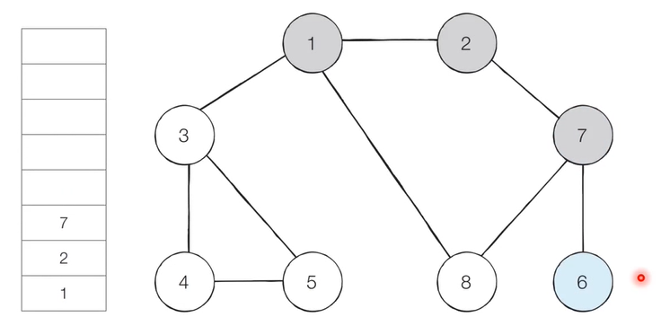
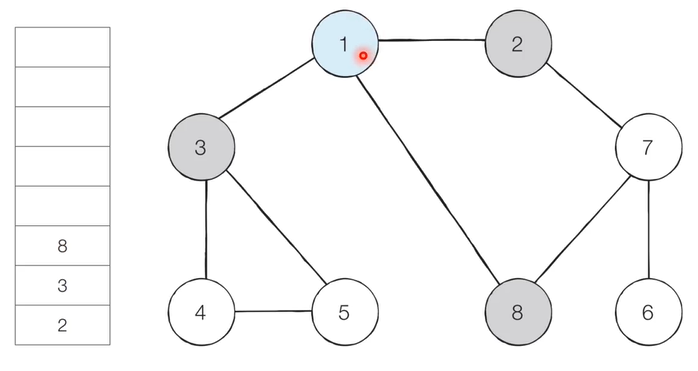
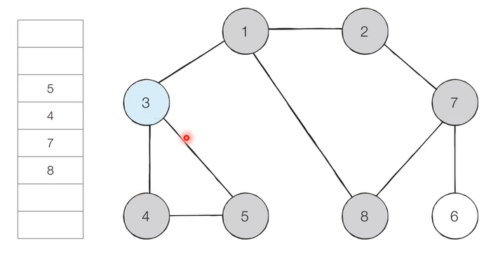

## 1. DFS(Depth-First Search)

- DFS는 깊이 우선 탐색이라고도 부르며 그래프에서 깊은 부분을 우선적으로 탐색하는 알고리즘이다.
- DFS는 스택 자료구조(혹은 재귀함수)를 이용하며 구체적인 동작은 다음과 같다.
    1. 탐색 시작 노드를 스택에 삽입하고 방문 처리를 한다.
    2. 스택의 최상단 노드에 방문하지 않은 인접한 노드가 하나라도 있으면 그 노드를 스택에 넣고 방문처리 한다. 방문하지 않은 인접 노드가 없으면 스택에서 최상단 노드를 꺼낸다.
    3. 더이상 2번의 과정을 수행할 수 없을 때까지 반복한다

**예시>**


1. 그래프를 준비하고 방문기준을 가장 낮은 인접 노드부터 할 때 시작을 1로 한다.

2. 스택의 치상단 노드인 1에 방문하지 않은 인접노드 2, 3, 8 중 가장 작은 노드인 2를 스택에 넣고 방문처리를 한다.
   
3. 그 다음 최 상단 노드인 7에 방문을 한 뒤 스택에 넣고 방문하지 않은 인접 노드 6, 8 중 더 작은 수인 6을 스택에 넣고 방문 처리를 한다.
   
3. 인접 노드가 없으면 다시 7로 되돌아가고 스택에서 6을 꺼내고 이를 반복한다. 탐색 순서는 1, 2, 7, 6, 8, 3, 4, 5이며 끝으로 1에 되돌아오고 스택을 비우면서 종료한다.

```python
# DFS 함수 정의
def dfs(graph, v, visited):
    # 현재 노드를 방문 처리
    visited[v] = True
    print(v, end=' ')
    # 현재 노드와 연결된 다른 노드를 재귀적으로 방문
    for i in graph[v]:
        if not visited[i]:
            dfs(graph, i, visited)

# 각 노드가 연결된 정보를 리스트 자료형으로 표현(2차원 리스트)
graph = [
  [],
  [2, 3, 8],
  [1, 7],
  [1, 4, 5],
  [3, 5],
  [3, 4],
  [7],
  [2, 6, 8],
  [1, 7]
]

# 각 노드가 방문된 정보를 리스트 자료형으로 표현(1차원 리스트)
visited = [False] * 9

# 정의된 DFS 함수 호출
dfs(graph, 1, visited)
```


## 2. BFS(Breadth-First Search)

- BFS는 너비 우선 탐색이라고 부르며 그래프에서 가까운 노드부터 우선적으로 탐색하는 알고리즘 이다.
- BFS는 큐 자료구조를 이용하며 구체적인 동작 과정은 다음과 같다.
  1. 탐색 시작 노드를 큐에 삽입하고 방문 처리를 한다.
  2. 큐에서 노드를 꺼낸 뒤 해당 노드의 인접 노드 중에서 방문하지 않은 노드를 모두 큐에 삽입하고 방문처리한다.
  3. 더 이상 2의 과정을 수행할 수 없을 떄까지 반복한다.

**예시>**


1. 1을 시작으로 하며 번호가 낮은 인접 노드부터 방문을 한다. 시작 노드인 1을 큐에 삽입하고 방문 처리를 한다.
   
2.  큐에서 노드 1을 꺼내 방문하지 않은 인접 노드 2, 3, 8을 큐에 삽입하고 방문처리 한다. 큐에는 작은 수 부터 넣는다.
   
3. 큐에서 노드 2를 꺼내 방문하지 않은 인접노드 7을 큐에 넣고 방문처리 한다. 
   
4. 큐에서 노드 3을 꺼내고 방문하지 않은 인접 노드 4, 5를 큐에 삽입하고 방문처리 한다. 이후로는 8번 노드를 꺼내고 이와 같은 작업을 반복하여 큐를 비우고 종료한다. 탐색 순서는 1, 2, 3, 8, 9, 4, 5, 6 이다.

```python
from collections import deque

# BFS 함수 정의
def bfs(graph, start, visited):
    # 큐(Queue) 구현을 위해 deque 라이브러리 사용
    queue = deque([start])
    # 현재 노드를 방문 처리
    visited[start] = True
    # 큐가 빌 때까지 반복
    while queue:
        # 큐에서 하나의 원소를 뽑아 출력
        v = queue.popleft()
        print(v, end=' ')
        # 해당 원소와 연결된, 아직 방문하지 않은 원소들을 큐에 삽입
        for i in graph[v]:
            if not visited[i]:
                queue.append(i)
                visited[i] = True

# 각 노드가 연결된 정보를 리스트 자료형으로 표현(2차원 리스트)
graph = [
  [],
  [2, 3, 8],
  [1, 7],
  [1, 4, 5],
  [3, 5],
  [3, 4],
  [7],
  [2, 6, 8],
  [1, 7]
]

# 각 노드가 방문된 정보를 리스트 자료형으로 표현(1차원 리스트)
visited = [False] * 9

# 정의된 BFS 함수 호출
bfs(graph, 1, visited)
```

