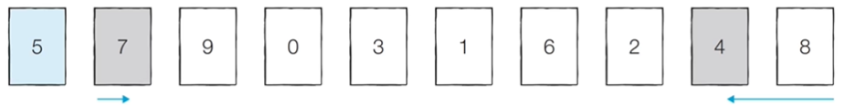
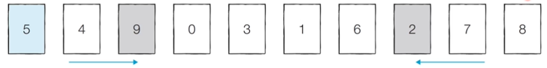
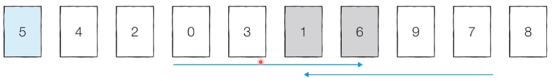
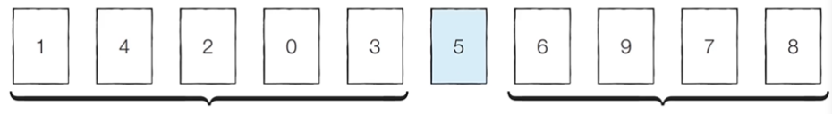
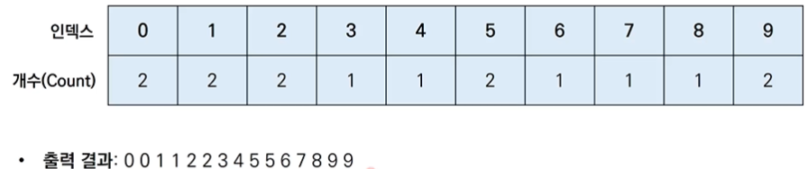

## 1. 선택정렬과 삽입정렬

### 1.1 선택정렬

- 처리되지 않은 데이터 중 가장 작은 데이터를 선택해 맨 앞의 데이터와 바꾸는 것을 반복한다.

```python
array = [7,5,9,0,3,1,6,2,4,8]

for i in range(len(array)):
    min_index=i
    for j in range(i+1, len(array)):
        if array[min_index] > array[j]:
            min_index=j

    array[min_index], array[i] = array[i], array[min_index]

print(array)
```

- 선택 정렬은 N번 만큼 가장 작은 수를 찾아 맨 앞으로 보내야 한다. 그렇기 떄문에 전체 연산 횟수는 아래와 같다.

$$
N +(N-1)+(N-1)+ \ldots +2
$$

- 이는 $(N^2+N-2)/2$로 표현이 가능하며 빅오 표기법에 따라 $O(N^2)$라 한다.


### 1.2 삽입 정렬

- 처리되지 않은 데이터를 하나씩 골라 적절한 위치에 삽입한다. 선택정렬에 비해 구현 난이도는 높지만 더 효율적이다. 삽입 정렬은 입력되는 리스트가 정렬되어 있다는 가정하에 수행한다.

```python
array = [7,5,9,0,3,1,6,2,4,8]

for i in range(1,len(array)):
    for j in range(i,0,-1):                             # 인덱스가 i부터 1까지 감소.
        if array[j] < array[j-1]:                       # 한칸씩 왼쪽으로 이동
            array[j], array[j-1] = array[j-1], array[j]
        else:                                           # 보다 작으면 정지.
            break

print(array)
```

- 삽입의 시간 복잡도는 $O(N^2)$이며 선택정렬과 마찬가지로 반복문이 두번 중첩되어 사용된다. 하지만 현재 리스트의 데이터가 거의 정렬되어있으면 매우 빠르게 동작한다. 때문에 최선의 경우 $O(N)$의 시간 복잡도를 가진다.


## 2. 퀵 정렬과 계수 정렬

### 2.1 퀵 정렬

- 기준 데이터를 설정하고 그 기준보다 큰 데이터와 작은 데이터의 위치를 바꾸는 방법이다. 일반적으로 가장 많이 사용한다.
- 병합 정렬과 더불어 대부분의 프로그래밍 언어의 정렬 라이브러리의 근간이 되는 알고리즘이다. 가장 기본적인 퀵 정렬은 첫 번째 데이터를 기준 데이터(Pivot)로 설정한다.

**예시>**

1. 피벗을 기준으로 오른쪽 방향으로 피벗보다 큰 데이터를, 끝지점에서 왼쪽 방향으로 피벗보다 작은 데이터를 검색한 뒤 두 자리를 바꾼다. (7, 4의 위치, 9, 2의 위치 교환)
   
2. 검색 중 큰 데이터의 검색과 작은 데이터의 검색이 엇갈리게 되는 경우 피벗과 작은 데이터를 교환한다. (5, 1 교환)
   
3. 피벗을 기준으로 왼쪽과 오른쪽을 분할(Divide)하여 다시 퀵 정렬을 수행해 모든 수의 정렬을 마친다.
   

- 이상적인 경우 분할이 절반씩 일어나 전체 연산 횟수가 $O(NlogN)$을 기대할 수 있다. 하지만 최악의 경우 $O(N^2)$의 시간 복잡도를 가진다. 라이브러리를 사용할 때 이를 방지해 $O(NlogN)$가 소요된다.

```python
array = [5, 7, 9, 0, 3, 1, 6, 2, 4, 8]

def quick_sort(array, start, end):
    if start >= end: # 원소가 1개인 경우 종료
        return
    pivot = start # 피벗은 첫 번째 원소
    left = start + 1
    right = end
    while(left <= right):
        # 피벗보다 큰 데이터를 찾을 때까지 반복
        while(left <= end and array[left] <= array[pivot]):
            left += 1
        # 피벗보다 작은 데이터를 찾을 때까지 반복
        while(right > start and array[right] >= array[pivot]):
            right -= 1
        if(left > right): # 엇갈렸다면 작은 데이터와 피벗을 교체
            array[right], array[pivot] = array[pivot], array[right]
        else: # 엇갈리지 않았다면 작은 데이터와 큰 데이터를 교체
            array[left], array[right] = array[right], array[left]
    # 분할 이후 왼쪽 부분과 오른쪽 부분에서 각각 정렬 수행
    quick_sort(array, start, right - 1)
    quick_sort(array, right + 1, end)

quick_sort(array, 0, len(array) - 1)
print(array)

```

**파이썬의 장점을 살린 코드**

```python
array = [5, 7, 9, 0, 3, 1, 6, 2, 4, 8]

def quick_sort(array):
    if len(array) <= 1:
        return array
    pivot = array[0]
    tail = array[1:] # 피벗을 제외한 리스트

    left_side = [x for x in tail if x <= pivot] # 분할된 왼쪽부분
    right_side = [x for x in tail if x > pivot] # 분할된 오른쪽부분

    # 분할 이후 왼쪽 부분과 오른쪽 부분에서 각각 정렬 수행하고 전체 리스트 반환
    return quick_sort(left_side) + [pivot] + quick_sort(right_side)

print(quick_sort(array))
```


### 2.2 계수 정렬

- 특정한 조건이 부합할 때 사용할 수 있지만 매우 빠르게 동작한다.
  제한조건 : 데이터의 크기 범위가 제한되어 정수 형태로 표현할 수 있을 때.
- 데이터의 개수가 N, 데이터(양수)의 최대값이 K일 떄 최악의 경우에도 O(N+K)를 보장한다.

**예시>**

1. 가장 작은 데이터부터 가장 큰 데이터까지의 인덱스를 가진 리스트를 생성한다.
2. 데이터를 하나씩 확인하며 데이터의 값과 동일한 인덱스를 +1 한다.
3. 리스트의 첫 번째 데이터부터 각 인덱스를 데이터의 값만큼 반복하여 출력한다.



- 계수 정렬의 시간 복잡도와 공간 복잡도는 모두 O(N+K)이다. 하지만 때에 따라서 심각한 비효율성을 초래한다. (array=[0,999999])
- 동일한 값을 가지는 데이터가 여러 개 등장할때 사용하도록 하자.

```python
array = [7,5,9,0,3,1,6,2,9,1,4,8,0,5,2]
count = [0]*(max(array)+1)

for i in range(len(array)):
    count[array[i]] += 1

for i in range(len(count)):
    for j in range(count[i]):
        print(i, end=' ')
```

