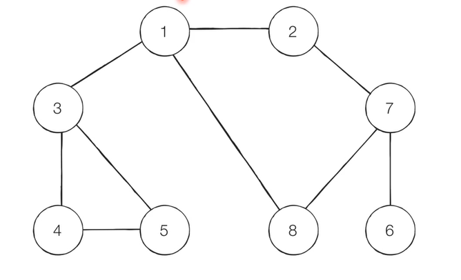
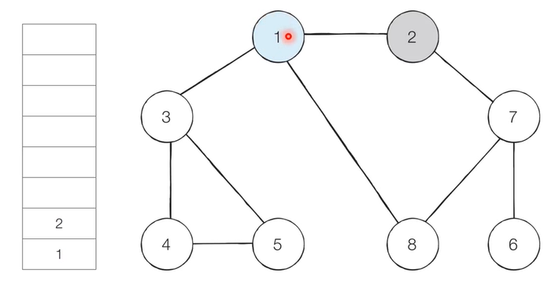
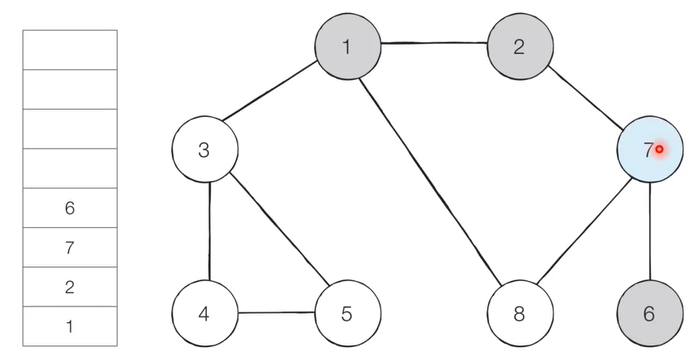
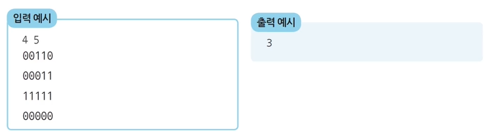
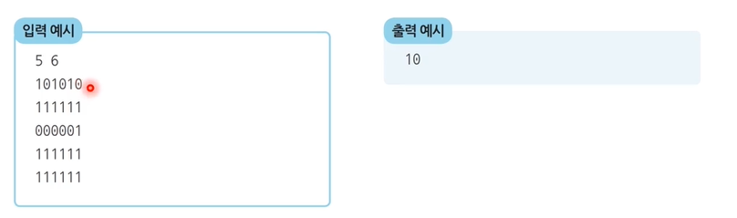

## 1. DFS(Depth-First Search)

- DFS는 깊이 우선 탐색이라고도 부르며 그래프에서 깊은 부분을 우선적으로 탐색하는 알고리즘이다.
- DFS는 스택 자료구조(혹은 재귀함수)를 이용하며 구체적인 동작은 다음과 같다.
    1. 탐색 시작 노드를 스택에 삽입하고 방문 처리를 한다.
    2. 스택의 최상단 노드에 방문하지 않은 인접한 노드가 하나라도 있으면 그 노드를 스택에 넣고 방문처리 한다. 방문하지 않은 인접 노드가 없으면 스택에서 최상단 노드를 꺼낸다.
    3. 더이상 2번의 과정을 수행할 수 없을 때까지 반복한다

**예시>**

​	

1. 그래프를 준비하고 방문기준을 가장 낮은 인접 노드부터 할 때 시작을 1로 한다.

2. 스택의 치상단 노드인 1에 방문하지 않은 인접노드 2, 3, 8 중 가장 작은 노드인 2를 스택에 넣고 방문처리를 한다.
   
3. 그 다음 최 상단 노드인 7에 방문을 한 뒤 스택에 넣고 방문하지 않은 인접 노드 6, 8 중 더 작은 수인 6을 스택에 넣고 방문 처리를 한다.
   
3. 인접 노드가 없으면 다시 7로 되돌아가고 스택에서 6을 꺼내고 이를 반복한다. 탐색 순서는 1, 2, 7, 6, 8, 3, 4, 5이며 끝으로 1에 되돌아오고 스택을 비우면서 종료한다.

```python
# DFS 함수 정의
def dfs(graph, v, visited):
    # 현재 노드를 방문 처리
    visited[v] = True
    print(v, end=' ')
    # 현재 노드와 연결된 다른 노드를 재귀적으로 방문
    for i in graph[v]:
        if not visited[i]:
            dfs(graph, i, visited)

# 각 노드가 연결된 정보를 리스트 자료형으로 표현(2차원 리스트)
graph = [
  [],
  [2, 3, 8],
  [1, 7],
  [1, 4, 5],
  [3, 5],
  [3, 4],
  [7],
  [2, 6, 8],
  [1, 7]
]

# 각 노드가 방문된 정보를 리스트 자료형으로 표현(1차원 리스트)
visited = [False] * 9

# 정의된 DFS 함수 호출
dfs(graph, 1, visited)
```


## 2. BFS(Breadth-First Search)

- BFS는 너비 우선 탐색이라고 부르며 그래프에서 가까운 노드부터 우선적으로 탐색하는 알고리즘 이다.
- BFS는 큐 자료구조를 이용하며 구체적인 동작 과정은 다음과 같다.
  1. 탐색 시작 노드를 큐에 삽입하고 방문 처리를 한다.
  2. 큐에서 노드를 꺼낸 뒤 해당 노드의 인접 노드 중에서 방문하지 않은 노드를 모두 큐에 삽입하고 방문처리한다.
  3. 더 이상 2의 과정을 수행할 수 없을 떄까지 반복한다.

**예시>**

​	

1. 1을 시작으로 하며 번호가 낮은 인접 노드부터 방문을 한다. 시작 노드인 1을 큐에 삽입하고 방문 처리를 한다.

2.  큐에서 노드 1을 꺼내 방문하지 않은 인접 노드 2, 3, 8을 큐에 삽입하고 방문처리 한다. 큐에는 작은 수 부터 넣는다.

3. 큐에서 노드 2를 꺼내 방문하지 않은 인접노드 7을 큐에 넣고 방문처리 한다. 


4. 큐에서 노드 3을 꺼내고 방문하지 않은 인접 노드 4, 5를 큐에 삽입하고 방문처리 한다. 이후로는 8번 노드를 꺼내고 이와 같은 작업을 반복하여 큐를 비우고 종료한다. 탐색 순서는 1, 2, 3, 8, 9, 4, 5, 6 이다.

```python
from collections import deque

# BFS 함수 정의
def bfs(graph, start, visited):
    # 큐(Queue) 구현을 위해 deque 라이브러리 사용
    queue = deque([start])
    # 현재 노드를 방문 처리
    visited[start] = True
    # 큐가 빌 때까지 반복
    while queue:
        # 큐에서 하나의 원소를 뽑아 출력
        v = queue.popleft()
        print(v, end=' ')
        # 해당 원소와 연결된, 아직 방문하지 않은 원소들을 큐에 삽입
        for i in graph[v]:
            if not visited[i]:
                queue.append(i)
                visited[i] = True

# 각 노드가 연결된 정보를 리스트 자료형으로 표현(2차원 리스트)
graph = [
  [],
  [2, 3, 8],
  [1, 7],
  [1, 4, 5],
  [3, 5],
  [3, 4],
  [7],
  [2, 6, 8],
  [1, 7]
]

# 각 노드가 방문된 정보를 리스트 자료형으로 표현(1차원 리스트)
visited = [False] * 9

# 정의된 BFS 함수 호출
bfs(graph, 1, visited)
```


## 3. DFS, BFS 기초문제 풀이

### 3.1 음료수 얼려 먹기

- N X M 크기의 얼음 틀이 있다. 구멍이 뚫려있는 부분은 0, 칸막이가 존재하는 부분은 1로 표시가 된다. 구멍이 뚫린 부분끼리 상화좌우로 붙어있는 경우 서로 연결된 것으로 간주한다. 이 때 얼음 틀의 모양이 주어졌을 때 생성되는 총 아이스크림의 개수를 구하는 프로그램을 작성하시오. 다음 4 X 5 얼음 틀 예시에서는 아이스크림이 3개 생성된다.



1. 특정한 지점의 주변 4방향을 살펴본 뒤 주변 지점 중 값이 0이면서 아직 방문하지 않은 지점에 방문을 한다. 
2. 방문한 지점에서 다시 4방향을 살피는 과정을 반복하면 연결된 모든 지점을 방문할 수 있다.
3. 모든 노드에 대해 1-2번의 과정을 반복하며 방문하지 않은 지점의 수를 카운트 한다.

```python
# DFS로 특정 노드를 방문하고 연결된 모든 노드들도 방문
def dfs(x,y):
    # 주어진 범위를 벗어나는 경우 종료
    if x<= -1 or x>n or y<= -1 or y >= m:
        return False
    if graph[x][y] == 0:
        # 해당 노드 방문 처리
        graph[x][y] =1
        # 상하좌우 재귀적 호출
        dfs(x-1, y)
        dfs(x, y-1)
        dfs(x+1, y)
        dfs(x, y+1)
        return True
    return False


# N, M 입력
n, m = map(int, input().split())

# 2차원 리스트의 맵 정보 입력 받기
graph = []
for i in range(n):
    graph.append(list(map(int, input())))
    
# 모든 노드에 대해 음료수 채우기
result = 0
for i in range(n):
    for j in range(m):
        if dfs(i,j) == True:
            result += 1

print(result) # 정답
```


### 3.2 미로 찾기

- 동빈이는 N X M 크기의 직사각형 형태의 미로에 갇혔습니다. 미로에는 여러 마리의 괴물이 있어 이를 피해 탈출해야 합니다. (1,1)에서 시작하며 출구는 (N,M)의 위치에 존재하고  한 번에 한 칸씩 이동할 수 있다. 이 때 괴물이 있는 부분은 0으로 괴물이 없는 부분은 1로 표시되어 있다. 미로는 반드시 탈출할 수 있는 형태로 제시된다. 이 때 탈출하기 위한 최소 칸의 개수를 구하시오.(시작 칸과 마지막 칸을 포함)



```python
from collections import deque

# N, M을 공백을 기준으로 구분하여 입력 받기
n, m = map(int, input().split())
# 2차원 리스트의 맵 정보 입력 받기
graph = []
for i in range(n):
    graph.append(list(map(int, input())))

# 이동할 네 가지 방향 정의 (상, 하, 좌, 우)
dx = [-1, 1, 0, 0]
dy = [0, 0, -1, 1]

# BFS 소스코드 구현
def bfs(x, y):
    # 큐(Queue) 구현을 위해 deque 라이브러리 사용
    queue = deque()
    queue.append((x, y))
    # 큐가 빌 때까지 반복하기
    while queue:
        x, y = queue.popleft()
        # 현재 위치에서 4가지 방향으로의 위치 확인
        for i in range(4):
            nx = x + dx[i]
            ny = y + dy[i]
            # 미로 찾기 공간을 벗어난 경우 무시
            if nx < 0 or nx >= n or ny < 0 or ny >= m:
                continue
            # 벽인 경우 무시
            if graph[nx][ny] == 0:
                continue
            # 해당 노드를 처음 방문하는 경우에만 최단 거리 기록
            if graph[nx][ny] == 1:
                graph[nx][ny] = graph[x][y] + 1
                queue.append((nx, ny))
    # 가장 오른쪽 아래까지의 최단 거리 반환
    return graph[n - 1][m - 1]

# BFS를 수행한 결과 출력
print(bfs(0, 0))
```

